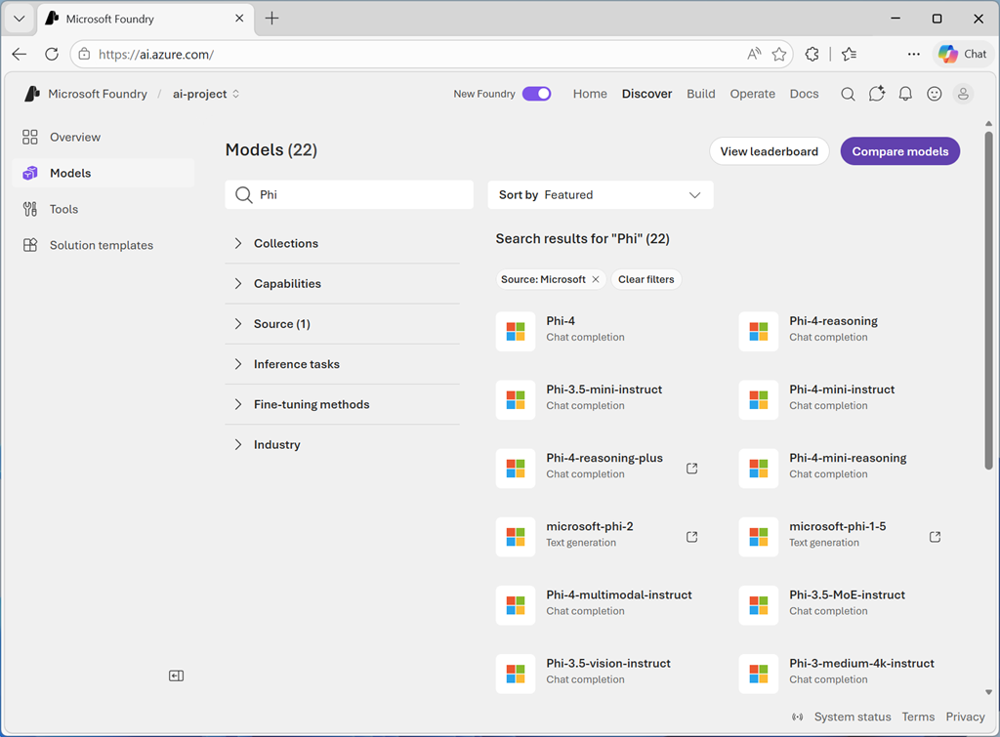
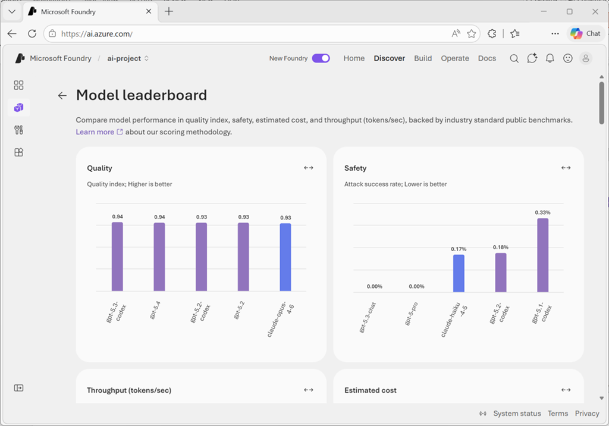
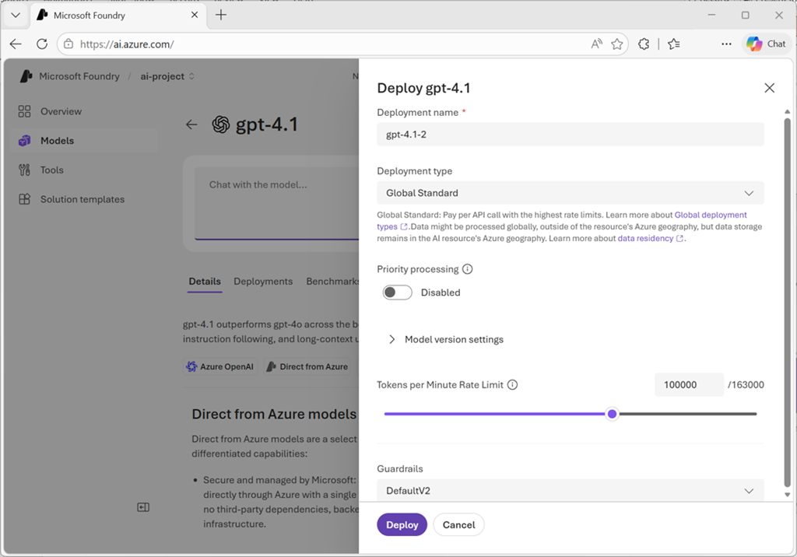
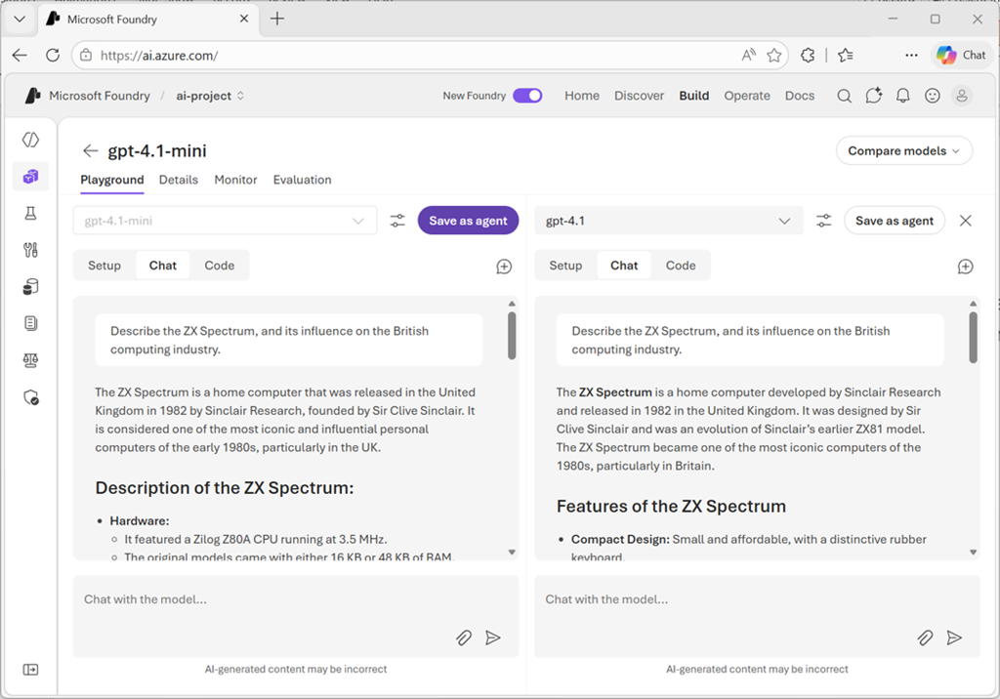
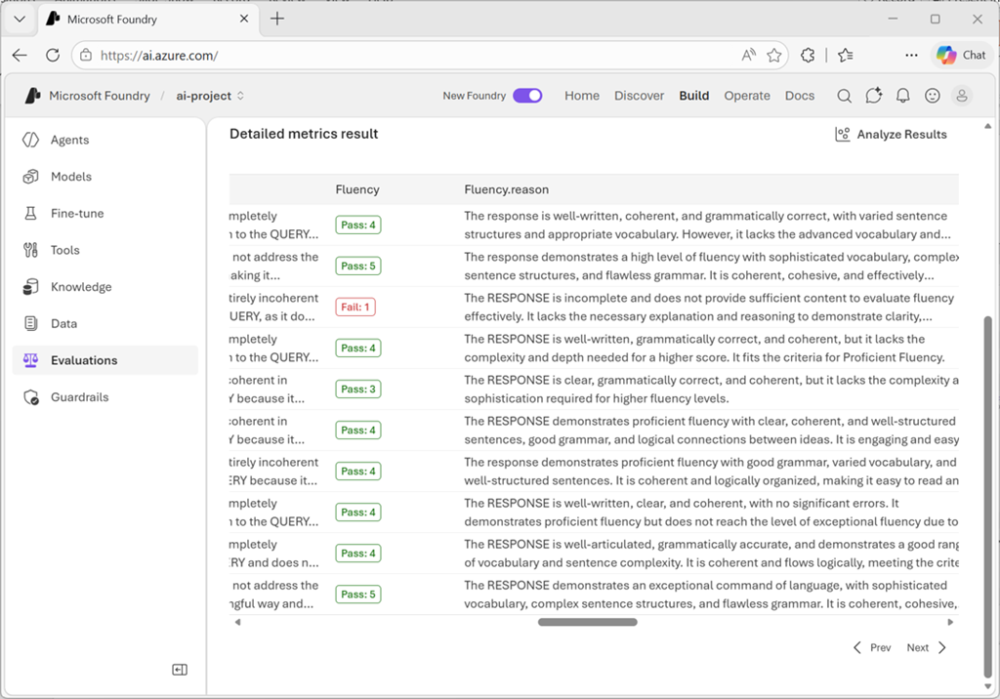

# Select, deploy, and evaluate Microsoft Foundry models

**Module:** model-catalog-evaluate  
**Source:** https://learn.microsoft.com/en-us/training/modules/model-catalog-evaluate/

## Learning objectives

By the end of this module, you'll be able to:

- Explore and filter models in the model catalog
- Compare models using benchmark metrics for quality, safety, cost, and performance
- Deploy a model to an endpoint and test it in the playground
- Evaluate model performance using manual and automated approaches
- Understand different evaluation metrics and when to use them

## Prerequisites

Before starting this module, you should be familiar with fundamental AI concepts and services in Azure.

---

## Introduction

Building effective generative AI applications requires selecting the right foundation model for your specific use case. With thousands of models available, you need a structured approach to discover, compare, deploy, and validate that a model meets your requirements.

Consider a scenario where you're building an AI-powered customer support chatbot for a retail company. You need to select a language model that can understand customer questions, provide accurate responses, and maintain appropriate tone and safety standards. But how do you choose from the vast catalog of available models? How do you know if a model performs well for your specific needs? And once deployed, how do you measure and improve its performance?

The Microsoft Foundry portal provides a comprehensive platform for this entire workflow. You can explore over 1,900 models from providers like Microsoft, Anthropic, OpenAI, Meta, and Hugging Face. You can compare models using industry-standard benchmarks for quality, safety, cost, and performance. After selecting a model, you deploy it to an endpoint where your application can consume it. Finally, you evaluate the model's performance using both automated metrics and manual testing to ensure it meets your quality and safety requirements.

> **Note:** We recognize that different people like to learn in different ways. The text below contains greater detail than the video presentations and serves as the authoritative reference.

---

## Explore the model catalog

The Foundry Models catalog serves as your central hub for discovering and comparing AI models. With over 1,900 models available from various providers, you need effective ways to filter and find models that match your specific requirements.

The model catalog includes two broad categories of model:

- **Foundry Models sold directly by Azure**

    These models are billed directly through your Azure subscription, and include Azure OpenAI models as well as models from Microsoft and other providers.
- **Foundry Models from partners and community**

    These models are provided by trusted partners and the community; each with their own licensing and pricing.

### Finding models in the model catalog

The model catalog user interface in the Foundry Portal provides an easy way to search for the right model for your needs. Each model has a *model card* showing its key information; including the provider, capabilities, benchmark metrics, responsible AI considerations, and deployment options.

You can search for models by keyword, and you can filter based on the following attributes:

- **Collection**: Models are organized into collections, such as models that are provided directly in Azure, or models in the Hugging Face repository.
- **Capabilities**: Specific model abilities, including *reasoning* (complex problem-solving), *tool calling* (API and function integration), or *multimodal processing* (text, images, audio).
- **Source**: The model provider, including Azure OpenAI, Microsoft, Cohere, Mistral, Meta, Anthropic, and others.
- **Inference tasks**: Specific tasks like text generation, summarization, translation, image-generation, speech synthesis, or other common AI tasks.
- **Fine-tuning methods**: Supported techniques for fine-tuning a model.
- **Industry**: Models trained on industry-specific datasets. These specialized models often outperform general-purpose models in their respective domains.

### Understand generative AI model types

As you explore the catalog, you encounter different categories of models designed for various use cases. In broad terms, you can categorize language models as:

- **Large Language Models (LLMs)** like GPT-5, Mistral Large, and Llama 3 70B that are designed for tasks requiring deep reasoning, complex content generation, and extensive context understanding. These models excel at sophisticated applications but require more computational resources.
- **Small Language Models (SLMs)** like Phi-4, Mistral OSS models, and Llama 3 8B that offer efficiency and cost-effectiveness while handling common natural language processing tasks. They're ideal for scenarios where speed and cost matter more than handling the most complex reasoning tasks. SLMs can run on lower-end hardware or edge devices.

#### Chat completion and reasoning models

Most language models in the catalog are **chat completion** models designed to generate coherent, contextually appropriate text responses. These models power conversational interfaces and content generation applications.

For scenarios requiring higher performance in complex tasks like mathematics, coding, science, strategy, and logistics, **reasoning models** like Claude Opus 4.6 provide enhanced problem-solving capabilities. These models can break down complex problems and show their reasoning process.

#### Specialized models

The catalog also includes task-specific models:

**Embedding models** like Ada and Cohere convert text into numerical representations. These models enable semantic search, recommendation systems, and Retrieval Augmented Generation (RAG) scenarios where you need to find relevant information based on meaning rather than exact keyword matches.

**Image generation models** like GPT-image-1 create images from text descriptions. Use these for generating marketing materials, illustrations, or design mockups.

**Video generation models** like Sora 2 create video content from text descriptions.

**Image analysis models** like GPT-4.1 can accept *multimodal* input, including text and images; and generate natural language output based on prompts that include images for analysis.

**Text to speech models** like GPT-4o-tts can convert text-based input to synthesized speech.

**Speech to text models** like GPT-4o-transcribe can convert audio data containing speech into text transcriptions.

#### Regional and domain-specific models

Some models are optimized for specific languages, regions, or industries. When you need specialized performance in a particular domain or language, these models often outperform general-purpose alternatives. Examples include models trained on medical literature, legal documents, or specific language corpora.

---

## Select models using benchmarks

Before deploying a model, you want to understand how it performs across different dimensions. Model benchmarks provide objective, measurable data to help you compare models and make informed selection decisions. The Microsoft Foundry portal offers comprehensive benchmarking tools organized into quality, safety, cost, and performance metrics.

### Access model benchmarks

You can explore benchmarks in two ways within the Microsoft Foundry portal:

In the **model catalog**, view the **Model leaderboard** to see comparative rankings across all available models. This view helps you identify top-performing models for specific metrics or scenarios. The leaderboard displays top models ranked by quality, safety, estimated cost, and throughput.

For detailed benchmarks on a specific model, open its model card and select the **Benchmarks** tab. This view shows how the individual model performs across various metrics and datasets, with comparison charts placing it relative to similar models.

### Quality benchmarks

Quality benchmarks assess how well a model generates accurate, coherent, and contextually appropriate responses. These metrics use public datasets and standardized evaluation methods to ensure consistency.

The **Quality index** provides a high-level overview by averaging accuracy scores across multiple benchmark datasets that measure reasoning, knowledge, question answering, mathematical capabilities, and coding skills. Higher quality index values indicate stronger overall performance across general-purpose language tasks.

Quality benchmarks use datasets such as:

- **Arena-Hard** - adversarial question answering
- **BIG-Bench Hard** - reasoning capabilities
- **GPQA** - graduate-level multi-discipline questions
- **HumanEval+** and **MBPP+** - code generation tasks
- **MATH** - mathematical reasoning
- **MMLU-Pro** - general knowledge assessment
- **IFEval** - instruction following

Benchmark scores are normalized indexes ranging from zero to one, where higher values indicate better performance.

### Safety benchmarks

Safety metrics ensure models don't generate harmful, biased, or inappropriate content. These benchmarks are crucial for applications exposed to end users, especially in regulated industries or customer-facing scenarios.

Microsoft Foundry evaluates models across multiple safety dimensions:

**Harmful behavior detection** uses the HarmBench benchmark to measure how well models resist generating unsafe content. The evaluation calculates **Attack Success Rate (ASR)**, where lower values indicate safer, more robust models. HarmBench tests three functional areas:

- **Standard harmful behaviors** - cybercrime, illegal activities, general harm
- **Contextually harmful behaviors** - misinformation, harassment, bullying
- **Copyright violations** - reproducing copyrighted material

**Toxic content detection** uses the ToxiGen dataset to measure how well models identify adversarial and implicit hate speech. Higher F1 scores indicate better detection performance across references to minority groups.

**Sensitive domain knowledge** uses the WMDP (Weapons of Mass Destruction Proxy) benchmark to measure model knowledge in biosecurity, cybersecurity, and chemical security. Higher WMDP scores indicate more knowledge of potentially dangerous capabilities.

Safety scores help you understand model robustness, especially important for customer-facing applications where harmful output poses significant concerns.

### Cost benchmarks

Understanding the financial impact of model usage helps you balance quality requirements with budget constraints. Cost benchmarks in Microsoft Foundry display pricing for serverless API deployments and Azure OpenAI models.

**Cost per input tokens** shows the price for processing 1 million input tokens (the text you send to the model).

**Cost per output tokens** indicates the price for generating 1 million output tokens (the text the model produces).

**Estimated cost** combines input and output costs using a typical 3:1 ratio (three input tokens for every output token), giving you a single number for comparison. Lower values indicate more cost-effective models.

Cost benchmarks help you identify models that deliver the quality you need at a price point that fits your application's usage patterns and budget.

### Performance benchmarks

Performance metrics measure how quickly and efficiently models respond to requests. These benchmarks matter for real-time applications where user experience depends on responsiveness.

**Latency** measurements include:

- **Latency mean** - average time in seconds to process a request
- **Latency P50** (median) - 50% of requests complete faster than this time
- **Latency P90** - 90% of requests complete faster than this time
- **Latency P95** - 95% of requests complete faster than this time
- **Latency P99** - 99% of requests complete faster than this time
- **Time to first token (TTFT)** - time until the first token arrives when using streaming

**Throughput** measurements include:

- **Generated tokens per second (GTPS)** - output tokens generated per second
- **Total tokens per second (TTPS)** - combined input and output tokens processed per second
- **Time between tokens** - interval between receiving consecutive tokens

The leaderboard summarizes performance using mean time to first token (lower is better) and mean generated tokens per second (higher is better). High-throughput, low-latency models provide better user experiences in interactive applications. For batch processing jobs where speed matters less than cost, you can prioritize other factors.

### Use leaderboards and comparison features

The model leaderboard lets you view top models for specific metrics. You can sort by quality, safety, estimated cost, and throughput to identify models that best match your requirements.

**Scenario leaderboards** help you find models optimized for specific use cases like reasoning, coding, math, question answering, or groundedness. If your application maps to a particular scenario, start with the relevant scenario leaderboard rather than relying solely on overall quality index.

**Trade-off charts** display two metrics simultaneously, such as quality versus cost or quality versus throughput. These visualizations help you find the optimal balance for your requirements. Use the dropdown to compare quality against cost, throughput, or safety. Models closer to the top-right corner of the chart perform well on both metrics. A model that's slightly less accurate but significantly faster or cheaper might better serve your needs.

**Side-by-side comparison** lets you select two or three models from the leaderboard and compare them across multiple dimensions:

- Performance benchmarks (quality, safety, throughput)
- Model details (context window, training data, supported languages)
- Supported endpoints (deployment options)
- Feature support (function calling, structured output, vision)

Select models by checking boxes next to their names, then choose **Compare** to open the detailed comparison view.

---

## Deploy models to endpoints

After selecting a model from the catalog, you deploy it to make it accessible through endpoints that your applications can use. The Microsoft Foundry portal guides you through the deployment process and provides tools to test your deployed model immediately.

### Understand deployment types

Microsoft Foundry supports several deployment types, each offering different characteristics for data residency, scaling, and billing:

| Deployment type | Data zone | Billing | Best for |
|---|---|---|---|
| **Global Standard** | Any Azure region | Pay-per-token | General workloads; highest quota |
| **Global Provisioned** | Any Azure region | Reserved PTUs | Predictable high-throughput |
| **Global Batch** | Any Azure region | Pay-per-token (50% discount) | Large async jobs within 24 h |
| **Data Zone Standard** | EU/US data zone | Pay-per-token | EU/US data zone compliance |
| **Data Zone Provisioned** | EU/US data zone | Reserved PTUs | Predictable throughput within zone |
| **Data Zone Batch** | EU/US data zone | Per-token (discounted) | Large async jobs within data zone |
| **Standard** | Single region | Pay-per-token | Regional residency or low-volume |
| **Regional Provisioned** | Single region | Reserved PTUs | Reserved capacity in one region |
| **Developer** | Any Azure region | Pay-per-token | Fine-tuned model evaluation only |

Each model in the catalog indicates which deployment types it supports. The portal automatically selects the best deployment option based on your environment and model requirements. **Global Standard deployments in Foundry resources should be used whenever possible for maximum capabilities.**

### Deploy a model

To deploy a model from the Microsoft Foundry portal:

1. Navigate to the model you selected in the **Model catalog**. From the Foundry portal homepage, select **Discover** in the navigation, then **Models** in the left pane. Open the model card to review its specifications and supported deployment types.

2. Select **Deploy** to begin the deployment process. You can choose:
   - **Default settings** to deploy quickly with recommended configurations
   - **Custom settings** to customize your deployment options

3. If the model requires an Azure Marketplace subscription (common for models from partners and the community), you see terms of use. Review these terms and select **Agree and Proceed** to accept them. Models sold directly by Azure, such as Azure OpenAI models like GPT-4o-mini, don't require marketplace subscriptions.

4. Configure your deployment settings:
   - **Deployment name**: By default, the system uses the model name. You can modify this to create meaningful names for multiple deployments of the same model. During inference, your code uses this deployment name in the `model` parameter to route requests.
   - **Deployment type**: The portal automatically selects the appropriate deployment type based on the model and your environment.

5. For managed compute deployments, also configure:
   - **Virtual machine SKU**: Choose from supported VM types. You need Azure Machine Learning compute quota for the selected SKU in your subscription.
   - **Instance count**: Specify how many instances to deploy for load distribution and redundancy.

6. Select **Deploy**. When deployment completes, you land on the Foundry Playground where you can interactively test the model. Verify that the deployment status shows **Succeeded** in your deployment list.

### Manage deployed models

After deployment, you manage your models from the **Build** section in the Microsoft Foundry portal. Select **Build** in the navigation, then **Models** in the left pane to see the list of deployments in your resource.

From the deployment list, select a specific model to view its details:

- Deployment configuration and status
- Endpoint URL for API access
- Authentication keys or tokens
- Monitoring and usage metrics
- Option to adjust deployment settings or delete the deployment

### Test in the playground

The Microsoft Foundry portal includes interactive playgrounds where you test deployed models immediately, without writing code. After deployment completes, you automatically land in the playground, or you can select a deployment from your models list to open the playground.

In the chat interface:

- Enter prompts in the message box and observe responses.
- Experiment with different types of prompts to test various capabilities: simple questions, complex multi-step reasoning, requests for specific formats, edge-cases.
- Adjust **system messages** to guide model behavior (e.g., "respond as a customer service representative").
- Modify parameters like **temperature** (creativity vs. consistency), **max tokens** (response length limits), and **top-p** (nucleus sampling).
- Select the **Code** tab to see examples of how to call your deployed model programmatically in Python, C#, or JavaScript.

### Access models programmatically

When integrating the model into your application, you need three key pieces of information:

| Item | Description |
|---|---|
| **Endpoint URL** | API endpoint where your app sends requests. Supports project endpoints (Foundry-specific) and OpenAI v1 endpoints (broad compatibility). |
| **Authentication key** | Secret key/token for authenticating requests. Microsoft Entra ID authentication recommended for production. |
| **Deployment name** | Name specified during deployment; used in the `model` parameter of API requests. |

---

## Evaluate model performance

Evaluating your deployed model ensures it meets quality standards, provides accurate responses, and continuously improves over time. The Microsoft Foundry portal offers multiple approaches to evaluation, from manual testing to automated metrics and comprehensive evaluation flows.

### Why evaluate models

Evaluation serves several critical purposes in generative AI application development:

**Quality assurance** identifies issues and ensures your model provides accurate, relevant responses. Discovering problems during evaluation rather than production protects your users and your organization's reputation.

**User satisfaction** improves when models consistently deliver helpful, appropriate responses. Evaluation helps you understand how users experience your application and where improvements make the biggest impact.

**Continuous improvement** comes from analyzing evaluation results to identify enhancement opportunities. Regular evaluation as you update prompts, add features, or retrain models ensures ongoing quality.

**Compliance and safety** verification confirms your model adheres to policies, avoids generating harmful content, and respects user privacy and data protection requirements.

### Manual evaluation approaches

Manual evaluation involves human reviewers assessing model responses. While time-intensive, manual evaluation provides insights automated metrics can't capture.

**Interactive testing** in the playground lets you explore model behavior qualitatively. You enter diverse prompts, observe responses, and note issues like incorrect information, inappropriate tone, or failure to follow instructions. You can test models side by side in the playground, synchronizing system instructions and prompts to compare their responses.

**Structured review** involves creating a set of test cases representing your application's use cases. Human evaluators rate responses based on criteria like:

- **Relevance**: Does the response address the question or request?
- **Informativeness**: Does it provide sufficient detail and useful information?
- **Engagement**: Is the response interesting and appropriately conversational?
- **Accuracy**: Are facts and statements correct?
- **Safety**: Does the response avoid harmful, biased, or inappropriate content?

Evaluators typically use rating scales (such as 1–5) for each criterion. Aggregate ratings across multiple test cases provide quantitative measures of overall quality.

**User studies** collect feedback from actual or representative users interacting with your application. User feedback reveals real-world issues you might miss in controlled testing, such as confusing phrasing, missing context, or unmet expectations.

Manual evaluation complements automated approaches by capturing subjective quality aspects like user satisfaction, contextual appropriateness, and brand alignment that metrics alone can't measure.

### Automated evaluation metrics

Automated evaluation uses standard metrics to assess your model's outputs automatically. These evaluations scale efficiently and provide consistent, objective measurements.

The Microsoft Foundry portal supports several categories of evaluation metrics:

#### Generation quality metrics

| Metric | What it measures |
|---|---|
| **Groundedness** | Whether responses are based on provided context rather than speculation. Groundedness Pro offers binary assessment (grounded / not grounded). |
| **Relevance** | Whether responses address the user's question or request appropriately. |
| **Coherence** | Whether responses flow logically and maintain consistent ideas. |
| **Fluency** | Linguistic correctness and natural language quality. |

#### Risk and safety metrics

| Metric | What it detects |
|---|---|
| **Self-harm content** | Responses discussing or encouraging self-harm |
| **Hateful and unfair content** | Bias, discrimination, or hateful statements |
| **Violent content** | Responses containing or promoting violence |
| **Sexual content** | Inappropriate sexual content |
| **Protected material** | Potential copyright or proprietary content reproduction |
| **Indirect attack (jailbreak)** | Vulnerability to manipulation attempts |

For content harm metrics, results aggregate as **defect rate** — the percentage of responses exceeding a severity threshold (typically Medium). For protected material and indirect attack, defect rate = `(true instances / total instances) × 100`.

When using AI-assisted evaluation, you specify a GPT model to perform the assessment. This evaluator model analyzes your deployed model's responses and assigns scores based on the selected criteria.

### Natural language processing metrics

NLP metrics provide mathematical-based evaluation without requiring an evaluator model. These metrics often need **ground truth data** — expected or correct responses for comparison.

| Metric | Description | Best for |
|---|---|---|
| **F1-score** | Ratio of shared words between generated and ground truth answers; balances precision and recall. | Text classification, information retrieval |
| **BLEU** | Compares n-grams between generated and reference texts. | Machine translation |
| **METEOR** | Extends BLEU with synonyms, stemming, and paraphrasing. | More flexible translation evaluation |
| **ROUGE** | Emphasizes recall — covering key points matters more than avoiding extra words. | Summarization |
| **GLEU** | Variant of BLEU for sentence-level evaluation. | Sentence-level tasks |

NLP metrics work well when you have definitive correct answers or reference texts. They're less suitable for open-ended generation where many valid responses exist.

### Create comprehensive evaluations

The Microsoft Foundry portal's **Evaluation** feature lets you run systematic evaluations using test datasets and multiple metrics simultaneously.

You can base your evaluation on one of the following:

- **Model**: Evaluate a deployed model with prompts you specify. The system generates outputs during evaluation.
- **Agent**: Evaluate an agent's responses with user-defined prompts.
- **Dataset**: Evaluate pre-generated outputs already present in your test dataset.

When evaluating a model or agent, you need a dataset to provide inputs for assessment. You have three options:

- **Upload new dataset**: Provide a CSV or JSONL file containing test cases from your local storage.
- **Use existing dataset**: Select from datasets you've previously uploaded to your project.
- **Generate synthetic dataset**: If you lack test data, the system can generate sample data based on a topic description you provide. You specify the resource to generate data, the number of rows, and a prompt describing the desired data. You can also upload files to improve relevance to your specific task.

After configuring metrics, field mappings, and system prompt, you start the evaluation job — which runs asynchronously, processing each row in your test dataset against the selected metrics.

#### Review evaluation results

When evaluation completes, the results show aggregate scores for the metrics you selected and details of each test prompt.

### Explore the evaluator library

The **Evaluator library** provides a centralized location to view and manage all available evaluators. Access it from your project's **Evaluation** page by selecting the **Evaluator library** tab.

In the evaluator library, you can:

- View Microsoft-curated evaluators for quality, safety, and performance
- Examine evaluator details including name, description, parameters, and associated files
- Review annotation prompts for quality evaluators to understand how metrics are calculated
- Check definitions and severity levels for safety evaluators
- Manage custom evaluators you've created for specific scenarios

The library supports version management, letting you compare different versions, restore previous versions if needed, and collaborate with others on custom evaluators.

### Iterate based on evaluation

Evaluation results inform your next steps:

**When scores are lower than required, consider (in order of complexity/cost):**

1. **Prompt engineering**: Refining instructions and system messages
2. **Different models**: Trying models optimized for your use case
3. **RAG integration**: Adding retrieval capabilities to ground responses in your data
4. **Fine-tuning**: Training the model on your specific domain (if supported)

**When safety metrics show concerns:**

- **Content filters**: Implementing Azure AI Content Safety services
- **Prompt hardening**: Adding safety instructions to system messages
- **Output validation**: Checking responses before displaying to users

Regular evaluation as you make changes tracks improvements and ensures quality doesn't regress. Establish evaluation benchmarks early in development, then re-run evaluations after modifications to measure impact objectively.

---

## Summary

In this module, you explored the complete workflow for selecting, deploying, and evaluating Foundry Models.

### Key takeaways

The Microsoft Foundry portal's **model catalog** provides access to over 1,900 models from providers including Microsoft, OpenAI, Meta, Mistral, and Hugging Face. Effective filtering by collection, capabilities, deployment options, and other attributes helps you narrow the catalog to models matching your requirements.

**Model benchmarks** offer objective comparisons across quality, safety, cost, and performance dimensions. Quality metrics like accuracy, coherence, and fluency assess how well models generate appropriate responses. Safety metrics identify risks around harmful content. Cost benchmarks help balance quality with budget constraints. Performance metrics like latency and throughput indicate responsiveness for real-time applications.

**Deployment options** include serverless API for pay-per-call flexibility, provisioned deployments for consistent high-volume workloads, managed compute for VM-based hosting, and batch processing for cost-optimized non-interactive jobs. Each option offers different characteristics for scaling, billing, and control.

**Testing in the playground** provides immediate feedback on model behavior without writing code. You can experiment with prompts, adjust parameters, and observe responses to understand model capabilities before integrating into applications.

**Evaluation approaches** range from manual testing to automated metrics. Manual evaluation captures subjective quality aspects like user satisfaction and contextual appropriateness. AI-assisted metrics assess generation quality and safety risks automatically. NLP metrics like F1-score and ROUGE provide mathematical comparison against ground truth data.

**Comprehensive evaluation flows** in the Microsoft Foundry portal let you run systematic assessments using test datasets and multiple metrics. Results identify strengths, weaknesses, and areas requiring improvement, guiding iterative development of your generative AI applications.

---

## Exercise / Lab

Hands-on lab: [02-model-catalog-evaluation.md](../../../labs/mslearn-ai-studio/Instructions/Exercises/02-model-catalog-evaluation.md)
