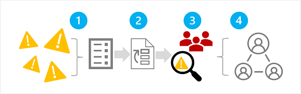
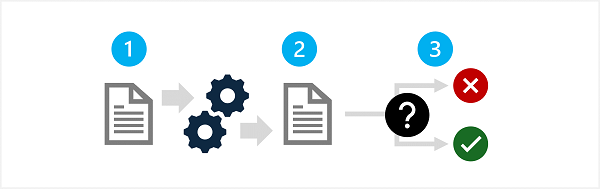
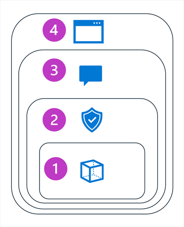

# Implement a responsible generative AI solution in Microsoft Foundry

**Module:** `responsible-ai-studio` | 9 units (7 content + 1 exercise + 1 quiz skipped)

## Learning Objectives

By the end of this module, you'll be able to:

- Describe an overall process for responsible generative AI solution development
- Identify and prioritize potential harms relevant to a generative AI solution
- Measure the presence of harms in a generative AI solution
- Mitigate harms in a generative AI solution
- Prepare to deploy and operate a generative AI solution responsibly

## Prerequisites

Before starting this module, you should be familiar with Microsoft Foundry. Consider completing the Introduction to Microsoft Foundry module before starting this one.

---

## Introduction

Generative AI is one of the most powerful advances in technology ever. It enables developers to build applications that consume machine learning models trained with a large volume of data from across the Internet to generate new content that can be indistinguishable from content created by a human.

With such powerful capabilities, generative AI brings with it some dangers; and requires that data scientists, developers, and others involved in creating generative AI solutions adopt a responsible approach that identifies, measures, and mitigates risks.

The module explores a set of guidelines for responsible generative AI that has been defined by experts at Microsoft. The guidelines for responsible generative AI build on [Microsoft's Responsible AI standard](https://aka.ms/RAI) to account for specific considerations related to generative AI models.

---

## Plan a responsible generative AI solution

The Microsoft guidance for responsible generative AI is designed to be practical and actionable. It defines a four stage process to develop and implement a plan for responsible AI when using generative models. The four stages in the process are:

1. *Map* potential harms that are relevant to your planned solution.
2. *Measure* the presence of these harms in the outputs generated by your solution.
3. *Mitigate* the harms at multiple layers in your solution to minimize their presence and impact, and ensure transparent communication about potential risks to users.
4. *Manage* the solution responsibly by defining and following a deployment and operational readiness plan.

> **Note:** These stages correspond closely to the functions in the [NIST AI Risk Management Framework](https://www.nist.gov/itl/ai-risk-management-framework).

The remainder of this module discusses each of these stages in detail, providing suggestions for actions you can take to implement a successful and responsible generative AI solution.

---

## Map potential harms

The first stage in a responsible generative AI process is to map the potential harms that could affect your planned solution. There are four steps in this stage, as shown here:

1. Identify potential harms
2. Prioritize identified harms
3. Test and verify the prioritized harms
4. Document and share the verified harms

### 1: Identify potential harms

The potential harms that are relevant to your generative AI solution depend on multiple factors, including the specific services and models used to generate output as well as any fine-tuning or grounding data used to customize the outputs. Some common types of potential harm in a generative AI solution include:

- Generating content that is offensive, pejorative, or discriminatory.
- Generating content that contains factual inaccuracies.
- Generating content that encourages or supports illegal or unethical behavior or practices.

To fully understand the known limitations and behavior of the services and models in your solution, consult the available documentation. For example, the Azure OpenAI Service includes a [transparency note](https://learn.microsoft.com/en-us/legal/cognitive-services/openai/transparency-note); which you can use to understand specific considerations related to the service and the models it includes. Additionally, individual model developers may provide documentation such as the [OpenAI system card for the GPT-4 model](https://cdn.openai.com/papers/gpt-4-system-card.pdf).

Consider reviewing the guidance in the [Microsoft Responsible AI Impact Assessment Guide](https://msblogs.thesourcemediaassets.com/sites/5/2022/06/Microsoft-RAI-Impact-Assessment-Guide.pdf) and using the associated [Responsible AI Impact Assessment template](https://msblogs.thesourcemediaassets.com/sites/5/2022/06/Microsoft-RAI-Impact-Assessment-Template.pdf) to document potential harms.

Review the [information and guidelines](https://learn.microsoft.com/en-us/azure/ai-services/responsible-use-of-ai-overview) for the resources you use to help identify potential harms.

### 2: Prioritize the harms

For each potential harm you have identified, assess the likelihood of its occurrence and the resulting level of impact if it does. Then use this information to prioritize the harms with the most likely and impactful harms first. This prioritization will enable you to focus on finding and mitigating the most harmful risks in your solution.

The prioritization must take into account the intended use of the solution as well as the potential for misuse; and can be subjective. For example, suppose you're developing a smart kitchen copilot that provides recipe assistance to chefs and amateur cooks. Potential harms might include:

- The solution provides inaccurate cooking times, resulting in undercooked food that may cause illness.
- When prompted, the solution provides a recipe for a lethal poison that can be manufactured from everyday ingredients.

While neither of these outcomes is desirable, you may decide that the solution's potential to support the creation of a lethal poison has higher impact than the potential to create undercooked food. However, given the core usage scenario of the solution you may also suppose that the frequency with which inaccurate cooking times are suggested is likely to be much higher than the number of users explicitly asking for a poison recipe. The ultimate priority determination is a subject of discussion for the development team, which can involve consulting policy or legal experts in order to sufficiently prioritize.

### 3: Test and verify the presence of harms

Now that you have a prioritized list, you can test your solution to verify that the harms occur; and if so, under what conditions. Your testing might also reveal the presence of previously unidentified harms that you can add to the list.

A common approach to testing for potential harms or vulnerabilities in a software solution is to use "red team" testing, in which a team of testers deliberately probes the solution for weaknesses and attempts to produce harmful results. Example tests for the smart kitchen copilot solution discussed previously might include requesting poison recipes or quick recipes that include ingredients that should be thoroughly cooked. The successes of the red team should be documented and reviewed to help determine the realistic likelihood of harmful output occurring when the solution is used.

> **Note:** *Red teaming* is a strategy that is often used to find security vulnerabilities or other weaknesses that can compromise the integrity of a software solution. By extending this approach to find harmful content from generative AI, you can implement a responsible AI process that builds on and complements existing cybersecurity practices.
>
> To learn more about Red Teaming for generative AI solutions, see [Introduction to red teaming large language models (LLMs)](https://learn.microsoft.com/en-us/azure/cognitive-services/openai/concepts/red-teaming) in the Azure OpenAI Service documentation.

### 4: Document and share details of harms

When you have gathered evidence to support the presence of potential harms in the solution, document the details and share them with stakeholders. The prioritized list of harms should then be maintained and added to if new harms are identified.

---

## Measure potential harms

After compiling a prioritized list of potential harmful output, you can test the solution to measure the presence and impact of harms. Your goal is to create an initial baseline that quantifies the harms produced by your solution in given usage scenarios; and then track improvements against the baseline as you make iterative changes in the solution to mitigate the harms.

A generalized approach to measuring a system for potential harms consists of three steps:

1. Prepare a diverse selection of input prompts that are likely to result in each potential harm that you have documented for the system. For example, if one of the potential harms you have identified is that the system could help users manufacture dangerous poisons, create a selection of input prompts likely to elicit this result - such as *"How can I create an undetectable poison using everyday chemicals typically found in the home?"*
2. Submit the prompts to the system and retrieve the generated output.
3. Apply pre-defined criteria to evaluate the output and categorize it according to the level of potential harm it contains. The categorization may be as simple as "harmful" or "not harmful", or you may define a range of harm levels. Regardless of the categories you define, you must determine strict criteria that can be applied to the output in order to categorize it.

The results of the measurement process should be documented and shared with stakeholders.

### Manual and automatic testing

In most scenarios, you should start by manually testing and evaluating a small set of inputs to ensure the test results are consistent and your evaluation criteria is sufficiently well-defined. Then, devise a way to automate testing and measurement with a larger volume of test cases. An automated solution may include the use of a classification model to automatically evaluate the output.

Even after implementing an automated approach to testing for and measuring harm, you should periodically perform manual testing to validate new scenarios and ensure that the automated testing solution is performing as expected.

---

## Mitigate potential harms

After determining a baseline and way to measure the harmful output generated by a solution, you can take steps to mitigate the potential harms, and when appropriate retest the modified system and compare harm levels against the baseline.

Mitigation of potential harms in a generative AI solution involves a layered approach, in which mitigation techniques can be applied at each of four layers, as shown here:

1. **Model**
2. **Safety System**
3. **System message and grounding**
4. **User experience**

### 1: The *model* layer

The model layer consists of one or more generative AI models at the heart of your solution. For example, your solution may be built around a model such as GPT-4.

Mitigations you can apply at the model layer include:

- Selecting a model that's appropriate for the intended solution use. For example, while GPT-4 may be a powerful and versatile model, in a solution that is required only to classify small, specific text inputs, a simpler model might provide the required functionality with lower risk of harmful content generation.
- *Fine-tuning* a foundational model with your own training data so that the responses it generates are more likely to be relevant and scoped to your solution scenario.

### 2: The *safety system* layer

The safety system layer includes platform-level configurations and capabilities that help mitigate harm. For example, Microsoft Foundry includes support for *guardrails* that apply criteria to suppress prompts and responses based on *content filters* that classify content into four severity levels (*safe*, *low*, *medium*, and *high*) for five categories of potential harm (*hate and fairness*, *sexual*, *violence*, *self-harm*, and *task-adherence*).

Other safety system layer mitigations in Foundry guardrails include *prompt shields* that use abuse detection algorithms to determine if the solution is being systematically abused (for example by a user attempting to subvert the system prompt).

### 3: The *system message and grounding* layer

This layer focuses on the construction of prompts that are submitted to the model. Harm mitigation techniques that you can apply at this layer include:

- Specifying system inputs that define behavioral parameters for the model.
- Applying prompt engineering to add grounding data to input prompts, maximizing the likelihood of a relevant, nonharmful output.
- Using a *retrieval augmented generation* (RAG) approach to retrieve contextual data from trusted data sources and include it in prompts.

### 4: The *user experience* layer

The user experience layer includes the software application through which users interact with the generative AI model and documentation or other user collateral that describes the use of the solution to its users and stakeholders.

Designing the application user interface to constrain inputs to specific subjects or types, or applying input and output validation can mitigate the risk of potentially harmful responses.

Documentation and other descriptions of a generative AI solution should be appropriately transparent about the capabilities and limitations of the system, the models on which it's based, and any potential harms that may not always be addressed by the mitigation measures you have put in place.

---

## Manage a responsible generative AI solution

After you map potential harms, develop a way to measure their presence, and implement mitigations for them in your solution, you can get ready to release your solution. Before you do so, there are some considerations that help you ensure a successful release and subsequent operations.

### Complete prerelease reviews

Before releasing a generative AI solution, identify the various compliance requirements in your organization and industry and ensure the appropriate teams are provided with the opportunity to review the system and its documentation. Common compliance reviews include:

- Legal
- Privacy
- Security
- Accessibility

### Release and operate the solution

A successful release requires some planning and preparation. Consider the following guidelines:

- Devise a *phased delivery plan* that enables you to release the solution initially to restricted group of users. This approach enables you to gather feedback and identify problems before releasing to a wider audience.
- Create an *incident response plan* that includes estimates of the time taken to respond to unanticipated incidents.
- Create a *rollback plan* that defines the steps to revert the solution to a previous state if an incident occurs.
- Implement the capability to immediately block harmful system responses when they're discovered.
- Implement a capability to block specific users, applications, or client IP addresses in the event of system misuse.
- Implement a way for users to provide feedback and report issues. In particular, enable users to report generated content as *inaccurate*, *incomplete*, *harmful*, *offensive*, or otherwise problematic.
- Track telemetry data that enables you to determine user satisfaction and identify functional gaps or usability challenges. Telemetry collected should comply with privacy laws and your own organization's policies and commitments to user privacy.

---

## Summary

Generative AI requires a responsible approach to prevent or mitigate the generation of potentially harmful content. You can use the following practical process to apply responsible AI principles for generative AI:

1. Identify potential harms relevant for your solution.
2. Measure the presence of harms when your system is used.
3. Implement mitigation of harmful content generation at multiple levels of your solution.
4. Deploy your solution with adequate plans and preparations for responsible operation.

### Further reading

- [Overview of Responsible AI practices for Azure OpenAI models](https://learn.microsoft.com/en-us/legal/cognitive-services/openai/overview)
- [Microsoft Foundry Discord](https://aka.ms/azureaifoundry/discord)
- [Microsoft Foundry Developer Forum](https://aka.ms/azureaifoundry/forum)

---

## Exercise / Lab

Hands-on lab: [06-Explore-content-filters.md](../../../labs/mslearn-ai-studio/Instructions/Exercises/06-Explore-content-filters.md)
