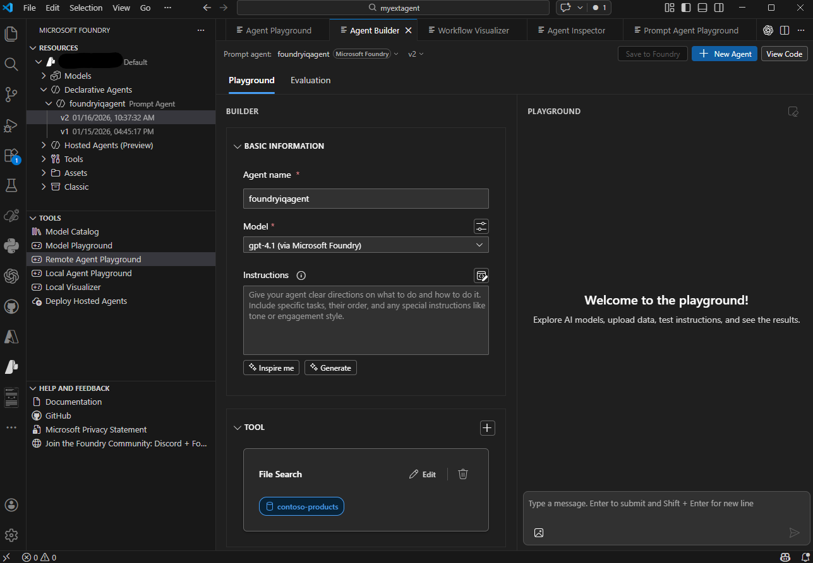

# Develop AI agents with Microsoft Foundry and Visual Studio Code

> **Source module:** `develop-ai-agents-azure-vs-code`
> **URL:** https://learn.microsoft.com/en-us/training/modules/develop-ai-agents-azure-vs-code/
> **Level:** Intermediate | Roles: AI Engineer, Developer, Data Scientist, Solution Architect
> **Services:** Microsoft Foundry, Foundry Agent Service

## Learning objectives

By the end of this module, you'll be able to:

- Describe the purpose and capabilities of AI agents
- Explain the key features of Microsoft Foundry Agent Service
- Set up and configure the Microsoft Foundry extension in Visual Studio Code
- Build and configure AI agents using multiple development approaches
- Extend agent capabilities with tools and functions
- Test agents using integrated playgrounds
- Deploy and integrate agents into applications

## Prerequisites

- Familiarity with Azure and the Azure portal
- An understanding of generative AI (recommended: [Fundamentals of Generative AI](https://learn.microsoft.com/en-us/training/modules/fundamentals-generative-ai/) module)
- Basic familiarity with Visual Studio Code

---

## Introduction

Imagine you work for a healthcare organization that needs to automate patient interactions while maintaining high security standards. You need an AI agent that can handle patient inquiries, schedule appointments, and access real-time medical information. Building such a system traditionally requires extensive infrastructure management, significant coding effort, and careful attention to data security. Microsoft Foundry Agent Service offers a solution that simplifies this complexity while maintaining enterprise-grade security.

Microsoft Foundry Agent Service is a fully managed platform that empowers you to build, deploy, and scale AI agents without managing underlying compute and storage resources. Whether you prefer working through the Foundry portal or developing directly in Visual Studio Code, you have flexible options for creating intelligent agents that automate workflows and enhance user experiences.

In this module, you'll learn how to develop AI agents using both the Foundry portal and the Microsoft Foundry extension for Visual Studio Code. You'll discover how to configure agents with custom instructions, extend their capabilities with tools, and integrate them into your applications. By the end, you'll be able to choose the right development approach for your scenarios and deploy production-ready AI agents.

> **Note:** Different people like to learn in different ways. The module offers both video-based and text-based content; the text contains greater detail.

---

## Understand AI agents and Microsoft Foundry Agent Service

An AI agent is a software service that uses generative AI to understand and perform tasks on behalf of users or other programs. Unlike traditional applications that follow predetermined rules, AI agents can operate independently by understanding context, making decisions, and taking actions to achieve specific goals. These agents combine advanced AI models with specialized tools to create intelligent automation that adapts to various scenarios.

The evolution of generative AI enables agents to behave intelligently on our behalf, transforming how we integrate AI into business processes and applications.

### Why AI agents are useful

AI agents provide significant value across multiple dimensions:

**Automation of routine tasks** - AI agents handle repetitive and mundane activities, freeing human workers to focus on strategic and creative work. This leads to measurable increases in productivity and efficiency.

**Enhanced decision-making** - By processing vast amounts of data and providing insights, AI agents support better decision-making. They can analyze trends, predict outcomes, and offer recommendations based on real-time information. Unlike simple chat models that only generate text, AI agents use advanced algorithms and machine learning to analyze data and make informed decisions autonomously.

**Scalability** - AI agents scale operations without proportional increases in human resources. Organizations can grow their capabilities without significantly increasing operational costs.

**24/7 availability** - Like all software, AI agents operate continuously without breaks, ensuring tasks are completed promptly and services remain available around the clock.

### Examples of AI agent use cases

AI agents have diverse applications across industries:

#### Personal productivity agents

Personal productivity agents assist with daily tasks like scheduling meetings, sending emails, and managing to-do lists. Microsoft 365 Copilot helps users draft documents, create presentations, and analyze data within the Microsoft Office suite.

#### Research agents

Research agents continuously monitor trends, gather data, and generate reports. Financial services use them to track stock performance, healthcare organizations stay updated with medical research, and marketing teams analyze consumer behavior.

#### Sales agents

Sales agents automate lead generation and qualification. They research potential leads, send personalized follow-up messages, and schedule sales calls. This automation lets sales teams focus on closing deals rather than administrative tasks.

#### Customer service agents

Customer service agents handle routine inquiries, provide information, and resolve common issues. Integrated into chatbots on websites or messaging platforms, they offer instant support. For example, Cineplex uses an AI agent to process refund requests, significantly reducing handling time and improving customer satisfaction.

#### Developer agents

Developer agents assist with software development tasks including code review, bug fixing, and repository management. They automatically update codebases, suggest improvements, and ensure coding standards are maintained. GitHub Copilot exemplifies this type of agent.

### Security considerations for AI agents

As AI agents become more autonomous and integrated into enterprise systems, they introduce security considerations beyond traditional application threats. Because agents can access sensitive data, make decisions, and act independently, you must design with security in mind from the start.

Key security risks include:

| **Risk Area** | **Description** | **Example Impact** |
| --- | --- | --- |
| **Data leakage and privacy exposure** | Agents often access sensitive business or user data. Without proper controls, they can unintentionally expose confidential information. | An agent summarizing internal files accidentally includes private data in customer-facing responses. |
| **Prompt injection and manipulation attacks** | Malicious users craft inputs that override an agent's intended behavior, tricking it into revealing data or performing unauthorized actions. | Hidden instructions in a message cause the agent to leak system credentials. |
| **Unauthorized access and privilege escalation** | Weak authentication or access controls let agents, or bad actors controlling them, access systems they shouldn't. | An agent connected to a CRM tool performs admin-level actions like exporting or deleting records. |
| **Data poisoning** | Attackers corrupt training or contextual data, causing agents to make biased, incorrect, or unsafe decisions. | A poisoned dataset causes a customer support agent to recommend harmful content. |
| **Supply chain vulnerabilities** | Agents rely on external APIs, plugins, or model endpoints, expanding the attack surface. | A compromised third-party plugin injects malicious code into the agent's workflow. |
| **Over-reliance on autonomous actions** | Highly autonomous agents may execute unintended actions if not carefully constrained or validated. | An agent mistakenly sends payments or publishes unverified content. |
| **Inadequate auditability and logging** | Without detailed logging, it's difficult to trace actions or detect malicious behavior early. | Security teams can't identify data misuse due to missing activity logs. |
| **Model inversion and output leakage** | Attackers might exploit model outputs to infer sensitive data used during training or prompting. | Repeated queries extract private information from a fine-tuning dataset. |

#### Mitigation strategies

To reduce these risks, adopt a security-by-design approach that includes:

- Enforcing **role-based access controls (RBAC)** and **least privilege** permissions
- Adding **prompt filtering and validation** layers to prevent injection attacks
- Sandboxing or gating sensitive operations behind **human-in-the-loop approvals**
- Maintaining **comprehensive logging and traceability** for all agent actions
- Auditing **third-party dependencies** and integrations regularly
- Continuously retraining and validating models to detect **data drift** or **poisoning attempts**

By embedding these practices early in development, you can deploy AI agents safely and confidently in real-world environments.

### Microsoft Foundry Agent Service overview

Microsoft Foundry Agent Service is a fully managed service designed to empower developers to securely build, deploy, and scale high-quality AI agents without managing underlying compute and storage resources. The service allows you to create agents tailored to your needs through custom instructions and advanced tools.

Previously, creating agent-like experiences required significant coding effort using standard APIs. Microsoft Foundry Agent Service handles the complexity through a streamlined interface, enabling you to build agents via the Foundry portal or in your own applications with fewer than 50 lines of code.

#### Agent types

Microsoft Foundry supports two primary types of agents:

**Declarative agents** - Agents defined through configuration rather than code. Declarative agents come in two forms:

- **Prompt-based agents** - A single agent configured with a model, instructions, tools, and prompts. This is the most common type and the focus of this module.
- **Workflow agents** - Multi-agent orchestrations defined in YAML, enabling complex scenarios where multiple agents collaborate to complete tasks.

**Hosted agents** - Containerized agents that are created and deployed in code, then hosted by the Foundry platform. Hosted agents give you full control over agent logic and execution while the platform manages infrastructure.

Understanding these agent types helps you choose the right approach for your scenarios. This module focuses primarily on declarative prompt-based agents, which provide the most accessible path to getting started.

#### Key features of Microsoft Foundry Agent Service

The service offers several powerful capabilities:

**Automatic tool calling** - The service handles the entire tool-calling lifecycle, including running the model, invoking tools, and returning results. This eliminates complex integration code.

**Securely managed data** - Conversation states are securely managed through the Responses API, removing the need for manual state management.

**Extensive tool catalog** - A rich set of built-in and community tools extends agent capabilities beyond text generation, including code execution, file search, web search, and integrations with Azure services and external APIs.

**Model selection** - Choose from various AI models to match your performance and cost requirements.

**Enterprise-grade security** - The service ensures data privacy and compliance with secure data handling, keyless authentication, and built-in content safety filters.

**Customizable storage solutions** - Use platform-managed storage or bring your own Azure Blob storage for full visibility and control.

**Observability and tracing** - Built-in monitoring capabilities help you track agent behavior, debug issues, and optimize performance in production.

These features provide a streamlined and secure way to build and deploy AI agents compared to developing with the Inference API directly.

---

## Explore development approaches

Microsoft Foundry Agent Service provides flexibility in how you develop agents, with options ranging from visual interfaces to code-centric workflows. Understanding the different development approaches helps you choose the right tools for your scenarios and team preferences.

### Foundry portal development

The Foundry portal provides a web-based interface for creating and managing AI agents without writing code. This approach is ideal when you want to quickly prototype ideas, collaborate with non-technical stakeholders, or manage agents through a centralized interface.

#### When to use the Foundry portal

The portal excels in these scenarios:

- **Quick prototyping** - Rapidly test agent concepts and configurations without setting up development environments
- **Visual configuration** - Configure agents through intuitive forms and dropdowns rather than code
- **Centralized management** - View and manage all agents across projects in one place
- **Team collaboration** - Share agent configurations with stakeholders who prefer visual interfaces
- **Resource oversight** - Monitor token usage, latency, and evaluation outcomes through dashboards

The Azure portal provides immediate access to agent creation without installing additional tools. You simply navigate to your Foundry project, select the Agents section, and start building.

### Visual Studio Code development

The Microsoft Foundry extension for Visual Studio Code brings enterprise-grade AI capabilities directly into your development environment. This approach suits developers who prefer working in familiar code editors and want tight integration with their development workflows.

#### Key capabilities of the VS Code extension

The extension organizes its features into three main sections:

**Resources** - Browse and manage your Foundry project assets directly from VS Code, including:

- **Deployed models** - View and manage model deployments
- **Declarative agents** - View and configure prompt-based and workflow agents
- **Hosted agents** - View and manage containerized, code-deployed agents
- **Connections** - Manage connections to external services
- **Vector stores** - Organize document collections for File Search

**Tools** - Access development and testing capabilities:

- **Model Catalog** - Browse and deploy models from the catalog
- **Model Playground** - Experiment with models directly
- **Agent Playgrounds** - Test agents using remote or local playgrounds
- **Local Visualizer** - Debug and visualize agent behavior locally
- **Deploy Hosted Agents** - Deploy containerized agents to production

**Help and Feedback** - Access documentation and support resources.

The extension also provides a visual **Agent Designer** for configuring agent properties, integrated **code generation** for application integration, and direct **YAML configuration** editing for precise control.



#### When to use Visual Studio Code

The VS Code extension is ideal for:

- **Developer-centric workflows** - Build agents alongside your application code in a single environment
- **Version control integration** - Track agent configurations in Git alongside your codebase
- **Rapid iteration** - Make quick changes and test immediately without switching tools
- **Code-first development** - Edit YAML configurations directly for precise control
- **Local development** - Work on agent designs offline before deploying to Azure

The extension installs directly from the Visual Studio Code Marketplace and connects to your existing Foundry projects.

### Typical development workflow

Regardless of your chosen approach, agent development follows a consistent pattern:

1. **Connect** to your Microsoft Foundry project
2. **Create** an AI agent in the Foundry portal with a descriptive name and purpose
3. **Configure** agent instructions defining its behavior and capabilities (in the portal or VS Code)
4. **Add tools** to extend what the agent can do
5. **Test** the agent using integrated playgrounds
6. **Iterate** on the design based on test results
7. **Deploy** the agent to production
8. **Integrate** the agent into your applications

The Foundry portal and VS Code extension both support this workflow, differing primarily in interface style rather than capabilities.

### Required Azure resources

Both development approaches require the same underlying Azure resources. To develop agents with Microsoft Foundry Agent Service, you need:

- **Microsoft Foundry project** - Organizes your agents, models, and related assets in one place
- **Model deployments** - Deployed AI models (such as GPT-4.1 or Claude Sonnet 4.6) that power your agents

When you create a Microsoft Foundry project, the necessary infrastructure is provisioned automatically. As you add capabilities to your agents, such as File Search or custom tools, the service seamlessly integrates any required supporting services behind the scenes.

#### Optional Azure services

Depending on your agent's capabilities, you might integrate additional Azure services:

- **Azure AI Search** - For advanced knowledge retrieval when using Foundry IQ or File Search tools
- **Azure Storage** - For storing and managing files that agents can access
- **Azure Key Vault** - For securely managing secrets and credentials
- **Azure Functions** - For custom tool implementations and business logic

These services integrate with your Foundry project as needed, but aren't required to get started building agents.

### Choosing your development approach

Both the Foundry portal and Visual Studio Code extension provide complete agent development capabilities. Your choice depends on your workflow preferences, team composition, and integration requirements:

Choose the **Foundry portal** when you want visual configuration, centralized management, or quick prototyping without local development setup.

Choose **Visual Studio Code** when you prefer developer-centric workflows, need tight integration with application code, or want version-controlled configuration files.

Many teams use both approaches — the portal for initial exploration and stakeholder reviews, and VS Code for detailed development and production deployments.

---

## Build your first agent in Microsoft Foundry

Building your first AI agent in the Foundry portal provides an accessible entry point to agent development. The portal's visual interface guides you through configuration without requiring code, making it easy to understand agent concepts while creating functional automation.

### Creating an agent in the Foundry portal

The Foundry portal streamlines agent creation through an intuitive interface:

1. **Navigate to Microsoft Foundry** at https://ai.azure.com and sign in with your Azure credentials
2. **Select your project** from the list of available projects, or create a new one
3. **Select Build > Agents** in the left navigation menu
4. **Select Create** to start building a new agent
5. **Enter agent details**:
    - **Name**: Provide a descriptive name for your agent
    - **Description**: Add a clear description of the agent's purpose
    - **Model**: Select a deployed model from the dropdown, or deploy a new model

The portal creates your agent and opens the configuration interface where you can refine its behavior and capabilities.

### Configuring agent instructions and properties

Agent instructions are the foundation of agent behavior. In the **Instructions** field, you define how your agent understands its role, responds to users, and handles various scenarios. Clear, specific instructions lead to consistent, reliable agent behavior. You'll configure instructions in more detail when working in Visual Studio Code later in this module.

Beyond instructions, the portal lets you configure model parameters such as **Temperature** (which controls response randomness) and **Top P** (which controls response diversity).

### Testing your agent in the portal

The Foundry portal includes an integrated playground for testing your agent before deployment. This testing environment lets you validate instructions, try different scenarios, and refine behavior based on results.

To test your agent, select the Playground tab and start a conversation. The playground maintains conversation history during your session, allowing you to test multi-turn interactions and verify the agent maintains context appropriately.

### Adding basic tools

Before deployment, you can enhance your agent with tools from the tool catalog in the **Tools** section of the agent configuration (also accessible via **Build > Tools** in the portal). The catalog organizes tools into three categories:

- **Configured** - Built-in tools ready to use immediately, such as Code Interpreter and File Search
- **Catalog** - Additional tools you can add, including Bing Web Search, Azure AI Search, SharePoint, and more
- **Custom** - Your own tools added through OpenAPI specifications or MCP servers

### Deploying your agent

Once you're satisfied with your agent's behavior in testing, you can deploy it for production use. The portal provides clear deployment status indicators and generates the connection information needed to integrate the agent into your applications. After deployment, you can access the agent through the Microsoft Foundry SDK or REST APIs.

---

## Set up Visual Studio Code for agent development

Setting up Visual Studio Code for AI agent development brings enterprise-grade capabilities directly into your familiar development environment. The Microsoft Foundry extension transforms VS Code into a comprehensive platform for building, testing, and deploying agents without leaving your editor.

### Understanding the Microsoft Foundry extension

The Microsoft Foundry for Visual Studio Code extension provides direct access to Microsoft Foundry Agent Service capabilities. This extension creates an integrated experience for agent development that combines visual design tools with code-based configuration.

The extension organizes its features into three sections: **Resources** (for managing deployed models, declarative agents, hosted agents, connections, and vector stores), **Tools** (for accessing the model catalog, playgrounds, and deployment features), and **Help and Feedback**.


### Installing and configuring the extension

Setting up the Microsoft Foundry extension takes just a few minutes and requires minimal configuration.

#### Installation steps

1. Open Visual Studio Code on your machine
2. Select **Extensions** from the left pane, or press Ctrl+Shift+X (Windows/Linux) or Cmd+Shift+X (Mac)
3. Search for **Foundry** in the marketplace search box
4. Select the **Microsoft Foundry** extension from the results
5. Select **Install** to add the extension to VS Code
6. Wait for installation to complete (status appears in the Extensions panel)

After installation, the Microsoft Foundry icon appears in the VS Code activity bar on the left side of the window.

#### Connecting to Azure

Before working with agents, connect the extension to your Azure account and project:

1. Select the **Azure** icon in the VS Code activity bar
2. In the **Azure Resources** pane, sign in to your Azure account if prompted
3. Expand your **Azure subscription** in the resource tree
4. Expand the **Foundry** section to see your projects
5. Right-click your **Microsoft Foundry project**
6. Select **Open in Foundry Extension**

The extension now displays your project resources in the Microsoft Foundry panel, including existing agents, model deployments, connections, and vector stores.

### Preparing for agent development

Before working with agents in VS Code, ensure you have the necessary resources deployed.

#### Deploying a model

Agents require deployed AI models to function. If you don't have a model deployment yet:

1. In the **Microsoft Foundry** extension, navigate to the **Resources** section
2. Expand the **Model deployments** subsection
3. Select the **+** (plus) icon to create a new deployment
4. Choose a model (such as GPT-4o or GPT-4) from the available options
5. Configure deployment settings:
    - **Deployment name**: Enter a descriptive name you'll use when configuring agents
    - **Model version**: Select the specific model version
    - **Capacity settings**: Configure throughput based on your needs
6. Select **Deploy** and wait for deployment to complete

The deployed model becomes available in dropdown menus when you configure agents.

### Working with agents in VS Code

Agents are often created in the Foundry portal (as described in the previous unit) and then managed and configured in VS Code through the extension. Once you've created an agent in the portal, it appears automatically in the extension's **Resources** section.

Changes to agents in VS Code can be saved directly to Foundry, so you can work with your agent across platforms.

### Managing multiple agents

As your projects grow, you'll likely manage multiple agents with different purposes. The Microsoft Foundry extension makes this straightforward:

- **Browse agents** in the Resources view organized by project
- **Switch between agents** by selecting them from the list
- **Compare configurations** by opening multiple YAML files side by side
- **Duplicate agents** to create variations without starting from scratch
- **Archive unused agents** to keep your workspace organized

---

## Configure and manage agents in Visual Studio Code

Once you have a declarative agent (created in the Foundry portal or through the SDK), the real work begins — configuring its behavior, instructions, and properties to match your requirements. The Microsoft Foundry VS Code extension provides comprehensive configuration options through both the visual Agent Designer and direct YAML file editing, giving you flexibility in how you work.

> **Note:** The configuration workflow described in this unit applies to **declarative prompt-based agents**. Hosted agents are configured through code, and workflow agents use a different YAML schema for multi-agent orchestration.

### Configuring agent properties

The Agent Designer provides an intuitive interface for setting up your agent's core properties. These settings define fundamental aspects of how your agent behaves and performs.

#### Essential configuration options

In the Agent Designer, you configure several key properties:

**Agent name** - Enter a descriptive name that clearly identifies your agent's purpose. This name appears in lists, logs, and when other developers work with your agents.

**Model selection** - Choose your model deployment from the dropdown. This selection determines which AI model powers your agent's responses. The dropdown shows only models you've already deployed in your project.

**Description** - Add a clear, concise description of what your agent does. Good descriptions help team members understand the agent's purpose without reading its instructions or code.

**System instructions** - Define the agent's behavior, personality, and response style. This is where you shape how your agent understands its role and interacts with users.

**Agent ID** - Automatically generated by the extension when you create the agent. This unique identifier is used when calling your agent through APIs.

#### Model configuration options

Beyond selecting a model, you can fine-tune its behavior through additional parameters:

**Temperature** - Controls response creativity and randomness. Lower values (0.1-0.3) produce consistent, focused outputs. Higher values (0.7-1.0) generate more creative, varied responses. For business agents handling structured tasks, values between 0.3 and 0.7 typically work well.

**Top P** - Controls diversity by limiting vocabulary choices during generation. Most scenarios work well with the default value of 1.0, but you can lower it for more constrained, predictable outputs.

These settings appear in both the Designer interface and the YAML file, remaining synchronized across both views.

### Understanding the agent YAML structure

The YAML file contains all your declarative agent's configuration in a structured, readable format. Understanding this structure helps you make precise changes and work efficiently when the visual interface isn't the best fit.

#### Complete YAML example

Here's a fully configured agent YAML file:

```yaml
# yaml-language-server: $schema=https://aka.ms/ai-foundry-vsc/agent/1.0.0
version: 1.0.0
name: healthcare-assistant
description: Assists healthcare staff with patient appointment scheduling and information retrieval
id: 'agent-abc123xyz'
metadata:
  authors:
    - developer-name
  tags:
    - healthcare
    - customer-service
    - scheduling
model:
  id: 'gpt-4.1'
  options:
    temperature: 0.5
    top_p: 1
instructions: |
  You're a healthcare assistant helping staff schedule patient appointments and retrieve information.

  Your responsibilities:
  - Help staff find available appointment slots
  - Answer questions about patient scheduling policies
  - Provide information about different appointment types
  - Assist with rescheduling and cancellations

  Important guidelines:
  - Never access or share patient medical information
  - Always verify appointment details before confirming
  - Be professional but friendly in all interactions
  - If you're unsure about policies, advise staff to check with management
tools: []
```

The YAML structure divides naturally into sections: metadata, model configuration, instructions, and tools. This organization makes it easy to locate and modify specific settings.

#### Benefits of YAML configuration

Direct YAML editing provides several advantages:

- **Version control** - Track changes in Git alongside your application code
- **Bulk updates** - Make multiple changes simultaneously with confidence
- **Templates** - Create reusable agent templates for consistent configurations
- **Code review** - Include agent configurations in your standard code review processes
- **Automation** - Build scripts that generate or modify agent configurations programmatically

The extension validates YAML syntax in real-time, highlighting errors and providing suggestions as you type.

### Best practices for agent configuration

As you build more complex agents, these practices help maintain quality and reliability:

**Version control your YAML files** - Commit agent configurations to Git alongside your application code. This enables rollback, code review, and change tracking.

**Use descriptive names and tags** - Clear naming and tagging make it easy to find and identify agents as your collection grows.

**Document complex instructions** - Include comments in your YAML files explaining why you chose specific instruction patterns or configurations.

**Test after every change** - Use the integrated playground to verify behavior after modifying configuration. Small changes can have unexpected effects.

**Start simple, then iterate** - Begin with basic instructions and add complexity based on testing results. Overly complex initial instructions are harder to debug.

**Keep instructions focused** - Each agent should have a clear, specific purpose. Agents trying to do too many things perform inconsistently.

---

## Extend agent capabilities with tools

One of the most powerful features of AI agents is their ability to use tools that extend their capabilities beyond text generation. Tools enable agents to perform actions, access data, and integrate with external systems. Microsoft Foundry provides built-in tools and supports custom integrations, transforming agents from simple chat interfaces into sophisticated automation systems.

### Understanding agent tools

Tools are programmatic functions that agents can invoke to complete tasks. When an agent determines that a tool is needed to respond to a user request, it automatically calls the appropriate tool, processes the results, and incorporates them into its response. This capability enables agents to work with real-time data, execute code, search knowledge bases, and interact with external services.

The tool-calling lifecycle happens automatically:

1. User sends a message to the agent
2. Agent analyzes the request and determines which tools (if any) are needed
3. Agent invokes the appropriate tools with relevant parameters
4. Tools execute and return results
5. Agent incorporates results into a natural language response
6. Response is returned to the user

This seamless integration means you can add powerful capabilities to agents without writing complex orchestration code.

### Built-in tools overview

Microsoft Foundry provides a **tool catalog** that organizes available tools into three categories: **Configured** (ready-to-use built-in tools), **Catalog** (additional tools you can add from a registry including MCP servers), and **Custom** (your own tools via OpenAPI specifications or custom implementations). You can access the tool catalog through **Build > Tools** in the portal or through the VS Code extension.

#### Code Interpreter

Code Interpreter enables agents to write and execute Python code in a secure, sandboxed environment. Use it for mathematical calculations, data analysis, chart generation, file processing, and complex problem-solving. For example, if a user asks an agent to "calculate the compound interest on a $10,000 investment at 5% annual rate over 10 years," the agent writes and executes Python code to compute the exact result.

#### File Search

File Search provides retrieval-augmented generation (RAG) by allowing agents to search through documents you've uploaded. The tool indexes your documents in a **vector store** and retrieves relevant information when needed, grounding agent responses in your specific knowledge base.

File Search supports PDF, Word (.docx), plain text (.txt), Markdown (.md), and other formats. When you add File Search to an agent, you create or select a vector store, upload documents, and the system automatically indexes them for semantic search.

#### Bing Web Search

Bing Web Search connects your agent to real-time internet information, enabling access to current events, trending topics, and information beyond training data. It includes automatic citation generation, so agents can reference their sources.

#### Azure AI Search

Azure AI Search provides advanced knowledge retrieval from your existing search indexes. Unlike File Search (which works with documents uploaded directly to the agent), Azure AI Search connects to enterprise-scale indexed data sources for structured and unstructured search scenarios.

#### OpenAPI tools

OpenAPI tools allow agents to interact with external APIs defined by OpenAPI 3.0 specifications, connecting your agents to web services and enterprise systems. You provide the specification, and Microsoft Foundry handles parameter mapping and response parsing.

#### Additional built-in tools

The tool catalog includes many more tools for specialized scenarios:

| Tool | Description |
| --- | --- |
| **Browser Automation** | Interact with web pages, fill forms, and extract content |
| **Computer Use** | Interact with desktop applications |
| **Image Generation** | Create images based on text descriptions |
| **SharePoint** | Access SharePoint content and document libraries |
| **Microsoft Fabric** | Connect to Fabric data agents for data analytics |
| **Deep Research** | Perform in-depth research across multiple sources |
| **Agent-to-Agent** | Delegate tasks to other agents |
| **Custom Code Interpreter** | Customizable code execution for specialized environments |

The tool catalog continues to expand. Check the Foundry portal for the latest available tools.

### Adding tools in Visual Studio Code

The Microsoft Foundry extension provides an intuitive interface for adding and configuring tools. You can add tools through either the visual designer or by editing the YAML file directly.

#### Using the visual designer

To add tools through the Agent Designer:

1. Open your agent in the Agent Designer
2. Navigate to the **Tools** section in the configuration panel
3. Select **Add Tool** or the **+** icon
4. Browse the available tools in the tool library
5. Select the tool you want to add
6. Configure tool-specific settings if required
7. Save your changes


When you add certain tools, the extension prompts you to configure related assets. For example, adding File Search lets you create or select a vector store for document indexing.

#### Adding tools through YAML

You can also add tools by editing the agent YAML file directly. This approach works well when you know exactly which tools you need or want to apply changes from templates.

Here's an example YAML configuration with multiple tools:

```yaml
version: 1.0.0
name: research-assistant
description: Helps with research tasks using code analysis and web search
model:
  id: 'gpt-4o-deployment'
instructions: |
  You're a research assistant helping users gather and analyze information.
  Use Code Interpreter for data analysis and Bing Search for current information.
tools:
  - type: code_interpreter
  - type: bing_grounding
    bing_grounding:
      connection_id: "your-connection-id"
  - type: file_search
    file_search:
      vector_store_ids:
        - "vectorstore-123"
```

The tools array lists each enabled tool with its configuration. Some tools require additional parameters like connection IDs or vector store references.

### Model Context Protocol (MCP) servers

Model Context Protocol (MCP) provides a standardized way to add custom tools to agents. MCP servers are available through the **Catalog** section of the tool catalog and offer reusable tool interfaces that work consistently across different agent implementations.

#### Types of MCP servers

The Foundry tool catalog supports three types of MCP servers:

- **Remote MCP servers** - Hosted externally and accessed over the network. These are the most common type for production scenarios.
- **Local MCP servers** - Run on your local machine during development. Useful for testing custom tools before deploying.
- **Custom MCP servers** - Your own MCP server implementations tailored to specific needs.

#### Benefits of MCP servers

MCP servers provide several advantages:

**Standardized protocol** - Consistent tool communication patterns make integration predictable and reliable.

**Reusable components** - Build tools once and use them across multiple agents and projects.

**Community-driven tools** - Access tools built by the community through MCP registries, expanding capabilities without custom development.

**Simplified integration** - Consistent interfaces reduce integration complexity and maintenance burden.

#### Using MCP servers in VS Code

The Microsoft Foundry extension supports MCP server integration:

1. Browse available MCP servers through the extension's tool registry
2. Add MCP servers to your agent configuration
3. Configure server-specific settings and parameters
4. Test MCP server functionality in the integrated playground
5. Deploy agents with MCP server integrations to production

### Tool configuration best practices

Effective tool management ensures reliable agent performance:

- **Start with built-in tools** before building custom solutions. Built-in tools are tested, maintained, and optimized for the platform.
- **Match tools to requirements** - List what your agent needs to do and select tools accordingly. Don't add tools without clear purposes, as each tool adds latency.
- **Provide clear instructions** - Tell your agent when and how to use each tool (for example, "Use Code Interpreter for any mathematical calculations") and when *not* to use them.
- **Keep knowledge bases current** - When using File Search, update documents regularly. Outdated information leads to incorrect responses.
- **Test tool behavior** thoroughly using the integrated playground. Send messages that should trigger tool usage, verify correct invocation, and test error scenarios.

Agents can use multiple tools together to handle complex scenarios. For example, a research agent might use Bing Web Search to gather current information, Code Interpreter to analyze data, and File Search to reference internal documentation — all orchestrated automatically based on the user's request.

---

## Test, deploy, and integrate agents

Testing, deploying, and publishing agents are critical steps in moving from development to production. Microsoft Foundry provides comprehensive capabilities for validating agent behavior, deploying to your Foundry project, and publishing agents as callable endpoints that external consumers and applications can use.

### Testing strategies for agents

Thorough testing ensures your agents behave reliably across diverse scenarios before reaching users. Both the Foundry portal and Visual Studio Code extension provide playgrounds for interactive testing.

**Using the playground effectively:**

- **Happy path testing** - Verify the agent handles common, expected requests correctly.
- **Edge case testing** - Try ambiguous inputs, incomplete information, and unusual requests to reveal how agents handle uncertainty.
- **Boundary testing** - Confirm the agent respects boundaries defined in its instructions by testing out-of-scope requests.
- **Multi-turn conversation testing** - Verify the agent maintains context across multiple exchanges and builds on previous responses.
- **Tool invocation testing** - Verify agents call the right tools at the right times and incorporate results correctly.

Record test results to track improvements and catch regressions.

### Deploying agents to your project

Microsoft Foundry supports deploying agents from the portal or Visual Studio Code. Deploying saves your agent configuration to your Foundry project so you can test and iterate.

#### Deploying from the Foundry portal

1. Navigate to your agent in the Foundry portal
2. Verify configuration and test results are satisfactory
3. Select **Save** from the agent's page
4. Confirm version and deployment settings

#### Deploying from Visual Studio Code

1. Open your agent in the AI Toolkit
2. Select **Save to Foundry** to push configuration changes
3. For hosted agents, open the **+Build** menu in the developer tools and select **Deploy to Microsoft Foundry**
4. Select your container configuration and confirm

Both approaches keep your agent within your project workspace where team members can access and test it.

### Publishing agents to an endpoint

Publishing moves an agent from your project workspace into a managed Azure resource called an **Agent Application**. This step is what makes your agent externally callable through a stable endpoint.

#### What publishing creates

When you publish an agent version, Foundry creates:

- **Agent Application** - An Azure resource with its own invocation URL, authentication policy, and Entra agent identity.
- **Deployment** - A running instance of a specific agent version inside the application, with start/stop lifecycle management.

The key difference between deploying and publishing is scope. Deploying keeps the agent within your project. Publishing creates a dedicated endpoint that external consumers can call without needing access to your Foundry project.

#### Publishing from the Foundry portal

1. In the portal, select the agent version you want to publish
2. Select **Publish** to create the Agent Application and deployment

#### Publishing from Visual Studio Code

1. Open the Command Palette (**Ctrl+Shift+P**) and run **Microsoft Foundry: Deploy Hosted Agent** for hosted agents
2. Select the target workspace and container configuration
3. Confirm and deploy

After publishing, the agent appears in the **Hosted Agents (Preview)** section of the AI Toolkit extension tree view.

#### The Agent Application endpoint

Published agents expose a stable endpoint using the Responses API protocol:

```
https://<foundry-resource-name>.services.ai.azure.com/api/projects/<project-name>/applications/<app-name>/protocols/openai/responses
```

This URL stays the same even as you roll out new agent versions, so downstream consumers aren't disrupted by updates.

#### Authentication and identity

Agent Applications use Microsoft Entra ID for authentication. Callers must have the **Azure AI User** role on the Agent Application resource. API key authentication isn't supported for Agent Applications.

> **Important:** When you publish an agent, it receives its own dedicated Entra identity, separate from the project's shared identity. Permissions don't transfer automatically. You must reassign RBAC roles to the new agent identity for any resources the agent accesses. If you skip this step, tool calls that work during development fail with authorization errors once the agent is published.

#### Verifying the endpoint

After publishing, verify the endpoint works:

1. Get an access token:

    ```azurecli
    az account get-access-token --resource https://ai.azure.com
    ```

2. Call the Agent Application endpoint:

    ```bash
    curl -X POST \
      "https://<foundry-resource-name>.services.ai.azure.com/api/projects/<project-name>/applications/<app-name>/protocols/openai/responses?api-version=2025-11-15-preview" \
      -H "Authorization: Bearer <access-token>" \
      -H "Content-Type: application/json" \
      -d '{"input":"Say hello"}'
    ```

If you receive `403 Forbidden`, confirm the caller has the **Azure AI User** role on the Agent Application resource.

#### Updating published agents

To roll out a new agent version:

1. Make changes in your development environment and test thoroughly
2. In the Foundry portal, select **Publish Updates** from the Agent playground
3. The Agent Application routes 100% of traffic to the new version automatically

The endpoint URL remains unchanged, so existing integrations continue working.

### Generating integration code

The Microsoft Foundry VS Code extension generates sample integration code to connect your application to a published agent:

1. Select your deployed agent in the My Resources view
2. Select **View Code**
3. Choose your folder
4. The extension generates code for authenticating, connecting, sending messages, and processing responses

### Integration patterns

Common patterns for integrating published agents include:

- **Web applications** - Send user messages to the Responses API endpoint and display responses in your UI. Store conversation history client-side for multi-turn interactions.
- **API-driven workflows** - Call the agent endpoint from backend services triggered by events or schedules. Process responses programmatically to drive downstream actions.
- **Chatbot interfaces** - Map user sessions to conversations. Handle real-time message exchange through the endpoint.
- **Background automation** - Schedule agent calls for recurring tasks. Feed system data into agents and process outputs to update business systems.

### Production considerations

Running agents in production requires attention to several operational areas:

- **Monitoring** - Track response times, tool invocation success rates, error patterns, and token consumption using Application Insights integration.
- **Security** - Use managed identities for authentication, apply least-privilege access, and define data retention policies.
- **Cost management** - Monitor token usage, set response length limits, and implement rate limiting to prevent unexpected spikes.
- **Error handling** - Implement retry logic with exponential backoff for transient failures. Handle rate limiting with backoff strategies. Validate inputs before sending to agents.
- **Conversation management** - Agent Application endpoints currently support only the stateless Responses API. Store conversation history in your client for multi-turn experiences.

---

## Summary

You've learned how to develop AI agents using Microsoft Foundry Agent Service through both the Foundry portal and Visual Studio Code. These flexible development approaches enable you to create intelligent automation that handles complex tasks, accesses real-time data, and integrates seamlessly with your applications.

Throughout this module, you discovered what AI agents are and why they're valuable for automating workflows and enhancing decision-making. You explored the key features of Microsoft Foundry Agent Service, including the two primary agent types — declarative agents (configured through visual designers and YAML) and hosted agents (created and deployed through code). You learned to build agents using both the visual Foundry portal and the developer-focused VS Code extension, understanding when each approach fits best.

You configured agents with clear instructions that define their behavior and personality. You extended agent capabilities using the tool catalog, which provides built-in tools like Code Interpreter, File Search, Bing Web Search, Azure AI Search, and many more, transforming simple chat interfaces into sophisticated automation systems. You tested agents using integrated playgrounds, deployed them to production environments, and generated integration code to connect agents with your applications.

With these skills, you can create AI agents that automate routine tasks, provide intelligent assistance, and integrate with your existing systems. Whether you're building customer service automation, developer productivity tools, or specialized research assistants, Microsoft Foundry Agent Service provides the foundation for reliable, scalable AI solutions.

---

## Exercise / Lab

Hands-on lab: [01-build-agent-portal-and-vscode.md](../../../labs/mslearn-ai-agents/Instructions/Exercises/01-build-agent-portal-and-vscode.md)

> Lab repo: `microsoftlearning/mslearn-ai-agents`
> Exercise file: `Instructions/Exercises/01-build-agent-portal-and-vscode.html`
> fwlink: https://go.microsoft.com/fwlink/?linkid=2352649
