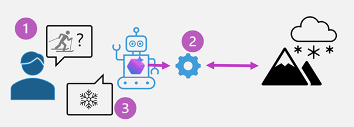

# Integrate custom tools into your agent

**Module:** build-agent-with-custom-tools
**Source:** https://learn.microsoft.com/en-us/training/modules/build-agent-with-custom-tools/

## Learning objectives

By the end of this module, you'll be able to:

- Describe the benefits of using custom tools with your agent.
- Explore the different options for custom tools.
- Build an agent that integrates custom tools using the Microsoft Foundry Agent Service.

## Prerequisites

- Familiarity with Azure and the Azure portal.
- An understanding of generative AI. You can learn more with [Fundamentals of Generative AI](https://learn.microsoft.com/en-us/training/modules/fundamentals-generative-ai/).
- It's highly recommended you have experience with the Microsoft Foundry Agent Service. You can learn more with [Develop an AI agent with Microsoft Foundry Agent Service](https://learn.microsoft.com/en-us/training/modules/develop-ai-agent-azure/).

---

## Introduction

Microsoft Foundry Agent Service offers a seamless way to build an agent without needing extensive AI or machine learning expertise. By using tools, you can provide your agent with functionality to execute actions on your behalf.

The AI Agent Service provides built-in tools for gathering knowledge and generating code, which provide your agent with some powerful functionality. However, sometimes your agent needs to be able to complete specific tasks or actions that an AI model would struggle to handle on its own. To accomplish these actions, you can provide your agent a *custom tool* based on your own code or a third-party service or API.

Imagine you're working in the retail industry, and your company is struggling with managing customer inquiries efficiently. The customer support team is overwhelmed with repetitive questions, leading to delays in response times and decreased customer satisfaction. By using Foundry Agent Service with custom tools, you can create a custom FAQ agent that handles common inquiries. This agent can be provided with a set of custom tools to look up customer orders, freeing up your support team to focus on more complex issues.

In this module, you'll learn how to utilize custom tools in Foundry Agent Service to enhance productivity, improve accuracy, and create tailored solutions for specific needs.

---

## Why use custom tools

Microsoft Foundry Agent Service offers a powerful platform for integrating custom tools to enhance productivity and provide tailored solutions for specific business needs. By using these custom tools, businesses can achieve greater efficiency and effectiveness in their operations.

### Why use custom tools?

Custom tools significantly enhance productivity by automating repetitive tasks and streamlining workflows that are specific to your use case. These tools improve accuracy by providing precise and consistent outputs, reducing the likelihood of human error. Additionally, custom tools offer tailored solutions that address specific business needs, enabling organizations to optimize their processes and achieve better outcomes.

- **Enhanced productivity**: Automate repetitive tasks and streamline workflows.
- **Improved accuracy**: Provide precise and consistent outputs, reducing human error.
- **Tailored solutions**: Address specific business needs and optimize processes.

Adding tools makes custom functionality available for the agent to use, depending on how it decides to respond to the user prompt. For example, consider how a custom tool to retrieve weather data from an external meteorological service could be used by an agent.



The diagram shows the process of an agent choosing to use the custom tool:

1. A user asks an agent about the weather conditions in a ski resort.
2. The agent determines that it has access to a tool that can use an API to get meteorological information, and calls it.
3. The tool returns the weather report, and the agent informs the user.

### Common scenarios for custom tools in agents

Custom tools within the Foundry Agent Service enable users to extend the capabilities of AI agents, tailoring them to meet specific business needs. Some example use cases that illustrate the versatility and impact of custom tools include:

#### Customer support automation

- **Scenario**: A retail company integrates a custom tool that connects the Azure AI Agent to their customer relationship management (CRM) system.
- **Functionality**: The AI agent can retrieve customer order histories, process refunds, and provide real-time updates on shipping statuses.
- **Outcome**: Faster resolution of customer queries, reduced workload for support teams, and improved customer satisfaction.

#### Inventory management

- **Scenario**: A manufacturing company develops a custom tool to link the AI agent with their inventory management system.
- **Functionality**: The AI agent can check stock levels, predict restocking needs using historical data, and place orders with suppliers automatically.
- **Outcome**: Streamlined inventory processes and optimized supply chain operations.

#### Healthcare appointment scheduling

- **Scenario**: A healthcare provider integrates a custom scheduling tool with the AI agent.
- **Functionality**: The AI agent can access patient records, suggest available appointment slots, and send reminders to patients.
- **Outcome**: Reduced administrative burden, improved patient experience, and better resource utilization.

#### IT Helpdesk support

- **Scenario**: An IT department develops a custom tool to integrate the AI agent with their ticketing and knowledge base systems.
- **Functionality**: The AI agent can troubleshoot common technical issues, escalate complex problems, and track ticket statuses.
- **Outcome**: Faster issue resolution, reduced downtime, and improved employee productivity.

#### E-learning and training

- **Scenario**: An educational institution creates a custom tool to connect the AI agent with their learning management system (LMS).
- **Functionality**: The AI agent can recommend courses, track student progress, and answer questions about course content.
- **Outcome**: Enhanced learning experiences, increased student engagement, and streamlined administrative tasks.

These examples demonstrate how custom tools within the Foundry Agent Service can be used across industries to address unique challenges, drive efficiency, and deliver value.

---

## Options for implementing custom tools

Microsoft Foundry Agent Service offers various custom tools that enhance the capabilities and efficiency of your AI agents. These tools allow for scalable interoperability with various applications, making it easier to integrate with existing infrastructure or web services.

### Custom tool options available in Microsoft Foundry Agent Service

Foundry Agent Service provides several custom tool options, including OpenAPI specified tools, Azure Functions, and function calling. These tools enable seamless integration with external APIs, event-driven applications, and custom functions.

- **Custom function**: Function calling allows you to describe the structure of custom functions to an agent and return the functions that need to be called along with their arguments. The agent can dynamically identify appropriate functions based on their definitions. This feature is useful for integrating custom logic and workflows, in a selection of programming languages, into your AI agents.
- **Azure Functions**: Azure Functions enables you to create intelligent, event-driven applications with minimal overhead. They support triggers and bindings, which simplify how your AI Agents interact with external systems and services. Triggers determine when a function executes, while bindings facilitate streamlined connections to input or output data sources.
- **OpenAPI specification tools**: These tools allow you to connect your Azure AI Agent to an external API using an OpenAPI 3.0 specification. This provides standardized, automated, and scalable API integrations that enhance the capabilities of your agent. OpenAPI specifications describe HTTP APIs, enabling people to understand how an API works, generate client code, create tests, and apply design standards.
- **Azure Logic Apps**: This action provides low-code/no-code solutions to add workflows and connects apps, data, and services with the low-code Logic App.

This flexibility to integrate custom functionality in multiple ways enables a wide range of extensibility possibilities for your Foundry Agent Service agents.

---

## How to integrate custom tools

Custom tools in an agent can be defined in a handful of ways, depending on what works best for your scenario. You may find that your company already has Azure Functions implemented for your agent to use, or a public OpenAPI specification gives your agent the functionality you're looking for.

### Function Calling

Function calling allows agents to execute predefined functions dynamically based on user input. This feature is ideal for scenarios where agents need to perform specific tasks, such as retrieving data or processing user queries, and can be done in code from within the agent. Your function may call out to other APIs to get additional information or initiate a program.

#### Example: Defining and using a function

Start by defining a function that the agent can call. For instance, here's a fake snowfall tracking function:

```python
import json

def recent_snowfall(location: str) -> str:
    """
    Fetches recent snowfall totals for a given location.
    :param location: The city name.
    :return: Snowfall details as a JSON string.
    """
    mock_snow_data = {"Seattle": "0 inches", "Denver": "2 inches"}
    snow = mock_snow_data.get(location, "Data not available.")
    return json.dumps({"location": location, "snowfall": snow})
```

Register the function with your agent using the Azure AI SDK:

```python
# Define a function tool for the model to use
function_tool = FunctionTool(
    name="recent_snowfall",
    parameters={
        "type": "object",
        "properties": {
            "location": {"type": "string", "description": "The city name to check snowfall for."},
        },
        "required": ["location"],
        "additionalProperties": False
    },
    description="Get recent snowfall totals for a given location.",
    strict=True,
)

# Add the function tool to a list of tools for the agent
tools: list[Tool] = [function_tool]

# Create your agent with the toolset
agent = project_client.agents.create_version(
    name="snowfall-agent",
    definition=PromptAgentDefinition(
        model="gpt-4.1",
        instructions="You are a weather assistant tracking snowfall. Use the provided functions to answer questions.",
        tools=tools,
    )
)
```

The agent can now call *recent\_snowfall* dynamically when it determines that the prompt requires information that can be retrieved by the function.

### Azure Functions

Azure Functions provides serverless computing capabilities for real-time processing. This integration is ideal for event-driven workflows, enabling agents to respond to triggers such as HTTP requests or queue messages.

#### Example: Using Azure Functions with a queue trigger

First, develop and deploy your Azure Function. In this example, imagine we have a function in our Azure subscription to fetch the snowfall for a given location.

When your Azure Function is in place, add it to the agent definition as an Azure Function tool:

```python
tool = AzureFunctionTool(
    azure_function=AzureFunctionDefinition(
        input_binding=AzureFunctionBinding(
            storage_queue=AzureFunctionStorageQueue(
                queue_name="STORAGE_INPUT_QUEUE_NAME",
                queue_service_endpoint="STORAGE_QUEUE_SERVICE_ENDPOINT",
            )
        ),
        output_binding=AzureFunctionBinding(
            storage_queue=AzureFunctionStorageQueue(
                queue_name="STORAGE_OUTPUT_QUEUE_NAME",
                queue_service_endpoint="STORAGE_QUEUE_SERVICE_ENDPOINT",
            )
        ),
        function=AzureFunctionDefinitionFunction(
            name="queue_trigger",
            description="Get weather for a given location",
            parameters={
                "type": "object",
                "properties": {"location": {"type": "string", "description": "location to determine weather for"}},
            },
        ),
    )
)

agent = project_client.agents.create_version(
    agent_name="MyAgent",
    definition=PromptAgentDefinition(
        model="gpt-4.1",
        instructions="You are a helpful weather assistant. Use the provided Azure Function to get weather information for a location when needed.",
        tools=[tool],
    ),
)
```

The agent can now send requests to the Azure Function via a storage queue and process the results.

### OpenAPI Specification

OpenAPI defined tools allow agents to interact with external APIs using standardized specifications. This approach simplifies API integration and ensures compatibility with various services. The Foundry Agent Service uses OpenAPI 3.0 specified tools.

> **Tip:** Currently, three authentication types are supported with OpenAPI 3.0 tools: *anonymous*, *API key*, and *managed identity*.

#### Example: Using an OpenAPI specification

First, create a JSON file (in this example, called *weather\_openapi.json*) describing the API.

```json
{
  "openapi": "3.1.0",
  "info": {
    "title": "get weather data",
    "description": "Retrieves current weather data for a location based on wttr.in.",
    "version": "v1.0.0"
  },
  "servers": [
    {
      "url": "https://wttr.in"
    }
  ],
  "auth": [],
  "paths": {
    "/{location}": {
      "get": {
        "description": "Get weather information for a specific location",
        "operationId": "GetCurrentWeather",
        "parameters": [
          {
            "name": "location",
            "in": "path",
            "description": "City or location to retrieve the weather for",
            "required": true,
            "schema": {
              "type": "string"
            }
          },
          {
            "name": "format",
            "in": "query",
            "description": "Always use j1 value for this parameter",
            "required": true,
            "schema": {
              "type": "string",
              "default": "j1"
            }
          }
        ],
        "responses": {
          "200": {
            "description": "Successful response",
            "content": {
              "text/plain": {
                "schema": {
                  "type": "string"
                }
              }
            }
          },
          "404": {
            "description": "Location not found"
          }
        },
        "deprecated": false
      }
    }
  },
  "components": {
    "schemes": {}
  }
}
```

Then, register the OpenAPI tool in the agent definition:

```python
from azure.ai.projects.models import OpenApiTool, OpenApiAnonymousAuthDetails

with open(weather_asset_file_path, "r") as f:
      openapi_weather = cast(dict[str, Any], jsonref.loads(f.read()))

tool = OpenApiTool(
    openapi=OpenApiFunctionDefinition(
        name="get_weather",
        spec=openapi_weather,
        description="Retrieve weather information for a location.",
        auth=OpenApiAnonymousAuthDetails(),
    )
)

agent = project_client.agents.create_version(
    agent_name="openapi-agent",
    definition=PromptAgentDefinition(
        model="gpt-4.1",
        instructions="You are a weather assistant. Use the API to fetch weather data.",
        tools=[openapi_tool],
    ),
)
```

The agent can now use the OpenAPI tool to fetch weather data dynamically.

> **Note:** One of the concepts related to agents and custom tools that developers often have difficulty with is the *declarative* nature of the solution. You don't need to write code that explicitly *calls* your custom tool functions — the agent itself decides to call tool functions based on messages in prompts. By providing the agent with functions that have meaningful names and well-documented parameters, the agent can "figure out" when and how to call the function all by itself!

By using one of the available custom tool options (or any combination of them), you can create powerful, flexible, and intelligent agents with Foundry Agent Service. These integrations enable seamless interaction with external systems, real-time processing, and scalable workflows, making it easier to build custom solutions tailored to your needs.

---

## Summary

In this module, we covered the benefits of integrating custom tools into Foundry Agent Service to boost productivity and provide tailored business solutions. By providing custom tools to our agent, we can optimize processes to meet specific needs, resulting in better responses from your agent.

The techniques learned in this module enable businesses to generate marketing materials, improve communications, and analyze market trends more effectively, all through custom tools. The integration of various tool options in the AI Agent Service, from Azure Functions to OpenAPI specifications, allows for the creation of intelligent, event-driven applications that use well-established patterns already used in many businesses.

### Further reading

- [AI Agents for beginners tool use](https://github.com/microsoft/ai-agents-for-beginners/blob/main/04-tool-use/README.md)
- [Microsoft Foundry Agent Service function calling](https://learn.microsoft.com/en-us/azure/ai-services/agents/how-to/tools/function-calling)
- [Introduction to Azure Functions](https://learn.microsoft.com/en-us/azure/azure-functions/functions-overview)
- [OpenAPI Specification](https://swagger.io/specification/)

---

## Exercise / Lab

Hands-on lab: [02-agent-custom-tools.md](../../../labs/mslearn-ai-agents/Instructions/Exercises/02-agent-custom-tools.md)
