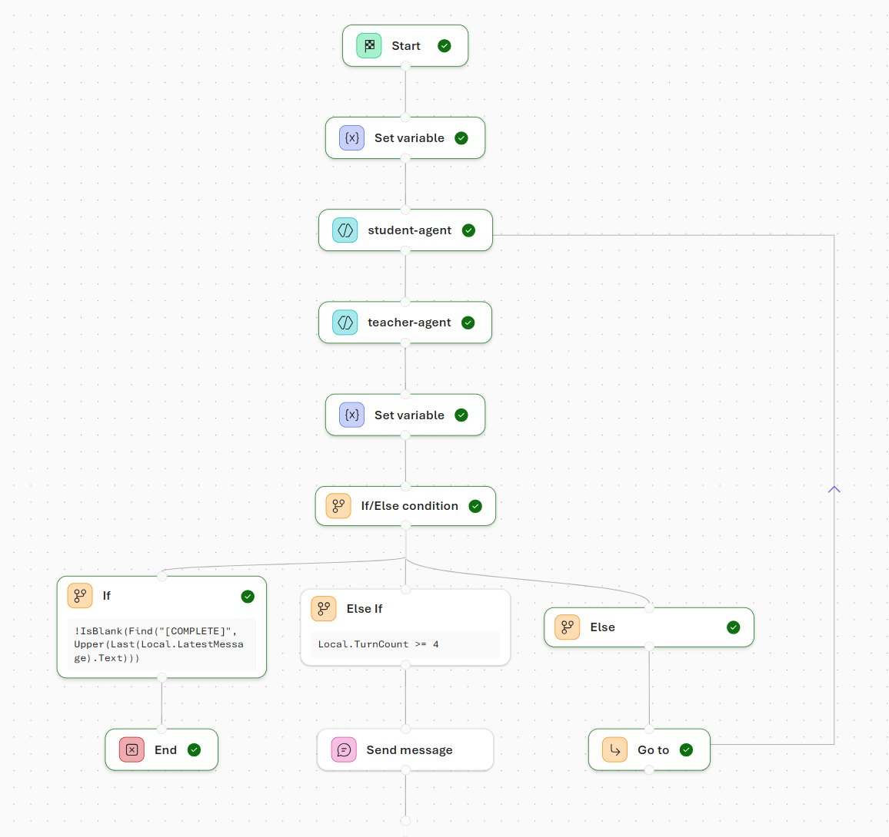
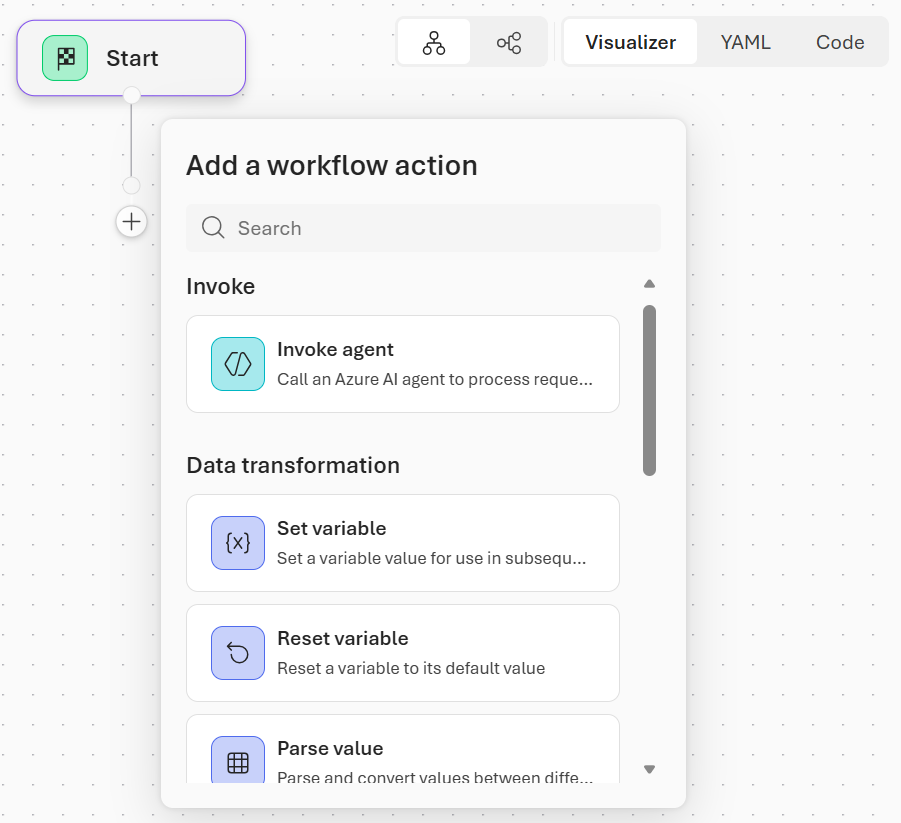
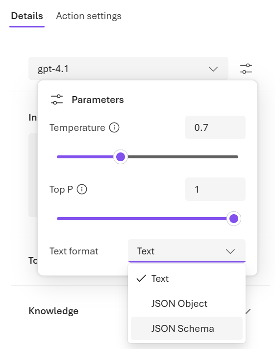
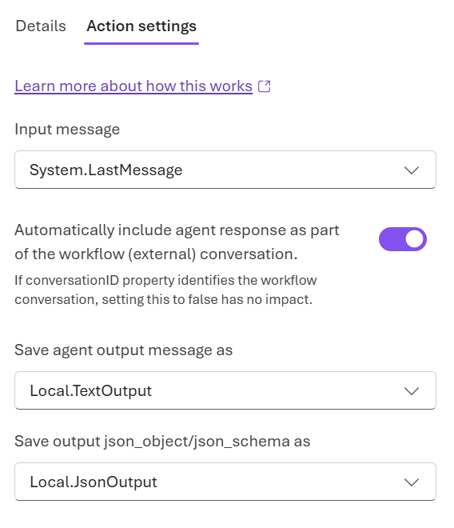
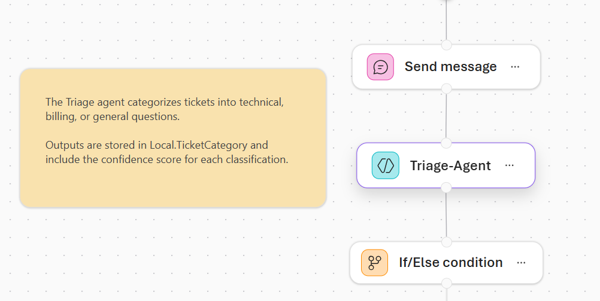

# Build agent-driven workflows using Microsoft Foundry

**Module:** build-agent-workflows-microsoft-foundry  
**Source:** https://learn.microsoft.com/en-us/training/modules/build-agent-workflows-microsoft-foundry/

## Learning Objectives

By the end of this module, you learn to:

- Explain how nodes, variables, and agent outputs control workflow execution
- Route requests using structured outputs and conditional logic
- Loop over multiple inputs with For-Each nodes
- Use human-in-the-loop and escalation patterns for low-confidence items
- Utilize Power Fx expressions to manipulate data and control flow

## Prerequisites

Before starting this module, you should:

- Be familiar with deploying and managing AI agents using Microsoft Foundry.

---

## Introduction

Modern AI solutions often rely on multiple agents working together to analyze inputs, make decisions, and take action. In Microsoft Foundry, agent workflows provide a way to orchestrate these interactions using a combination of agents, control flow, and runtime safeguards.

Foundry includes a visual workflow builder that lets you design and test these systems without writing extensive code. Using the canvas, you can define how agents are invoked, how data moves between steps, and how decisions are made based on agent outputs. You can also observe execution paths and inspect intermediate results to understand how your workflow behaves at runtime.

Suppose you're a developer responsible for automating customer support workflows at a growing SaaS company. Your team receives a steady stream of support tickets ranging from billing disputes to API errors and simple how-to questions. Manually reviewing each request doesn't scale, but fully automating responses isn't always safe. Workflows allow you to combine multiple AI agents, conditional logic, and human-in-the-loop escalation. By using agent-driven workflows, you can triage multiple support requests efficiently and at scale while maintaining reliability and control.

### After completing this module, you'll be able to:

- Explain how workflow nodes, variables, and agent outputs work together to control execution paths.
- Use structured agent outputs and conditional logic to route requests to the appropriate workflow steps.
- Implement loops (For-Each) to process multiple inputs efficiently within a single workflow.
- Apply human-in-the-loop and escalation patterns to manage uncertainty and low-confidence agent responses.
- Utilize Power Fx expressions to manipulate data, evaluate conditions, and control flow within workflows.

---

## Understand Workflows

Workflows in Microsoft Foundry provide a way to orchestrate AI-driven actions using a visual, declarative approach. Rather than writing code, you define a sequence of steps that describe what should happen and when, allowing the platform to manage execution and state. This makes workflows well-suited for business processes that combine AI reasoning, logic, and user interaction.

A workflow consists of connected nodes, where each node performs a specific function. Some nodes invoke agents, while others evaluate conditions, manage data, or communicate with users. Together, these nodes form an execution path that determines how requests move through the system. By arranging and configuring nodes, you control how information flows and how decisions are made.



One of the key advantages of workflows is their ability to coordinate multiple agents. Single-agent solutions often struggle with complex or ambiguous tasks, but workflows allow you to combine agents with different responsibilities—such as classification, decision-making, and resolution—into a cohesive process. This orchestration enables more robust and scalable automation.

Workflows also support patterns that balance automation with oversight. In scenarios where confidence is low or more context is required, workflows can pause execution, request human input, or escalate decisions. This flexibility makes workflows suitable for real-world systems where reliability and control are just as important as efficiency.

By understanding what workflows are and the problems they're designed to solve, you establish the conceptual foundation needed to build, extend, and reason about agent-driven systems in Microsoft Foundry.

---

## Identify Workflow Patterns

When building agent-driven solutions, the structure of your workflow matters as much as the agents themselves. Different problems require different orchestration approaches, depending on how decisions are made, how data flows, and whether human input is required. Microsoft Foundry provides several predefined workflow patterns that help you model these interactions clearly and consistently.

A **sequential** workflow follows a fixed, step-by-step path. Each node executes in order, passing its output to the next step in the workflow. This pattern works well for pipelines and multi-stage processes, such as validating input, enriching data, and generating a final response. Sequential workflows are predictable and easy to reason about, making them a good starting point when you're learning how workflows operate.

A **human-in-the-loop** workflow introduces pauses where user input or approval is required before the workflow can continue. In this pattern, the workflow explicitly asks a question, waits for a response, and then resumes execution based on that input. Human-in-the-loop workflows are useful when automation must be balanced with oversight—such as approvals, confirmations, or situations where missing context needs to be provided by a person.

A **group chat** workflow enables more dynamic orchestration across multiple agents. Instead of following a fixed path, control can shift between agents based on context, rules, or intermediate results. This pattern is useful for scenarios where multiple specialized agents collaborate to handle complex requests, such as customer support or multi-domain question answering. Group chat workflows allow for flexible interactions, where agents can build on each other's outputs and adapt to changing inputs.

Each pattern provides a foundation for structuring agent interactions, managing control flow, and incorporating human input as needed. By recognizing these workflow patterns and understanding their strengths, you can choose an orchestration approach that aligns with your scenario before you begin designing a workflow.

---

## Create workflows in Microsoft Foundry

Microsoft Foundry provides a visual designer that lets you build workflows as a sequence of connected nodes. Each node represents a specific action—such as invoking an agent, evaluating logic, or transforming data—and the connections between nodes define how execution flows from one step to the next. This visual approach makes it easier to reason about orchestration logic and understand how agents interact within a larger process.

You can start a workflow from a blank canvas or by selecting a predefined pattern, such as a sequential workflow. The designer displays the workflow as a series of nodes laid out in execution order. As you build, you can move nodes, insert new steps, and inspect configuration details directly within the canvas. Because workflows aren't saved automatically, it's important to save your changes regularly to preserve each version of your design.



The main node types in the workflow builder are:

- **Invoke**: Invokes an AI agent from your project or creates a new one. Agent nodes can return free-text responses or structured outputs (like JSON) that other nodes can use. They're used for classification, reasoning, recommendations, or any AI-driven task.
- **Flow**: Controls the workflow's execution path. Flow nodes let your workflow adapt dynamically to different inputs or situations. Flow nodes include:

    - If/Else: Branches execution based on conditions.
    - Go To: Jumps to another node in the workflow.
    - For Each: Loops over a list of items, performing the same actions for each one.
- **Data transformation**: Manipulates data and manages variables. Data transformation nodes ensure that information is correctly passed to subsequent steps. Data transformation nodes include:

    - Set Variable: Assigns a value to a variable for later use.
    - Reset Variable: Clears or reinitializes a variable.
    - Parse value: Extracts specific data from structured outputs or converts values to different formats.
- **Basic chat**: Sends messages to the user or asks questions to collect input. These nodes are often paired with variables to capture responses, which can then influence logic or agent decisions later in the workflow.
- **End**: Marks the conclusion of a workflow. The End node can optionally return a final result or status.

Variables provide shared state across nodes, allowing outputs from one step—such as agent results or user input—to inform decisions or trigger more actions. While agent nodes are an important part of a workflow, effective automation relies on the coordinated use of all node types.

Workflows execute within a conversational context, letting you interact with them through the chat window. This interactivity allows you to observe how inputs move through the nodes and validate that each step behaves as expected before adding more complexity. As workflows grow, the visual designer makes it easy to trace execution paths and quickly identify where logic branches or decisions occur.

Understanding nodes and how to combine them gives you the foundation for creating workflows that integrate AI reasoning, data handling, and control logic. Nodes are the building blocks you assemble to turn concepts and automation goals into functional, scalable workflows.

---

## Add Agents to a Workflow

Agents are the core reasoning components within a Microsoft Foundry workflow. By adding agents to a workflow, you enable AI-driven decision-making, classification, and response generation as part of a larger orchestration. Each agent can be configured with a specific purpose, model, prompt, and set of tools, allowing workflows to combine multiple specialized capabilities.

You add agents to a workflow by inserting an **Invoke agent** node. This node can reference an existing agent from your Foundry project, or you can create a new agent directly within the workflow designer. The **Invoke agent** editor allows you to configure tools, knowledge bases, memory, and guardrails for the agent, tailoring its behavior to the workflow's needs. When you invoke an agent, the workflow passes context—such as user input or previously set variables—to the agent and receives a response that can be used in subsequent steps.

Agents can be reused across multiple workflows, which encourages modular design. For example, a single categorization agent might be invoked in many workflows to classify incoming requests, while different resolution agents handle follow-up actions. This separation of concerns makes workflows easier to maintain and evolve over time.

In addition to generating natural language responses, agents can be configured to return structured output. By defining a response format such as a JSON schema, you ensure that agent output follows a predictable shape. Structured outputs are especially useful when agent responses drive control flow, such as routing logic or variable assignment in later nodes. You can define an agent's output schema in the parameters of the **Details** tab of the **Invoke agent** editor.



Once an agent is added to a workflow, its output can be stored in a variable and referenced throughout the workflow. Using variables allows agents to influence decisions, trigger conditional branches, or provide input to other agents. You can configure variable storage in the **Action settings** of the **Invoke agent** node.



By thoughtfully adding and configuring agents, you transform a simple sequence of actions into an intelligent, adaptive workflow.

---

## Apply Power Fx in Workflows

Power Fx is the low-code, Excel-like language that acts as the glue of a workflow. It allows you to manipulate data, evaluate conditions, and control the flow of execution without writing complex code. In a workflow, Power Fx formulas are used wherever decisions are made, variables are set, or loops are applied, enabling workflows to react dynamically to user input, agent outputs, or stored data.

### How formulas work

A Power Fx formula is an expression that evaluates to a value. Formulas can reference **system** and **local** variables:

- **System variables** provide contextual information about the workflow or conversation, such as the current activity, last message, or user info.
- **Local variables** store data captured or created during workflow execution and can be used in subsequent nodes.

For example, you might create formulas to:

- Convert a user's input to uppercase: `Upper(Local.Input)`
- Check whether an agent's confidence score is above a threshold: `Local.Confidence > 0.8`
- Sum values in a list or a column of records: `Sum(Local.ItemList, Amount)`

Using variables in formulas allows workflows to adapt based on context and previous steps.

### Conditions as decision points

Power Fx expressions are commonly used in **If/Else** nodes to evaluate conditions and branch execution. Conditions can reference system or local variables, structured agent outputs, or other workflow data. For example, a workflow might check an agent's confidence score to decide whether to continue processing automatically or escalate to a human.

### Loops for processing multiple items

**For-each** nodes use Power Fx to iterate over collections, applying the same set of actions to each item. By combining loops with variables and conditions, workflows can handle lists of inputs—such as multiple support tickets—without duplicating nodes or logic.

### Power Fx formula examples

| Purpose | Formula Example | Notes |
| --- | --- | --- |
| Convert text to uppercase | `Upper(Local.Input)` | Transforms a string to all caps |
| Convert text to lowercase | `Lower(Local.Input)` | Transforms a string to all lowercase |
| Get string length | `Len(Local.Input)` | Returns the number of characters in a string |
| Conditional check | `Local.Confidence > 0.8` | Returns true/false; used in If/Else nodes |
| If/Else logic | `If(Local.Confidence > 0.8, "Proceed", "Escalate")` | Returns one of two values depending on a condition |
| Sum a list of numbers | `Sum([10, 20, 30])` | Adds up numbers in a simple list |
| Sum a column in a table | `Sum(Local.ItemList, Amount)` | Adds up the `Amount` property of each record in a table |
| Count items in a table or list | `Count(Local.ItemList)` | Returns the number of items |
| Check if blank | `IsBlank(Local.Input)` | Returns true if variable or input is empty |
| Check if empty table | `IsEmpty(Local.ItemList)` | Returns true if a table has no records |
| Loop over items | `ForAll(Local.ItemList, Upper(Name))` | Applies a formula to each item in a list or table |
| Concatenate text | `Concatenate(Local.FirstName, " ", Local.LastName)` | Joins multiple strings into one |

By using Power Fx formulas throughout a workflow, you create dynamic, data-driven processes that respond intelligently to inputs and agent outputs. This low-code approach empowers you to build complex logic while keeping workflows maintainable and understandable.

> **Tip:** For more information about the Power Fx language, visit the [Power Fx documentation](https://learn.microsoft.com/en-us/power-platform/power-fx/overview).

---

## Maintain Workflows in Microsoft Foundry

Building a workflow is just the first step—real-world automation evolves over time. Maintaining and refining workflows ensures that they remain reliable, understandable, and adaptable as business needs or AI models change. Using Microsoft Foundry's built-in features, you can effectively manage workflow versions, document changes, and keep both visual and YAML representations in sync.

### YAML and visual representations

Microsoft Foundry workflows can be represented in both a visual canvas and YAML. The visual canvas is ideal for conceptual understanding, tracing execution paths, and collaborating with others. YAML provides a textual representation of the workflow, which can be edited for advanced configuration, version tracking, or integration with source control. Changes in either view are reflected in the other, giving flexibility while keeping workflows consistent.

### Versioning

Every time a workflow is saved, Foundry automatically creates a new, immutable version. Versioning provides a safety net: you can review prior versions, compare changes, or roll back to an earlier workflow if a modification introduces errors. Versioning also supports collaboration, making it easier to track who made changes and why.

### Adding notes for maintainers

The workflow visualizer allows you to attach notes to nodes or sections of the workflow. Notes provide context, explain design decisions, or clarify variable usage. Adding clear documentation helps future maintainers or team members understand the workflow's purpose and logic, reducing errors and accelerating updates.



### Best practices for refinement

Maintaining workflows is not just about fixing errors—it's about improving clarity, reliability, and efficiency. Best practices include:

- Regularly reviewing workflows for unused or redundant nodes.
- Ensuring structured agent outputs are consistently handled.
- Documenting decisions and logic with notes.
- Leveraging version history to track changes and validate updates.

By combining YAML editing, version control, and thoughtful documentation, you ensure that workflows are robust, maintainable, and ready for enterprise use. This focus on maintainability allows teams to scale automation with confidence and adaptability.

---

## Use Workflows in Code

After designing and testing a workflow in the Microsoft Foundry visual designer, you can integrate it into your applications using the Azure AI Projects SDK. This allows you to embed workflow-driven automation into web apps, APIs, backend services, and other software solutions.

Workflows are created in the Foundry portal using the visual designer, which generates the underlying YAML definition. Once a workflow is saved in your project, you can invoke it programmatically by referencing its name. You can also download the workflow's YAML definition from the portal and include it in your codebase.

### Invoke a workflow

Before running a workflow, establish a connection to your Microsoft Foundry project using the `AIProjectClient`. This client handles authentication and provides access to the OpenAI-compatible API for executing conversations and invoking workflows. To run an existing workflow in your project, create a conversation and invoke the workflow by name.

```python
# Reference a workflow created in the Foundry portal
workflow_name = "triage-workflow"

# Create a conversation context for the workflow
conversation = openai_client.conversations.create()

# Execute the workflow, passing input to drive the workflow logic
stream = openai_client.responses.create(
    conversation=conversation.id,
    extra_body={"agent": {"name": workflow_name, "type": "agent_reference"}},
    input="Users can't reset their password from the mobile app.",
    stream=True,
)
```

The `input` parameter lets you pass a prompt or message to the workflow, which the workflow can use to drive its logic—such as processing a user request, triaging a support ticket, or answering a question. Depending on how your workflow is designed, this input might be:

- A user question that agents analyze and respond to
- A support ticket description for classification and routing
- A data payload that triggers processing logic
- An empty string that simply starts the workflow without specific input

### Process workflow events

When streaming is enabled, your application receives events as the workflow executes. These events let you display real-time progress, capture agent outputs, and respond to workflow actions.

```python
for event in stream:
    if event.type == "response.completed":
        print("Workflow completed:")
        for message in event.response.output:
            if message.content:
                for content_item in message.content:
                    if content_item.type == 'output_text':
                        print(content_item.text)
    if (event.type == "response.output_item.done") and event.item.type == ItemType.WORKFLOW_ACTION:
        print(f"Action '{event.item.action_id}' completed with status: {event.item.status}")
```

Common event types include:

| Event Type | Description |
| --- | --- |
| `response.completed` | The workflow finished executing and returned a final response |
| `response.output_item.done` | An individual output item (such as a workflow action) completed |

By monitoring these events, you can see how the workflow progresses in real-time, or trigger external actions based on workflow state. Alternatively, you can choose to wait for the entire workflow to complete and process the final response without streaming. For workflows that include human-in-the-loop patterns, your application may need to handle pauses where the workflow waits for user input. In these cases, you can send additional messages to the conversation to provide the requested input and resume workflow execution.

### Benefits of code integration

Integrating workflows into your code enables several scenarios:

| Scenario | Benefit |
| --- | --- |
| Web applications | Embed AI-driven workflows directly in user-facing apps |
| APIs and microservices | Expose workflow capabilities through REST endpoints |
| Batch processing | Invoke workflows programmatically for bulk operations |
| Testing and validation | Automate workflow testing as part of CI/CD pipelines |
| Custom interfaces | Build specialized UIs tailored to specific workflow use cases |

By combining the visual design experience of the Foundry portal with the flexibility of code integration, you can create powerful AI-driven solutions that fit seamlessly into your existing software architecture.

---

## Summary

In this module, you explored the foundational concepts and practices for designing agent-driven workflows in Microsoft Foundry. You began by understanding what workflows are and why they provide a structured way to orchestrate AI reasoning, logic, and user interaction. You then learned how to compose workflows by combining nodes—including agents, logic, data transformation, and chat—into sequences that define both actions and control flow.

You discovered how agents generate structured outputs, how these outputs are captured in variables, and how they drive workflow decisions such as routing, escalation, or continuation. You also explored how Power Fx acts as a low-code "glue" language, enabling workflows to transform data, evaluate conditions, and iterate over multiple items using loops. The module emphasized how variables, conditions, and loops move data through a workflow, creating adaptive, intelligent behavior.

Finally, you learned how to maintain and refine workflows using versioning, notes, and dual visual/YAML representations. These practices ensure that workflows remain reliable, understandable, and scalable—ready for real-world, enterprise applications.

By combining these concepts, you now have the knowledge to design workflows that integrate AI agents, control logic, human input, and data transformation into coherent, maintainable systems. This foundation prepares you to implement and experiment with workflows in hands-on scenarios, giving you the skills to build robust automation solutions with confidence.

> **Tip:** For more information about workflows in Microsoft Foundry, visit the [Create a workflow documentation](https://learn.microsoft.com/en-us/azure/ai-foundry/agents/concepts/workflow).

---

## Exercise / Lab

Hands-on lab: [06-build-workflow-ms-foundry.md](../../../labs/mslearn-ai-agents/Instructions/Exercises/06-build-workflow-ms-foundry.md)
