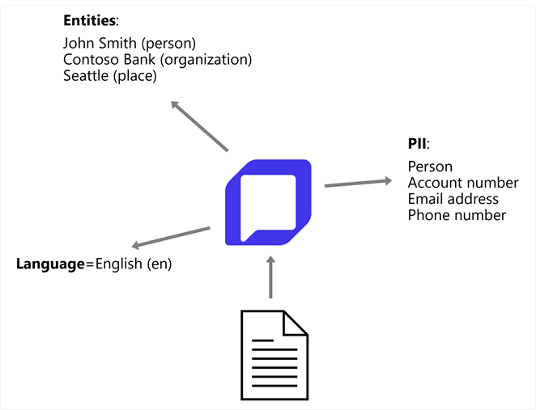

# Analyze text with Azure Language in Foundry Tools

**Module slug:** `analyze-text-ai-language`
**Source:** https://learn.microsoft.com/en-us/training/modules/analyze-text-ai-language/

## Learning Objectives

In this module, you'll learn how to use Azure Language in Foundry Tools to:

- Detect language from text.
- Recognize named entities in text.
- Extract personally identifiable information (PII) in text.

## Prerequisites

Before starting this module, you'll need:

- Familiarity with Microsoft Azure and the Azure portal.
- Programming experience.

---

## Introduction

Every day, the world generates a vast quantity of data; much of it text-based in the form of emails, social media posts, online reviews, business documents, and more. Artificial intelligence techniques that apply statistical and semantic models enable you to create applications that extract meaning and insights from this text-based data.

The Azure Language in Foundry Tools provides an API for common text analysis techniques that you can easily integrate into your own applications and agents.

In this module, you'll explore how to use Azure Language in Foundry Tools in your own applications, with examples in Python. You can develop text analytics applications using multiple language-specific SDKs; including:

- [Microsoft Azure Text Analytics Client Library for Python](https://pypi.org/project/azure-ai-textanalytics/)
- [Microsoft Azure Text Analytics Client Library for .NET](https://www.nuget.org/packages/Azure.AI.TextAnalytics)
- [Microsoft Azure Text Analytics Client Library for JavaScript](https://www.npmjs.com/package/@azure/ai-text-analytics)

---

## Azure Language in Microsoft Foundry Tools

Azure Language in Foundry Tools is designed to help you extract information from text. It provides functionality that you can use for tasks like:

- *Language detection* - determining the language in which text is written.
- *Named entity recognition* - detecting references to entities, including people, locations, time periods, organizations, and more.
- *Personally Identifiable Information (PII) extraction* - identifying and redacting personal details in text.



> **Note:** Azure Language also provides functionality for sentiment analysis, summarization, key phrase extraction, and other common language-related tasks. These deprecated capabilities are provided to support existing applications.

### Using a Microsoft Foundry resource for text analysis

To use Azure Language in Foundry Tools to analyze text, you must provision a Microsoft Foundry resource in your Azure subscription.

After you have provisioned a Foundry resource in your Azure subscription, you can use its **endpoint** to call the Azure Language APIs from your code, authenticating requests by either providing the **key** associated with your resource or by using a Microsoft Entra ID identity. You can call the Azure Language APIs by submitting requests in JSON format to the REST interface, or by using any of the available programming language-specific SDKs.

> **Note:** The code examples in this module are based in Python, using the [Python SDK for Azure Language in Foundry Tools](https://pypi.org/project/azure-ai-textanalytics/). SDKs for other common languages (such as Microsoft C#, JavaScript, and others) follow a similar pattern.

### Authentication

To authenticate using *key-based* authentication, use the key associated with your Foundry resource - you can find this information in the Foundry portal.

> **Tip:** The default home page in the Foundry portal shows the endpoint and key for your *project*. To view the key and endpoint for your *resource*, you can view the parent resource for your project in the **Admin** tab of the **Operate** page of the portal. The project and foundry resource keys are the same, and the project endpoint is the resource endpoint with `/api/projects/{project_name}` appended - so if the project endpoint is `https://my-ai-app-foundry.services.ai.azure.com/api/projects/my-ai-app`, then the resource endpoint is `https://my-ai-app-foundry.services.ai.azure.com`.

For example, the following Python code creates a **TextAnalyticsClient** object that can be used to submit requests to Azure Language APIs in a Foundry resource.

```python
# run "pip install azure-ai-textanalytics" first to install the package 
from azure.core.credentials import AzureKeyCredential
from azure.ai.textanalytics import TextAnalyticsClient

# Create client using endpoint and key
credential = AzureKeyCredential("YOUR_FOUNDRY_RESOURCE_KEY")
client = TextAnalyticsClient(endpoint="YOUR_FOUNDRY_RESOURCE_ENDPOINT", 
                             credential=credential)
```

For greater security in production solutions, Microsoft recommends using Microsoft Entra ID authentication. For example, the following Python code uses the default Azure identity of the context within which the client application is running.

```python
# run "pip install azure-identity azure-ai-textanalytics" first to install the packages 
from azure.identity import DefaultAzureCredential
from azure.ai.textanalytics import TextAnalyticsClient

# Create client using endpoint and default Azure identity
credential = DefaultAzureCredential()
client = TextAnalyticsClient(endpoint="YOUR_FOUNDRY_RESOURCE_ENDPOINT", 
                             credential=credential)
```

---

## Detect language

The Azure Language detection API evaluates text input and, for each document submitted, returns language identifiers with a score indicating the strength of the analysis.

This capability is useful for content stores that collect arbitrary text, where language is unknown. Another scenario could involve a chat application. If a user starts a session with the application, language detection can be used to determine which language they're using and allow you to configure your application's responses in the appropriate language.

You can parse the results of this analysis to determine which language is used in the input document. The response also returns a score, which reflects the confidence of the model (a value between 0 and 1).

Language detection can work with documents or single phrases. It's important to note that the document size must be under 5,120 characters. The size limit is per document and each collection is restricted to 1,000 items (IDs). A sample of a properly formatted JSON payload that you might submit to the service in the request body is shown here, including a collection of **documents**, each containing a unique **id** and the **text** to be analyzed.

For example, the following Python code analyzes two (short) documents to detect the language in which they're written.

```python
# Assumes code to create TextAnalyticsClient is above...

# Example text to analyze
documents = ["Hello World!", "Bonjour le monde!"]

# Detect language
response = client.detect_language(documents=documents)
for doc in response:
    print(f"Document: {doc.id}")
    print(f"\tPrimary Language: {doc.primary_language.name}")
    print(f"\tISO6391 Name: {doc.primary_language.iso6391_name}")
    print(f"\tConfidence Score: {doc.primary_language.confidence_score}")
```

The response contains a result for each **document** in the request, including the predicted language and a value indicating the confidence level of the prediction. The confidence level is a value ranging from 0 to 1 with values closer to 1 being a higher confidence level. Here's an example of a response from the previous code.

```output
Document: 0
        Primary Language: English
        ISO6391 Name: en
        Confidence Score: 0.9
Document: 1
        Primary Language: French
        ISO6391 Name: fr
        Confidence Score: 0.98
```

In our sample, both languages show a high confidence value, mostly because the text is relatively simple and easy to identify the language for.

If you try to detect the language of a document that has multilingual content, for example `I know a cool AI developer. He has a certain je ne sais quoi!`, the response may reflect some ambiguity. Mixed language content within the same document returns the language with the largest representation in the content, but with a lower positive rating, reflecting the marginal strength of that assessment.

The last condition to consider is when there's ambiguity as to the language content. The scenario might happen if you submit textual content that the analyzer isn't able to parse, for example because of character encoding issues when converting the text to a string variable. As a result, the response for the language name and ISO code will be returned as `(unknown)` and the score value will be returned as `0`.

---

## Extract entities

Named Entity Recognition identifies entities that are mentioned in the text. Entities are grouped into categories and subcategories, for example:

- Person
- Location
- DateTime
- Organization
- Address
- Email
- URL

> **Note:** For a full list of categories, see the [documentation](https://learn.microsoft.com/en-us/azure/ai-services/language-service/named-entity-recognition/concepts/named-entity-categories?tabs=ga-api).

Input for entity recognition is similar to input for other Azure Language API functions:

```python
# Example text to analyze
documents = ["Microsoft was founded on April 4, 1975 by Bill Gates and Paul Allen in Albuquerque, New Mexico.",
             "Satya Nadella became CEO of Microsoft on February 4, 2014."]

# Extract named entities
response = client.recognize_entities(documents=documents)
for doc in response:
    print(f"Entities in document {doc.id}:")
    for entity in doc.entities:
        print(f" - {entity.text} ({entity.category})")
```

The response includes a list of categorized entities found in each document:

```output
Entities in document 0:
 - Microsoft (Organization)
 - April 4, 1975 (DateTime)
 - Bill Gates (Person)
 - Paul Allen (Person)
 - Albuquerque (Location)
 - New Mexico (Location)
Entities in document 1:
 - Satya Nadella (Person)
 - CEO (PersonType)
 - Microsoft (Organization)
 - February 4, 2014. (DateTime)
```

---

## Extract personally identifiable information (PII)

In many scenarios, you need to identify and protect sensitive personal information in documents. For example, you might need to remove personally identifiable information (PII) from customer feedback, medical records, or legal documents before sharing them.

Azure Language provides PII detection and redaction capabilities to identify sensitive information such as names, addresses, phone numbers, email addresses, social security numbers, and credit card numbers. You can both extract PII entities for analysis and redact (mask) them to protect privacy.

As with all Azure Language functions, you can submit one or more documents for analysis:

```python
# Example text to analyze
documents = ["John Smith works at Contoso Ltd. His email is john.smith@contoso.com and his phone number is 555-012-456.",
             "Patient Sarah Johnson, SSN 123-45-6789, was admitted on 03/15/2024."]

# Extract PII entities
response = client.recognize_pii_entities(documents=documents, language="en")
for doc in response:
    print(f"\nPII entities in document {doc.id}:")
    for entity in doc.entities:
        print(f" - {entity.text}: {entity.category} (confidence: {entity.confidence_score:.2f})")
```

The response includes the PII entities identified in the text along with their categories and confidence scores:

```output
PII entities in document 0:
 - John Smith: Person (confidence: 0.99)
 - Contoso Ltd: Organization (confidence: 0.85)
 - john.smith@contoso.com: Email (confidence: 1.00)
 - 555-012-456: PhoneNumber (confidence: 0.80)
PII entities in document 1:
 - Sarah Johnson: Person (confidence: 0.99)
 - 123-45-6789: USSocialSecurityNumber (confidence: 0.99)
 - 03/15/2024: DateTime (confidence: 0.80)
```

You can also redact the PII entities to protect sensitive information. The service returns a redacted version of the text with PII replaced by asterisks or a specified character:

```python
# Redact PII entities
response = client.recognize_pii_entities(documents=documents, language="en")
for doc in response:
    print(f"\nDocument {doc.id} (redacted):")
    print(f" {doc.redacted_text}")
```

This produces output with the sensitive information masked:

```output
Document 0 (redacted):
 ********** works at ************. His email is ************************ and his phone number is ********.
Document 1 (redacted):
 Patient *************, SSN ***********, was admitted on **********.
```

---

## Summary

In this module, you learned how to use Azure Language in Foundry Tools to:

- Detect language from text.
- Recognize named entities in text.
- Extract personally identifiable information (PII) in text.

To learn more about Azure Language in Foundry Tools and some of the concepts covered in this module, refer to the [Azure Language in Foundry Tools documentation](https://learn.microsoft.com/en-us/azure/ai-services/language-service?azure-portal=true).

---

## Exercise / Lab

Hands-on lab: [01-analyze-text.md](../../../labs/mslearn-ai-language/Instructions/Exercises/01-analyze-text.md)

> **Lab source:** https://microsoftlearning.github.io/mslearn-ai-language/Instructions/Exercises/01-analyze-text.html
