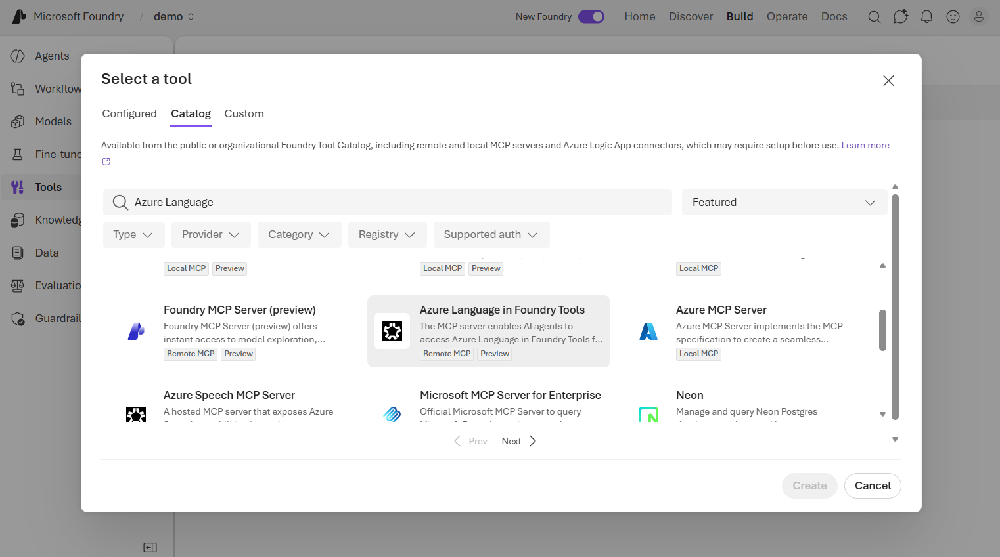

# Develop a text analysis agent with the Azure Language MCP server

**Module slug:** `develop-text-analysis-agent-language-mcp`  
**Source:** <https://learn.microsoft.com/en-us/training/modules/develop-text-analysis-agent-language-mcp/>

## Learning objectives

After completing this module, you'll be able to:

- Describe the Azure Language MCP server and the text analysis capabilities it exposes.
- Explain how MCP enables dynamic tool discovery and selection by AI agents.
- Connect the Azure Language MCP server to an agent in Microsoft Foundry.
- Build a Python client application that invokes an agent to perform text analysis.

## Prerequisites

Before starting this module, you should:

- Be familiar with Azure services and the Microsoft Foundry portal.
- Have experience deploying generative AI models in Microsoft Foundry.
- Have some familiarity with Python programming.

---

## Introduction

Azure Language in Foundry Tools provides a set of natural language processing (NLP) capabilities that you can use to analyze text. These capabilities include language detection, named entity recognition, and personally identifiable information (PII) extraction.

While you can call these capabilities individually through REST APIs or SDKs, you can also make them available to an AI agent through the **Azure Language Model Context Protocol (MCP) server**. This approach lets the agent dynamically select and call the appropriate language tool based on a user's request, without you needing to write specific code for each capability.

For example, suppose you work for a company that needs to analyze customer feedback. Customers submit reviews in multiple languages, and your team needs to determine which language was used, identify the people and places mentioned, and redact any personal details in the reviews. Rather than building separate integrations for each of these tasks, you can create an AI agent that uses the Azure Language MCP server to perform all of them through a single tool connection.

In this module, you learn how the Azure Language MCP server works, how to connect it to an AI agent in Microsoft Foundry, and how to build a client application that interacts with the agent programmatically.

> **Note:** The Azure Language MCP server is currently in public preview. Details described in this module are subject to change.

---

## Understand the Azure Language MCP server

The Azure Language MCP server connects AI agents to Azure Language services through the **Model Context Protocol (MCP)**. Before exploring the Language MCP server itself, it helps to understand what MCP is and how it enables agents to use external tools.

### What is the Model Context Protocol?

The Model Context Protocol (MCP) is an open protocol that defines how AI agents interact with external tools, data sources, and services. MCP uses a client-server architecture with the following components:

- **Host**: The application that runs the agent (such as Microsoft Foundry or a custom app).
- **Client**: A component within the host that manages connections to MCP servers and handles communication.
- **Server**: A program that exposes tools, resources, and prompts that an agent can discover and call.

When an agent connects to an MCP server, it receives a catalog of available tools along with descriptions of what each tool does. The agent can then choose the right tool based on the user's request. This approach is called *dynamic tool discovery* — the agent doesn't need hardcoded knowledge of each tool. Instead, it queries the MCP server at runtime to find out what's available.

The key advantage of MCP for AI agents is flexibility. Tools can be added, updated, or removed on the server without modifying the agent itself. The agent always has access to the latest tool definitions, which makes MCP-based solutions easier to maintain and scale.

> **Tip:** To learn more about MCP architecture and how to build custom MCP tool integrations, see the [Integrate MCP Tools with Azure AI Agents](https://learn.microsoft.com/en-us/training/modules/connect-agent-to-mcp-tools/) module.

### Azure Language MCP server capabilities

The Azure Language MCP server exposes Azure Language NLP capabilities as tools that any MCP-compatible agent can call. The server supports the following text analysis capabilities:

| Capability | Description |
| --- | --- |
| **Language Detection** | Identifies the language in which text is written. |
| **Named Entity Recognition** | Identifies and categorizes entities in text, such as people, places, organizations, dates, and quantities. |
| **PII Redaction** | Detects and redacts personally identifiable information (PII) such as names, addresses, and phone numbers. |
| **Text Analytics for Health** | Extracts and labels medical entities (such as diagnoses, medications, and symptoms) from clinical text. |

> **Note:** Azure Language also provides functionality for sentiment analysis, summarization, key phrase extraction, and other common language-related tasks. These deprecated capabilities are provided to support existing applications.

When you connect the Language MCP server to an agent, the agent receives the full list of available tools. Based on the user's prompt, the agent's underlying model decides which tool (or combination of tools) to call. For example, if a user asks "Determine the language that this article is written in, and tell me what people are mentioned." the agent might call both the language detection tool and the named entity recognition tool in the same turn.

### How the agent selects tools

The tool selection process works as follows:

1. The user sends a prompt to the agent.
2. The agent analyzes the prompt and determines which task (or tasks) need to be performed.
3. The agent checks the available MCP tools and their descriptions to find the best match.
4. The agent calls the selected tool through the MCP server, passing the relevant input text.
5. The MCP server processes the request using the appropriate Azure Language capability and returns the results.
6. The agent combines the results into a natural language response for the user.

This means you don't need to write routing logic to direct requests to specific tools. The agent handles tool selection autonomously, based on the tool descriptions it received from the MCP server.

### MCP server endpoint

The Azure Language MCP server is available as a remote endpoint with the following URL format:

```
https://{foundry-resource-name}.cognitiveservices.azure.com/language/mcp?api-version=2025-11-15-preview
```

Replace `{foundry-resource-name}` with the name of your Foundry resource (or Azure Language resource). This endpoint is what you configure when connecting the MCP server to your agent.

> **Note:** Azure Language also provides a local MCP server that you can host in your own environment. For setup guidance, see the [Azure Language MCP Server quickstart](https://github.com/Azure-Samples/ai-language-samples) in the Azure Language samples repository.

---

## Connect and use the Language MCP server with an agent

After you understand the capabilities of the Azure Language MCP server, the next step is to connect it to an agent and start using it. This involves creating an agent in Microsoft Foundry, connecting the Language MCP tool, testing it in the agent playground, and optionally building a client application to interact with the agent programmatically.

### Create a Foundry project and agent

To use the Azure Language MCP server, you first need a Microsoft Foundry project with a deployed model.

1. In the [Microsoft Foundry portal](https://ai.azure.com), create a new project (or use an existing one).
2. Deploy a model (such as **gpt-4.1**) that your agent will use for reasoning and generating responses.
3. Create an agent and give it instructions that describe its purpose. For example:

    ```
    You are an AI agent that assists users by helping them analyze and summarize text.
    ```

The agent is now ready to receive tool connections.

### Connect the Azure Language MCP server

You connect the Azure Language MCP server to your agent through the **Tools** page in the Foundry portal.

1. In the navigation pane, select the **Tools** page.
2. Select **Connect a tool** and choose **Azure Language in Foundry Tools** from the catalog.
3. Configure the connection with the following settings:

    - **Foundry resource name**: The name of your Foundry resource (for example, `myproject-resource`).
    - **Authentication**: Key-based.
    - **Credential** (`Ocp-Apim-Subscription-Key`): The key for your Foundry project.
4. Wait for the connection to be created, then select **Use in an agent** and choose your agent.



The agent now has access to all the text analysis tools exposed by the Azure Language MCP server.

> **Tip:** You can find the project key on the project home page in the Foundry portal.

### Update agent instructions

After connecting the Language MCP tool, update the agent's instructions to direct it to use the tool:

```
You are an AI agent that assists users by helping them analyze text. Use the Azure Language tool to perform text analysis tasks.
```

This instruction helps the agent understand that it should use the connected tool when processing text analysis requests.

### Test in the agent playground

The agent playground in the Foundry portal provides an interactive environment for testing your agent before deploying it in an application.

When you send a prompt that requires text analysis, the agent:

1. Identifies the tasks needed (for example, language detection and entity recognition).
2. Calls the appropriate Azure Language MCP tool(s).
3. Returns a combined response.

The first time the agent uses an MCP tool, you're prompted to **approve** the tool usage. You can approve the tool for a single use, or select **Always approve all Azure Language in Foundry Tools tools** to skip future approval prompts.

After the agent responds, you can review the **Logs** pane to verify which tools were used. The logs show each MCP tool call, the input that was sent, and the result that was returned.

### Build a client application

While the agent playground is useful for testing, you typically want to build a client application that uses the agent programmatically. The Microsoft Foundry SDK supports this through the OpenAI Responses API.

To build a client application, you use the `azure-ai-projects` and `azure-identity` packages. The general pattern is:

1. Create an `AIProjectClient` using your Foundry project endpoint and `DefaultAzureCredential` (which uses your Azure CLI credentials in development).
2. Get an OpenAI client from the project client by calling `get_openai_client()`.
3. Call `responses.create()` to send a user prompt to the agent.

The key part is how you reference the agent — you specify it by name in the `extra_body` parameter:

```python
response = openai_client.responses.create(
    input=[{"role": "user", "content": user_prompt}],
    extra_body={
        "agent_reference": {
            "name": "Text-Analysis-Agent",
            "type": "agent_reference"
        }
    },
)

print(response.output_text)
```

The agent processes the prompt, calls the appropriate MCP tools, and returns the result in `output_text`. You can also inspect the full response JSON (using `response.model_dump_json()`) to see which tools the agent called — for example, `extract_named_entities_from_text` or `detect_language_from_text` — along with the arguments and results for each tool call.

### Connect the MCP server in code

Instead of connecting the Azure Language MCP server through the Foundry portal, you can also define the MCP tool connection directly in code when you create an agent. Use the `MCPTool` class from the `azure-ai-projects` SDK to specify the server label, URL, and allowed tools:

```python
from azure.ai.projects.models import MCPTool

mcp_tool = MCPTool(
    server_label="azure-language",
    server_url="https://{foundry-resource-name}.cognitiveservices.azure.com/language/mcp?api-version=2025-11-15-preview",
    require_approval="always",
)
```

You then pass the `mcp_tool` when creating the agent through the SDK. This approach is useful when you want to manage tool connections as part of your application code rather than configuring them manually in the portal. You can also use the `allowed_tools` property on `MCPTool` to restrict which specific Language tools the agent can call.

### Tool selection with multi-task prompts

When a user's prompt involves multiple text analysis tasks, the agent can call multiple tools in a single turn. For example, the prompt:

> "Tell me what entities and dates are mentioned in this review, and whether it is positive or negative."

This prompt requires both entity recognition and sentiment analysis. The agent identifies both tasks, calls the appropriate tools (`extract_named_entities_from_text` and `detect_language_from_text`), and combines the results into a single response.

Each tool call goes through the MCP server independently, and the agent synthesizes the outputs into a coherent answer for the user.

---

## Exercise / Lab

Hands-on lab: [02-language-agent.md](../../../labs/mslearn-ai-language/Instructions/Exercises/02-language-agent.md)

> **Exercise summary:** Create an AI agent in Microsoft Foundry, connect it to the Azure Language MCP server, test it in the agent playground, and build a Python client application that uses the agent to perform text analysis tasks such as entity recognition and PII redaction.

---

## Summary

The Azure Language MCP server connects AI agents to a range of Azure Language text analysis capabilities through the Model Context Protocol. In this module, you learned how to use this server to build an agent that can analyze text dynamically.

In this module, you learned how to:

- Describe the Azure Language MCP server and the text analysis capabilities it exposes.
- Explain how MCP enables dynamic tool discovery and selection by AI agents.
- Connect the Azure Language MCP server to an agent in Microsoft Foundry.
- Test language tool integration in the agent playground.
- Build a Python client application that invokes an agent with language tools using the Foundry SDK.

## Learn more

- [Azure Language tools and agents](https://learn.microsoft.com/en-us/azure/ai-services/language-service/concepts/foundry-tools-agents)
- [Azure Language MCP server capabilities](https://learn.microsoft.com/en-us/azure/ai-services/language-service/concepts/foundry-tools-agents#azure-language-mcp-server-preview)
- [Connect to Model Context Protocol servers](https://learn.microsoft.com/en-us/azure/foundry/agents/how-to/tools/model-context-protocol)
- [Azure AI Projects SDK for Python](https://learn.microsoft.com/en-us/python/api/overview/azure/ai-projects-readme)
- [Build agents using Model Context Protocol on Azure](https://learn.microsoft.com/en-us/azure/developer/ai/intro-agents-mcp)
