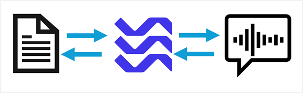
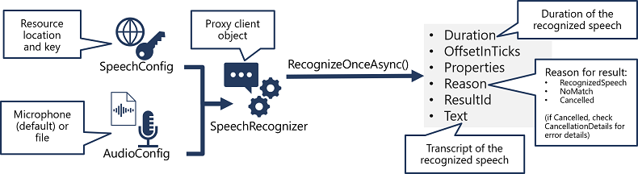
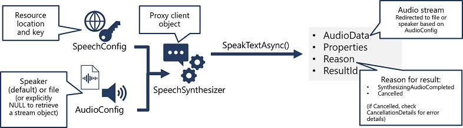

# Create speech-enabled apps with Azure Speech in Microsoft Foundry Tools

**Module slug:** `create-speech-enabled-apps`
**Source:** [MS Learn](https://learn.microsoft.com/en-us/training/modules/create-speech-enabled-apps/)

## Learning objectives

In this module, you'll learn how to:

- Use a Microsoft Foundry resource for Azure Speech in Foundry Tools
- Implement speech recognition with the Azure Speech to text API
- Use the Text to speech API to implement speech synthesis
- Configure audio format and voices
- Use Speech Synthesis Markup Language (SSML)

## Prerequisites

Before starting this module, you should:

- Be familiar with Azure services and the Azure portal
- Have programming experience

---

## Introduction

Azure Speech in Foundry Tools provides APIs that you can use to build speech-enabled applications, including:

- **Speech to text**: An API that enables *speech recognition* in which your application can accept spoken input.
- **Text to speech**: An API that enables *speech synthesis* in which your application can provide spoken output.
- **Speech Translation**: An API that you can use to translate spoken input into multiple languages.
- **Voice Live**: An API that you can use to build AI agents that are capable of conducting real-time conversations.

This module focuses on speech recognition and speech synthesis, which are core capabilities of any speech-enabled application.

The code examples in this module are provided in Python, but you can use any of the available Azure Speech SDK packages to develop speech-enabled applications in your preferred language. Available SDK packages include:

- [Azure Speech for Python](https://pypi.org/project/azure-cognitiveservices-speech)
- [Azure Speech for Microsoft .NET](https://www.nuget.org/packages/Microsoft.CognitiveServices.Speech)
- [Azure Speech for JavaScript](https://www.npmjs.com/package/microsoft-cognitiveservices-speech-sdk)
- [Azure Speech For Java](https://mvnrepository.com/artifact/com.microsoft.cognitiveservices.speech/client-sdk)

---

## Azure Speech in Foundry Tools

Azure Speech in Foundry Tools is a set of speech-related capabilities that are provided by a Foundry resource. You can use these capabilities to add speech support to apps and agents built in Microsoft Foundry projects. For example:

- Creating an application to transcribe recorded calls or meetings.
- Creating an AI assistant that can read text messages or emails aloud.



### Using Azure Speech in a Microsoft Foundry resource

To use Azure Speech in Foundry Tools, you must provision a Microsoft Foundry resource in your Azure subscription.

After you have provisioned a Foundry resource in your Azure subscription, you can use its **endpoint** to call the Azure Language APIs from your code, authenticating requests by providing the **key** associated with your resource. You can call the Azure Language APIs by submitting requests in JSON format to the REST interface, or by using any of the available programming language-specific SDKs.

> **Note:** The code examples in this module are based in Python, using the [Python SDK for Azure Speech in Foundry Tools](https://pypi.org/project/azure-cognitiveservices-speech/). SDKs for other common languages (such as Microsoft C#, JavaScript, and others) follow a similar pattern.

#### Creating a SpeechConfig

The initial object you need to create to provide access to the Azure Speech in Foundry Tools endpoint is a **SpeechConfig** object; which encapsulates the connection details for the service in your Foundry resource.

> **Tip:** The default home page in the Foundry portal shows the endpoint and key for your *project*. To view the key and endpoint for your *resource*, you can view the parent resource for your project in the **Admin** tab of the **Operate** page of the portal. The project and foundry resource keys are the same, and the project endpoint is the resource endpoint with `/api/projects/{project_name}` appended - so if the project endpoint is `https://my-ai-app-foundry.services.ai.azure.com/api/projects/my-ai-app`, then the resource endpoint is `https://my-ai-app-foundry.services.ai.azure.com`.

For example, the following Python code creates a **SpeechConfig** object that can be used to submit requests to Azure Speech APIs in a Foundry resource.

```python
# run "pip install azure-cognitiveservices-speech" first to install the package 
import azure.cognitiveservices.speech as speech_sdk

# Create SpeechConfig using endpoint and key
speech_config = speech_sdk.SpeechConfig(subscription="YOUR_FOUNDRY_KEY",
                                        endpoint="YOUR_FOUNDRY_ENDPOINT")
```

> **Note:** Releases of the Python SDK prior to **1.48.2** required that you specify the *region* where your resource is deployed instead of the endpoint. With the latest release, you can use either the Foundry resource endpoint or the region.

---

## Use the Speech to Text API

Azure Speech in Foundry Tools supports speech recognition through the *Speech to text* API. While the specific details vary, depending on the SDK being used (Python, C#, and so on); there's a consistent pattern for using the **Speech to text** API:



1. Use a **SpeechConfig** object to encapsulate the information required to connect to your Foundry resource. Specifically, its **endpoint** (or **region**) and **key**.
2. Optionally, use an **AudioConfig** to define the input source for the audio to be transcribed. By default, this is the default system microphone, but you can also specify an audio file.
3. Use the **SpeechConfig** and **AudioConfig** to create a **SpeechRecognizer** object. This object is a proxy client for the **Speech to text** API.
4. Use the methods of the **SpeechRecognizer** object to call the underlying API functions. For example, the **RecognizeOnceAsync()** method uses the Azure Speech service to asynchronously transcribe a single spoken utterance.
5. Process the response. In the case of the **RecognizeOnceAsync()** method, the result is a **SpeechRecognitionResult** object that includes the following properties:
    - Duration
    - OffsetInTicks
    - Properties
    - Reason
    - ResultId
    - Text

If the operation was successful, the **Reason** property has the enumerated value **RecognizedSpeech**, and the **Text** property contains the transcription. Other possible values for **Result** include **NoMatch** (indicating that the audio was successfully parsed but no speech was recognized) or **Canceled**, indicating that an error occurred (in which case, you can check the **Properties** collection for the **CancellationReason** property to determine what went wrong).

### Example - Transcribing an audio file

The following Python example uses Azure Speech in Foundry Tools to transcribe speech in an audio file.

```python
import azure.cognitiveservices.speech as speech_sdk

# Speech config encapsulates the connection to the resource
speech_config = speech_sdk.SpeechConfig(subscription="YOUR_FOUNDRY_KEY",
                                       endpoint="YOUR_FOUNDRY_ENDPOINT")

# Audio config determines the audio stream source (defaults to system mic)
file_path = "audio.wav"
audio_config = speech_sdk.audio.AudioConfig(filename=file_path)

# Use a speech recognizer to transcribe the audio
speech_recognizer = speech_sdk.SpeechRecognizer(speech_config=speech_config,
                                               audio_config=audio_config)

result = speech_recognizer.recognize_once_async().get()

# Did it succeed?
if result.reason == speech_sdk.ResultReason.RecognizedSpeech:
    # Yes!
    print(f"Transcription:\n{result.text}")
else:
    # No. Try to determine why.
    print("Error transcribing message: {}".format(result.reason))
```

---

## Use the Text to Speech API

Similarly to its **Speech to text** APIs, Azure Speech in Foundry Tools offers a **Text to speech** API for speech synthesis.

As with speech recognition, in practice most interactive speech-enabled applications are built using the Azure Speech SDK.

The pattern for implementing speech synthesis is similar to that of speech recognition:



1. Use a **SpeechConfig** object to encapsulate the information required to connect to your Azure Speech resource. Specifically, its **location** and **key**.
2. Optionally, use an **AudioConfig** to define the output device for the speech to be synthesized. By default, this is the default system speaker, but you can also specify an audio file, or by explicitly setting this value to a null value, you can process the audio stream object that is returned directly.
3. Use the **SpeechConfig** and **AudioConfig** to create a **SpeechSynthesizer** object. This object is a proxy client for the **Text to speech** API.
4. Use the methods of the **SpeechSynthesizer** object to call the underlying API functions. For example, the **SpeakTextAsync()** method uses the Azure Speech service to convert text to spoken audio.
5. Process the response from the Azure Speech service. In the case of the **SpeakTextAsync** method, the result is a **SpeechSynthesisResult** object that contains the following properties:
    - AudioData
    - Properties
    - Reason
    - ResultId

When speech has been successfully synthesized, the **Reason** property is set to the **SynthesizingAudioCompleted** enumeration and the **AudioData** property contains the audio stream (which, depending on the **AudioConfig** may have been automatically sent to a speaker or file).

### Example - synthesizing text as speech

The following Python example uses Azure Speech in Foundry Tools to generate spoken output from text.

```python
import azure.cognitiveservices.speech as speechsdk

# Speech config encapsulates the connection to the resource
speech_config = speechsdk.SpeechConfig(subscription=KEY, endpoint=ENDPOINT)

# Audio output config determines where to send the audio stream (defaults to speaker)
audio_config = speechsdk.audio.AudioOutputConfig(use_default_speaker=True)

# Use speech synthesizer to synthesize text as speech
speech_synthesizer = speechsdk.SpeechSynthesizer(speech_config=speech_config,
                                                 audio_config=audio_config)
text = "My voice is my password!"
speech_synthesis_result = speech_synthesizer.speak_text_async(text).get()

# Did it succeed?
if speech_synthesis_result.reason == speechsdk.ResultReason.SynthesizingAudioCompleted:
    # Yes!
    print("Speech synthesized for text [{}]".format(text))
elif speech_synthesis_result.reason == speechsdk.ResultReason.Canceled:
    # No - Try to find out why not
    cancellation_details = speech_synthesis_result.cancellation_details
    print("Speech synthesis canceled: {}".format(cancellation_details.reason))
    if cancellation_details.reason == speechsdk.CancellationReason.Error:
        if cancellation_details.error_details:
            print("Error details: {}".format(cancellation_details.error_details))
```

---

## Configure audio format and voices

When synthesizing speech, you can use a **SpeechConfig** object to customize the audio that is returned by Azure Speech in Foundry Tools.

### Audio format

Azure Speech supports multiple output formats for the audio stream that is generated by speech synthesis. Depending on your specific needs, you can choose a format based on the required:

- Audio file type
- Sample-rate
- Bit-depth

For example, the following Python code sets the speech output format for a previously defined **SpeechConfig** object named *speech_config*:

```python
speech_config.set_speech_synthesis_output_format(SpeechSynthesisOutputFormat.Riff24Khz16BitMonoPcm)
```

For a full list of supported formats and their enumeration values, see the [Azure Speech SDK documentation](https://learn.microsoft.com/en-us/python/api/azure-cognitiveservices-speech/azure.cognitiveservices.speech.speechsynthesisoutputformat).

### Voices

The Azure Speech service provides multiple voices that you can use to personalize your speech-enabled applications. Voices are identified by names that indicate a locale, a person's name, and other details - for example `en-US-Brian:DragonHDLatestNeural`.

The following Python example code sets the voice to be used:

```python
speech_config.speech_synthesis_voice_name='en-US-Brian:DragonHDLatestNeural'
```

For information about voices, see the [Azure Speech SDK documentation](https://learn.microsoft.com/en-us/azure/ai-services/speech-service/language-support?tabs=tts).

---

## Use Speech Synthesis Markup Language

While the Azure Speech SDK enables you to submit plain text to be synthesized into speech, the service also supports an XML-based syntax for describing characteristics of the speech you want to generate. This **Speech Synthesis Markup Language** (SSML) syntax offers greater control over how the spoken output sounds, enabling you to:

- Specify a speaking style, such as "excited" or "cheerful" when using a neural voice.
- Insert pauses or silence.
- Specify *phonemes* (phonetic pronunciations), for example to pronounce the text "SQL" as "sequel".
- Adjust the *prosody* of the voice (affecting the pitch, timbre, and speaking rate).
- Use common "say-as" rules, for example to specify that a given string should be expressed as a date, time, telephone number, or other form.
- Insert recorded speech or audio, for example to include a standard recorded message or simulate background noise.

For example, consider the following SSML:

```xml
<speak version="1.0" xmlns="http://www.w3.org/2001/10/synthesis" 
                     xmlns:mstts="https://www.w3.org/2001/mstts" xml:lang="en-US"> 
    <voice name="en-US-AriaNeural"> 
        <mstts:express-as style="cheerful"> 
          I say tomato 
        </mstts:express-as> 
    </voice> 
    <voice name="en-US-GuyNeural"> 
        I say <phoneme alphabet="sapi" ph="t ao m ae t ow"> tomato </phoneme>. 
        <break strength="weak"/>Lets call the whole thing off! 
    </voice> 
</speak>
```

This SSML specifies a spoken dialog between two different neural voices, like this:

- **Ariana** (*cheerfully*): "I say tomato"
- **Guy**: "I say tomato (pronounced *tom-ah-toe*) ... Let's call the whole thing off!"

To submit an SSML description to the Speech service, you can use an appropriate method of a **SpeechSynthesizer** object, like this:

```python
speech_synthesis_result = speech_synthesizer.speak_ssml_async('<speak>...').get()
```

For more information about SSML, see the [Azure Speech SDK documentation](https://learn.microsoft.com/en-us/azure/ai-services/speech-service/speech-synthesis-markup).

---

## Summary

In this module, you learned how to:

- Connect to Azure Speech in Foundry Tools in a Foundry resource
- Use the Speech to text API to implement speech recognition
- Use the Text to speech API to implement speech synthesis
- Configure audio format and voices
- Use Speech Synthesis Markup Language (SSML)

To learn more about the Azure Speech, refer to the [Azure Speech in Foundry Tools documentation](https://learn.microsoft.com/en-us/azure/ai-services/speech-service/).

---

## Exercise / Lab

Hands-on lab: [04-azure-speech.md](../../../labs/mslearn-ai-language/Instructions/Exercises/04-azure-speech.md)
