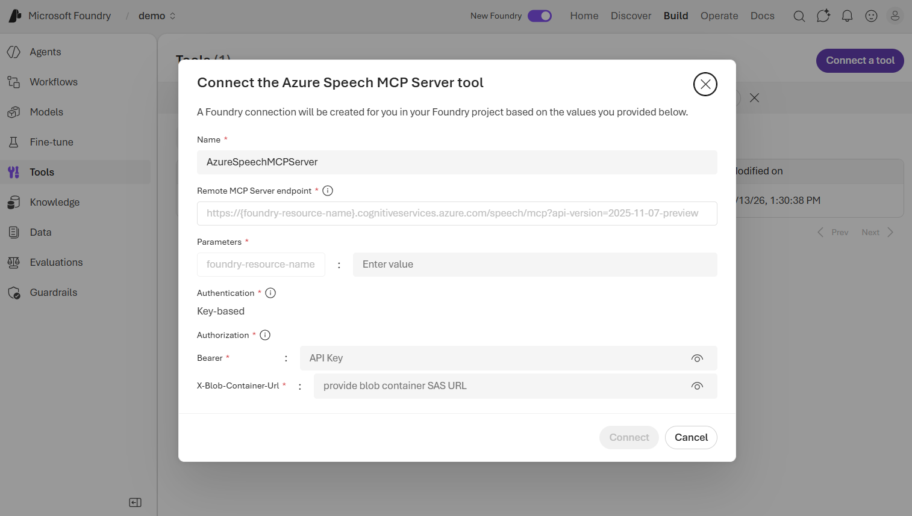

# Develop a speech agent with the Azure Speech MCP server

## Learning objectives

After completing this module, you'll be able to:

- Describe the Azure Speech MCP server and the speech capabilities it exposes.
- Explain how MCP enables dynamic tool discovery and selection by AI agents.
- Set up Azure Blob Storage for audio file input and output.
- Connect the Azure Speech MCP server to an agent in Microsoft Foundry.
- Build a Python client application that invokes an agent to perform speech tasks.

## Prerequisites

Before starting this module, you should:

- Be familiar with Azure services and the Microsoft Foundry portal.
- Have experience deploying generative AI models in Microsoft Foundry.
- Have some familiarity with Python programming.

---

## Introduction

Azure Speech in Foundry Tools provides speech-to-text and text-to-speech capabilities that you can integrate into AI applications. These capabilities let you transcribe audio to text and synthesize natural-sounding speech from text.

While you can call these capabilities directly through the Speech SDK or REST APIs, you can also make them available to an AI agent through the **Azure Speech Model Context Protocol (MCP) server**. This approach lets the agent handle speech tasks based on a user's natural language request, without you needing to write specific code for each speech operation.

For example, suppose you work for a company that needs to process customer support calls. Your team needs to transcribe recorded calls to text for analysis, and generate audio responses that can be played back to customers. Rather than building separate integrations for transcription and synthesis, you can create an AI agent that uses the Azure Speech MCP server to perform both tasks through a single tool connection.

In this module, you learn how the Azure Speech MCP server works, how to connect it to an AI agent in Microsoft Foundry, and how to build a client application that interacts with the agent programmatically.

> **Note:** The Azure Speech MCP server is currently in public preview. Details described in this module are subject to change.

---

## Understand the Azure Speech MCP server

The Azure Speech MCP server connects AI agents to Azure Speech in Foundry Tools through the **Model Context Protocol (MCP)**. Before exploring the Speech MCP server itself, it helps to understand what MCP is and how it enables agents to use external tools.

### What is the Model Context Protocol?

The Model Context Protocol (MCP) is an open protocol that defines how AI agents interact with external tools, data sources, and services. MCP uses a client-server architecture with the following components:

- **Host**: The application that runs the agent (such as Microsoft Foundry or a custom app).
- **Client**: A component within the host that manages connections to MCP servers and handles communication.
- **Server**: A program that exposes tools, resources, and prompts that an agent can discover and call.

When an agent connects to an MCP server, it receives a catalog of available tools along with descriptions of what each tool does. The agent can then choose the right tool based on the user's request. This approach is called *dynamic tool discovery* — the agent doesn't need hardcoded knowledge of each tool. Instead, it queries the MCP server at runtime to find out what's available.

The key advantage of MCP for AI agents is flexibility. Tools can be added, updated, or removed on the server without modifying the agent itself. The agent always has access to the latest tool definitions, which makes MCP-based solutions easier to maintain and scale.

> **Tip:** To learn more about MCP architecture and how to build custom MCP tool integrations, see the [Integrate MCP Tools with Azure AI Agents](https://learn.microsoft.com/en-us/training/modules/connect-agent-to-mcp-tools/) module.

### Azure Speech MCP server capabilities

The Azure Speech MCP server exposes two core speech capabilities as tools that any MCP-compatible agent can call:

| Capability | Description |
| --- | --- |
| **Speech-to-text (Recognize)** | Converts audio files to text using advanced speech recognition. Supports WAV, MP3, OGG, FLAC, MP4, M4A, AAC, and other common audio formats. Includes options for language selection, phrase hints for improved accuracy, profanity filtering, and detailed or simple output formats. |
| **Text-to-speech (Synthesize)** | Converts text input into natural-sounding audio files using neural text-to-speech voices. Supports multiple languages and voices (for example, `en-US-JennyNeural` or `en-GB-SoniaNeural`), and generates output in WAV, MP3, or other formats. |

When you connect the Speech MCP server to an agent, the agent receives the available speech tools and their descriptions. Based on the user's prompt, the agent decides which tool to call. For example, if a user says "Transcribe this audio file," the agent calls the speech-to-text tool. If the user says "Generate speech from this text," the agent calls the text-to-speech tool.

### How the agent selects tools

The tool selection process works as follows:

1. The user sends a prompt to the agent.
2. The agent analyzes the prompt and determines which speech task needs to be performed.
3. The agent checks the available MCP tools and their descriptions to find the best match.
4. The agent calls the selected tool through the MCP server, passing the relevant input (audio file URL or text).
5. The MCP server processes the request using Azure Speech and returns the results (transcribed text or a link to an audio file).
6. The agent presents the results to the user in a natural language response.

The agent handles tool selection autonomously, so you don't need to write routing logic to determine whether a prompt requires speech-to-text or text-to-speech.

### Storage requirements

Unlike text-only MCP tools, the Azure Speech MCP server works with audio files, which requires an **Azure Storage account**.

- **Text-to-speech**: The Speech MCP server saves generated audio files to an Azure Blob Storage container. The agent's response includes a link to the generated audio file.
- **Speech-to-text**: The agent can transcribe audio files from a publicly accessible URL or from an Azure Blob Storage container accessed with a SAS URL.

When you connect the Speech MCP server to your agent, you provide a **SAS URL** for a blob container. The SAS URL grants the MCP server permission to read and write files in that container.

> **Important:** Treat SAS URLs as secrets. Use the shortest practical expiry time, scope them to a single container, and don't embed them in source code, agent prompts, or chat transcripts.

### Prerequisites

To use the Azure Speech MCP server with an agent, you need:

- An **Azure subscription**.
- A **Foundry resource and project** — you need Contributor or Owner role on the resource group. Your Foundry resource includes speech capabilities.
- An **Azure Storage account** with a blob container for storing audio files.
- A **SAS URL** for the blob container with read, write, add, create, and list permissions.

### Security considerations

The Azure Speech MCP server uses key-based authentication. When you create the connection, you provide your resource key and a blob container SAS URL. Follow these best practices:

- Store keys and SAS URLs in a secure secret store and rotate them regularly.
- Avoid embedding keys or SAS URLs directly in source code, scripts, or documentation.
- Use the shortest practical SAS expiry time and scope it to the minimum required resource.
- Rotate keys immediately if you suspect they're exposed.

---

## Connect and use the Speech MCP server with an agent

After you understand the capabilities of the Azure Speech MCP server, the next step is to connect it to an agent and start using it. This involves setting up storage, creating an agent in Microsoft Foundry, connecting the Speech MCP tool, testing it in the agent playground, and optionally building a client application.

### Set up Azure Blob Storage

The Azure Speech MCP server requires an Azure Storage account to store audio files. You need to create a storage account and a blob container before connecting the tool.

1. In the [Azure portal](https://portal.azure.com), create a new **Azure Storage account** (or use an existing one).
2. In the storage account, expand **Data storage** and select **Containers**.
3. Create a new container (for example, named **files**) to store the audio files your agent generates and reads.
4. Generate a **SAS token** for the container with the following permissions: Read, Add, Create, Write, and List. Set the expiry time to the shortest practical duration.

> **Important:** Copy the generated SAS URL and store it securely — you need it when connecting the Speech MCP server.

### Create a Foundry project and agent

To use the Azure Speech MCP server, you need a Microsoft Foundry project with a deployed model.

1. In the [Microsoft Foundry portal](https://ai.azure.com), create a new project (or use an existing one).
2. Deploy a model (such as **gpt-4.1**) that your agent will use for reasoning and generating responses.
3. Create an agent and give it instructions that describe its purpose. For example:

    ```
    You are an AI agent that uses the Azure AI Speech tool to transcribe and generate speech.
    ```

The agent is now ready to receive tool connections.

### Connect the Azure Speech MCP server

You connect the Azure Speech MCP server to your agent through the **Tools** page in the Foundry portal.

1. In the navigation pane, select the **Tools** page.
2. Select **Connect a tool** and choose **Azure Speech in Foundry Tools** from the catalog.
3. Configure the connection with the following settings:

    - **Foundry resource name**: The name of your Foundry resource (for example, `myproject-resource`).
    - **Bearer** (`Ocp-Apim-Subscription-Key`): The key for your Foundry project.
    - **X-Blob-Container-Url**: The SAS URL for your blob container.
4. Wait for the connection to be created, then select **Use in an agent** and choose your agent.



The agent now has access to the speech-to-text and text-to-speech tools exposed by the Azure Speech MCP server.

> **Tip:** You can find the project key on the project home page in the Foundry portal.

### Test in the agent playground

The agent playground in the Foundry portal provides an interactive environment for testing your agent.

#### Test text-to-speech

Enter a prompt that asks the agent to generate speech:

```
Generate "To be or not to be, that is the question." as speech
```

The first time the agent uses the Speech MCP tool, you're prompted to **approve** the tool usage. You can select **Always approve all Azure Speech MCP Server tools** to skip future approval prompts.

The response includes a link to the generated audio file saved in your blob container. Select the link to listen to the synthesized speech.

#### Test speech-to-text

Enter a prompt that asks the agent to transcribe an audio file. You can use a publicly accessible URL or a SAS URL pointing to a file in your blob container:

```
Transcribe the file at https://example.com/audio/meeting-recording.wav
```

The agent calls the speech-to-text tool and returns the transcribed text.

#### Customizing speech output

The Speech MCP tools support several options you can specify in your prompts:

- **Voice selection**: Specify a neural voice, such as `en-GB-SoniaNeural` or `en-US-JennyNeural`.
- **Language**: Specify the language for recognition or synthesis (for example, `es-ES` for Spanish).
- **Phrase hints**: Provide domain-specific terms to improve transcription accuracy (for example, "Azure, OpenAI, Cognitive Services").
- **Profanity filtering**: Request `masked`, `removed`, or `raw` profanity handling during transcription.

For example:

```
Synthesize "Better a witty fool, than a foolish wit!" as speech using the voice "en-GB-SoniaNeural".
```

### Build a client application

While the agent playground is useful for testing, you typically want to build a client application that uses the agent programmatically. The Microsoft Foundry SDK supports this through the OpenAI Responses API.

To build a client application, you use the `azure-ai-projects` and `azure-identity` packages. The general pattern is:

1. Create an `AIProjectClient` using your Foundry project endpoint and `DefaultAzureCredential` (which uses your Azure CLI credentials in development).
2. Get an OpenAI client from the project client by calling `get_openai_client()`.
3. Call `responses.create()` to send a user prompt to the agent.

The key part is how you reference the agent — you specify it by name in the `extra_body` parameter:

```python
response = openai_client.responses.create(
    input=[{"role": "user", "content": user_prompt}],
    extra_body={
        "agent_reference": {
            "name": "Speech-Agent",
            "type": "agent_reference"
        }
    },
)

print(response.output_text)
```

The agent processes the prompt, calls the appropriate Speech MCP tool, and returns the result in `output_text`. For text-to-speech requests, the output includes a link to the generated audio file in your blob container.

#### Connect the MCP server in code

Instead of connecting the Azure Speech MCP server through the Foundry portal, you can define the MCP tool connection directly in code when you create an agent. Use the `MCPTool` class from the `azure-ai-projects` SDK:

```python
from azure.ai.projects.models import MCPTool

mcp_tool = MCPTool(
    server_label="azure-speech",
    server_url="https://{foundry-resource-name}.cognitiveservices.azure.com/speech/mcp",
    require_approval="always",
)
```

You then pass the `mcp_tool` when creating the agent through the SDK. This approach is useful when you want to manage tool connections as part of your application code rather than configuring them manually in the portal.

---

## Summary

The Azure Speech MCP server connects AI agents to speech-to-text and text-to-speech capabilities through the Model Context Protocol. In this module, you learned how to use this server to build an agent that can transcribe audio and generate speech.

In this module, you learned how to:

- Describe the Azure Speech MCP server and the speech capabilities it exposes.
- Explain how MCP enables dynamic tool discovery and selection by AI agents.
- Set up Azure Blob Storage for audio file input and output.
- Connect the Azure Speech MCP server to an agent in Microsoft Foundry.
- Build a Python client application that invokes an agent with speech tools using the Foundry SDK.

### Learn more

- [Azure Speech in Foundry Tools for the Azure MCP Server](https://learn.microsoft.com/en-us/azure/developer/azure-mcp-server/tools/ai-services-speech)
- [Connect to Model Context Protocol servers](https://learn.microsoft.com/en-us/azure/foundry/agents/how-to/tools/model-context-protocol)
- [Azure AI Projects SDK for Python](https://learn.microsoft.com/en-us/python/api/overview/azure/ai-projects-readme)
- [Azure Speech service overview](https://learn.microsoft.com/en-us/azure/ai-services/speech-service/overview)

---

## Exercise / Lab

Hands-on lab: [05-azure-speech-mcp.md](../../../labs/mslearn-ai-language/Instructions/Exercises/05-azure-speech-mcp.md)
