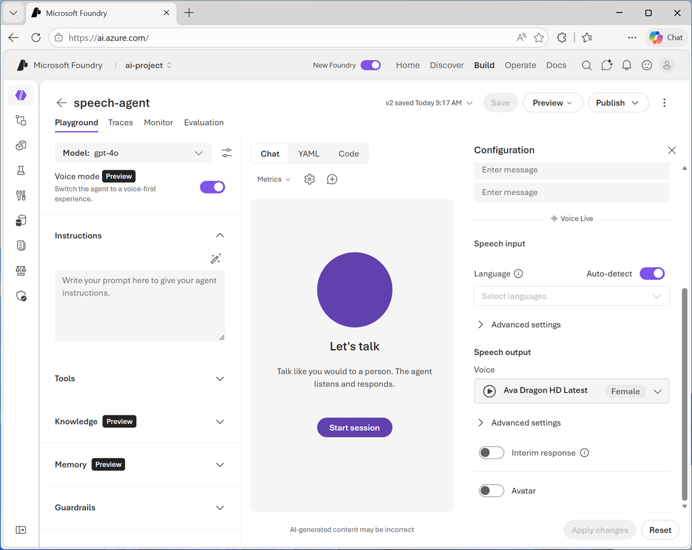

# Develop an Azure Speech Voice Live Agent in Microsoft Foundry

**Module:** develop-voice-live-agent | **Level:** Intermediate | **Role:** Developer | **Service:** Azure Speech / Foundry Tools

## Learning objectives

After completing this module, you'll be able to:

- Describe the core components and capabilities of the Azure Speech Voice Live platform.
- Use the Voice Live API to create conversational AI solutions.
- Use the Voice Live SDK to build and deploy conversational AI solutions.
- Integrate Microsoft Foundry agents with the Voice Live API to create voice agents.

## Prerequisites

- Programming experience with languages such as Python, JavaScript, or C#.
- Familiarity with RESTful APIs and webhooks.
- Basic understanding of Azure services and cloud computing concepts.

---

## Introduction

Voice-enabled applications are transforming how we interact with technology, and this module guides you through building a real-time, interactive voice solutions using advanced APIs and tools. The Voice live API in Azure Speech in Foundry Tools is a solution enabling low-latency, high-quality speech to speech interactions for voice agents. The API is designed for developers seeking scalable and efficient voice-driven experiences as it eliminates the need to manually orchestrate multiple components.

After completing this module, you'll be able to:

- Implement the Azure Speech Voice Live API to enable real-time, bidirectional communication.
- Set up and configure the agent session.
- Develop and manage event handlers to create dynamic and interactive user experiences.
- Use Voice Live with a Foundry Agent.

> **Note:** Different people like to learn in different ways. The text contains greater detail than videos, so in some cases you might want to refer to it as supplemental material to the video presentation.

---

## Explore the Azure Voice Live API

The Voice live API enables developers to create voice-enabled applications with real-time, bidirectional communication. This unit explores its architecture, configuration, and implementation.

### Key features of the Voice Live API

The Voice live API provides real-time communication using WebSocket connections. It supports advanced features such as speech recognition, text-to-speech synthesis, avatar streaming, and audio processing.

- JSON-formatted events manage conversations, audio streams, and responses.
- Events are categorized into client events (sent from client to server) and server events (sent from server to client).

Key features include:

- Real-time audio processing with support for multiple formats like PCM16 and G.711.
- Advanced voice options, including OpenAI voices and Azure custom voices.
- Avatar integration using WebRTC for video and animation.
- Built-in noise reduction and echo cancellation.

> **Note:** Voice Live API is optimized for Microsoft Foundry resources. We recommend using Microsoft Foundry resources for full feature availability and best Microsoft Foundry integration experience.
>
> For a table of supported models and regions, visit the [Voice Live API overview](https://learn.microsoft.com/en-us/azure/ai-services/speech-service/voice-live#supported-models-and-regions).

### Connect to the Voice Live API

The Voice live API supports two authentication methods: Microsoft Entra (keyless) and API key. Microsoft Entra uses token-based authentication for a Microsoft Foundry resource. You apply a retrieved authentication token using a `Bearer` token with the `Authorization` header.

For the recommended keyless authentication with Microsoft Entra ID, you need to assign the **Cognitive Services User** role to your user account or a managed identity. You generate a token using the Azure CLI or Azure SDKs. The token must be generated with the `https://ai.azure.com/.default` scope, or the legacy `https://cognitiveservices.azure.com/.default` scope. Use the token in the `Authorization` header of the WebSocket connection request, with the format `Bearer <token>`.

For key access, an API key can be provided in one of two ways. You can use an `api-key` connection header on the prehandshake connection. This option isn't available in a browser environment. Or, you can use an `api-key` query string parameter on the request URI. Query string parameters are encrypted when using https/wss.

> **Note:** The `api-key` connection header on the prehandshake connection isn't available in a browser environment.

#### WebSocket endpoint

The endpoint to use varies depending on how you want to access your resources. You can access resources through a connection to the Foundry project when implementing an agent, or through a direct connection to a model.

- **Project connection:** The endpoint is `wss://<your-ai-foundry-resource-name>.services.ai.azure.com/voice-live/realtime?api-version=2025-10-01`
- **Model connection:** The endpoint is `wss://<your-ai-foundry-resource-name>.cognitiveservices.azure.com/voice-live/realtime?api-version=2025-10-01`.

The endpoint is the same for all models. The only difference is the required `model` query parameter, or, when using the Agent service, the `agent_id` and `project_id` parameters.

### Voice Live API events

Client and server events facilitate communication and control within the Voice live API. Key client events include:

- `session.update`: Modify session configurations.
- `input_audio_buffer.append`: Add audio data to the buffer.
- `response.create`: Generate responses via model inference.

Server events provide feedback and status updates:

- `session.updated`: Confirm session configuration changes.
- `response.done`: Indicate response generation completion.
- `conversation.item.created`: Notify when a new conversation item is added.

For a full list of client/server events, visit [Voice live API Reference](https://learn.microsoft.com/en-us/azure/ai-services/speech-service/voice-live-api-reference).

> **Note:** Proper handling of events ensures seamless interaction between client and server.

#### Configure session settings for the Voice live API

Often, the first event sent by the caller on a newly established Voice live API session is the `session.update` event. This event controls a wide set of input and output behavior. Session settings can be updated dynamically using the `session.update` event. Developers can configure voice types, modalities, turn detection, and audio formats.

Example configuration:

```json
{
  "type": "session.update",
  "session": {
    "modalities": ["text", "audio"],
    "voice": {
      "type": "openai",
      "name": "alloy"
    },
    "instructions": "You are a helpful assistant. Be concise and friendly.",
    "input_audio_format": "pcm16",
    "output_audio_format": "pcm16",
    "input_audio_sampling_rate": 24000,
    "turn_detection": {
      "type": "azure_semantic_vad",
      "threshold": 0.5,
      "prefix_padding_ms": 300,
      "silence_duration_ms": 500
    },
    "temperature": 0.8,
    "max_response_output_tokens": "inf"
  }
}
```

> **Tip:** Use Azure semantic VAD for intelligent turn detection and improved conversational flow.

#### Implement real-time audio processing with the Voice live API

Real-time audio processing is a core feature of the Voice live API. Developers can append, commit, and clear audio buffers using specific client events.

- **Append audio:** Add audio bytes to the input buffer.
- **Commit audio:** Process the audio buffer for transcription or response generation.
- **Clear audio:** Remove audio data from the buffer.

Noise reduction and echo cancellation can be configured to enhance audio quality. For example:

```json
{
  "type": "session.update",
  "session": {
    "input_audio_noise_reduction": {
      "type": "azure_deep_noise_suppression"
    },
    "input_audio_echo_cancellation": {
      "type": "server_echo_cancellation"
    }
  }
}
```

> **Note:** Noise reduction improves VAD accuracy and model performance by filtering input audio.

#### Integrate avatar streaming using the Voice live API

The Voice live API supports WebRTC-based avatar streaming for interactive applications. Developers can configure video, animation, and blendshape settings.

- Use the `session.avatar.connect` event to provide the client's SDP offer.
- Configure video resolution, bitrate, and codec settings.
- Define animation outputs such as blendshapes and visemes.

Example configuration:

```json
{
  "type": "session.avatar.connect",
  "client_sdp": "<client_sdp>"
}
```

> **Tip:** Use high-resolution video settings for enhanced visual quality in avatar interactions.

---

## Explore the AI Voice Live Client Library for Python

The Azure AI Voice Live client library for Python provides a real-time, speech-to-speech client for Azure AI Voice Live API. It opens a WebSocket session to stream microphone audio to the service and receives server events for responsive conversations.

> **Important:** As of version 1.0.0, this SDK is async-only. The synchronous API is deprecated to focus exclusively on async patterns. All examples and samples use async/await syntax.

In this unit, you learn how to use the SDK to implement authentication and handle events. You also see a minimal example of creating a session. For a full reference to the Voice Live package, visit the [voice live Package reference](https://learn.microsoft.com/en-us/python/api/azure-ai-voicelive/azure.ai.voicelive?view=azure-python).

### Implement authentication

You can implement authentication with an API key or a Microsoft Entra ID token. The following code sample shows an API key implementation. It assumes environment variables are set in a `.env` file, or directly in your environment.

```python
import asyncio
from azure.core.credentials import AzureKeyCredential
from azure.ai.voicelive import connect

async def main():
    async with connect(
        endpoint="your-endpoint",
        credential=AzureKeyCredential("your-api-key"),
        model="gpt-4o"
    ) as connection:
        # Your async code here
        pass

asyncio.run(main())
```

For production applications, Microsoft Entra authentication is recommended. The following code sample shows implementing the `DefaultAzureCredential` for authentication:

```python
import asyncio
from azure.identity.aio import DefaultAzureCredential
from azure.ai.voicelive import connect

async def main():
    credential = DefaultAzureCredential()

    async with connect(
        endpoint="your-endpoint",
        credential=credential,
        model="gpt-4o"
    ) as connection:
        # Your async code here
        pass

asyncio.run(main())
```

### Handling events

Proper handling of events ensures a more seamless interaction between the client and agent. For example, when handling a user interrupting the voice agent you need to cancel agent audio playback immediately in the client. If you don't, the client continues to play the last agent response until the interrupt is processed in the API - resulting in the agent "talking over" the user.

The following code sample shows some basic event handling:

```python
async for event in connection:
    if event.type == ServerEventType.SESSION_UPDATED:
        print(f"Session ready: {event.session.id}")
        # Start audio capture

    elif event.type == ServerEventType.INPUT_AUDIO_BUFFER_SPEECH_STARTED:
        print("User started speaking")
        # Stop playback and cancel any current response

    elif event.type == ServerEventType.RESPONSE_AUDIO_DELTA:
        # Play the audio chunk
        audio_bytes = event.delta

    elif event.type == ServerEventType.ERROR:
        print(f"Error: {event.error.message}")
```

### Minimal example

The following code sample shows authenticating to the API and configuring the session.

```python
import asyncio
from azure.core.credentials import AzureKeyCredential
from azure.ai.voicelive.aio import connect
from azure.ai.voicelive.models import (
    RequestSession, Modality, InputAudioFormat, OutputAudioFormat, ServerVad, ServerEventType
)

API_KEY = "your-api-key"
ENDPOINT = "your-endpoint"
MODEL = "gpt-4o"

async def main():
    async with connect(
        endpoint=ENDPOINT,
        credential=AzureKeyCredential(API_KEY),
        model=MODEL,
    ) as conn:
        session = RequestSession(
            modalities=[Modality.TEXT, Modality.AUDIO],
            instructions="You are a helpful assistant.",
            input_audio_format=InputAudioFormat.PCM16,
            output_audio_format=OutputAudioFormat.PCM16,
            turn_detection=ServerVad(
                threshold=0.5, 
                prefix_padding_ms=300, 
                silence_duration_ms=500
            ),
        )
        await conn.session.update(session=session)

        # Process events
        async for evt in conn:
            print(f"Event: {evt.type}")
            if evt.type == ServerEventType.RESPONSE_DONE:
                break

asyncio.run(main())
```

---

## Create a Voice Live Agent

You can create and run an application to use Voice Live with a Microsoft Foundry agent. Using agents with Voice Live brings the following advantages over connecting directly to a model:

- Agents encapsulate instructions and configuration within the agent itself, rather than specifying instructions in the session code.
- Agents support complex logic and behaviors, making it easier to manage and update conversational flows without changing the client code.
- The agent approach streamlines integration. The agent ID is used to connect and all necessary settings are handled internally, reducing the need for manual configuration in the code.
- Separating agent logic from voice implementation supports better maintainability and scalability for scenarios where multiple conversational experiences or business logic variations are needed.

### Create a voice agent in the agent playground

As you develop an agent in the Microsoft Foundry portal, you can enable **voice mode** to easily integrate Voice Live into your agent, and test it in the playground.



After enabling voice mode, you can use the **Configuration** pane to enable Voice Live settings, including:

- **Language**: The language spoken and understood by the agent.
- **Advanced settings**:
    - Voice activity detection (VAD) settings to detect interruptions and end of speech.
    - Audio enhancement to mitigate background noise and audio quality.
- **Voice**: The specific voice used by the agent, and advanced voice settings to control the tone and speaking rate.
- **Interim response**: The agent can automatically generate speech while waiting for a model's response.
- **Avatar**: Inclusion of a visual avatar to represent the agent.

### Create a voice agent using code

If you prefer to create your agent using code, you can use the appropriate Foundry Agent SDK (for example the Foundry SDK for Python) to create the agent, and add Voice Live metadata to its definition.

```python
import os
import json
from azure.identity import DefaultAzureCredential
from azure.ai.projects import AIProjectClient
from azure.ai.projects.models import PromptAgentDefinition

load_dotenv()

# Setup client
project_client = AIProjectClient(
    "PROJECT_ENDPOINT",
    credential=DefaultAzureCredential(),
)

# Define Voice Live session settings
voice_live_config = {
    "session": {
        "voice": {
            "name": "en-US-Ava:DragonHDLatestNeural",
            "type": "azure-standard",
            "temperature": 0.8
        },
        "input_audio_transcription": {
            "model": "azure-speech"
        },
        "turn_detection": {
            "type": "azure_semantic_vad",
            "end_of_utterance_detection": {
                "model": "semantic_detection_v1_multilingual"
            }
        },
        "input_audio_noise_reduction": {"type": "azure_deep_noise_suppression"},
        "input_audio_echo_cancellation": {"type": "server_echo_cancellation"}
    }
}

# Create agent with Voice Live configuration in metadata
agent = project_client.agents.create_version(
    agent_name="AGENT_NAME",
    definition=PromptAgentDefinition(
        model="MODEL_DEPLOYMENT_NAME",
        instructions="You are a helpful assistant.",
    ),
    metadata=chunk_config(json.dumps(voice_live_config))
)
print(f"Agent created: {agent.name} (version {agent.version})")

# Helper function for Voice Live configuration chunking (to handle 512-char metadata limit)
def chunk_config(config_json: str, limit: int = 512) -> dict:
    """Split config into chunked metadata entries."""
    metadata = {"microsoft.voice-live.configuration": config_json[:limit]}
    remaining = config_json[limit:]
    chunk_num = 1
    while remaining:
        metadata[f"microsoft.voice-live.configuration.{chunk_num}"] = remaining[:limit]
        remaining = remaining[limit:]
        chunk_num += 1
    return metadata
```

### Use your agent in a client application

To use your agent, you need to build a client application that:

1. Connects to the agent
2. Configures audio hardware input and output
3. Establishes a Voice live session
4. Monitors audio systems for activity
5. Processes events (such as user speech input and responses from the agent)

While you can implement these tasks using any of the functionality available in the APIs, the recommended pattern for Voice Live client applications is to:

- Use Microsoft Entra ID authentication to connect to the agent in a Microsoft Foundry project.
- Implement a custom **VoiceAssistant** class that encapsulates strongly typed agent configuration, defines functions to configure and start the Voice live session, and processes voice events.
- Implement a custom **AudioProcessor** class that encapsulates input and output through audio devices.

The following example shows a minimal implementation of this pattern in Python (using the *PyAudio* library for audio input and output).

```python
import os
import asyncio
import base64
import queue
from dotenv import load_dotenv
import pyaudio
from azure.identity.aio import AzureCliCredential
from azure.ai.voicelive.aio import connect
from azure.ai.voicelive.models import (
    InputAudioFormat,
    Modality,
    OutputAudioFormat,
    RequestSession,
    ServerEventType,
    AudioNoiseReduction,
    AudioEchoCancellation,
    AzureSemanticVadMultilingual
) 

# Main program entry point
def main():
    """Main entry point."""

    try:
        # Get required configuration from environment variables
        load_dotenv()
        endpoint = os.environ.get("AZURE_VOICELIVE_ENDPOINT")
        agent_name = os.environ.get("AZURE_VOICELIVE_AGENT_ID")
        project_name = os.environ.get("AZURE_VOICELIVE_PROJECT_NAME")

        # Create credential for authentication
        credential = AzureCliCredential()

        # Create and start the voice assistant
        assistant = VoiceAssistant(
            endpoint=endpoint,
            credential=credential,
            agent_name=agent_name,
            project_name=project_name
        )

        # Run the assistant
        try:
            asyncio.run(assistant.start())
        except KeyboardInterrupt:
            # Exit if the user enters CTRL+C
            print("\nGoodbye!")

    except Exception as e:
        print(f"An error occurred: {e}")

# VoiceAssistant class
class VoiceAssistant:
    """Main voice assistant - coordinates the conversation"""

    def __init__(self, endpoint, credential, agent_name, project_name):
        self.endpoint = endpoint
        self.credential = credential

        # Agent configuration
        self.agent_config = {
            "agent_name": agent_name,
            "project_name": project_name
        }

    async def start(self):
        """Start the voice assistant."""

        try:
            # Connect the agent
            async with connect(
                endpoint=self.endpoint,
                credential=self.credential,
                api_version="2026-01-01-preview",
                agent_config=self.agent_config
            ) as connection:
                self.connection = connection

                # Initialize audio processor
                self.audio_processor = AudioProcessor(connection)

                # Configure the session
                await self.setup_session()

                # Start audio I/O 
                self.audio_processor.start_playback()
                print("\nVoice session started...")
                print("Press Ctrl+C to exit\n")

                # Process events
                await self.process_events()

        finally:
            if hasattr(self, 'audio_processor'):
                self.audio_processor.shutdown()

    async def setup_session(self):
        """Configure the session with audio settings."""

        session_config = RequestSession(
            # Enable both text and audio
            modalities=[Modality.TEXT, Modality.AUDIO],

            # Audio format (16-bit PCM at 24kHz)
            input_audio_format=InputAudioFormat.PCM16,
            output_audio_format=OutputAudioFormat.PCM16,

            # Voice activity detection (when to detect speech)
            turn_detection=AzureSemanticVadMultilingual(),

            # Prevent echo from speaker feedback
            input_audio_echo_cancellation=AudioEchoCancellation(),

            # Reduce background noise
            input_audio_noise_reduction=AudioNoiseReduction(type="azure_deep_noise_suppression")
        )

        await self.connection.session.update(session=session_config)
        print("Session configured")

    async def process_events(self):
        """Process events from the VoiceLive service."""

        # Listen for events from the service
        async for event in self.connection:
            await self.handle_event(event)

    async def handle_event(self, event):
        """Handle different event types from the service."""

        # Session is ready - start capturing audio
        if event.type == ServerEventType.SESSION_UPDATED:
            print(f"Connected to agent: {event.session.agent.name}")
            self.audio_processor.start_capture()

        # User speech was transcribed
        elif event.type == ServerEventType.CONVERSATION_ITEM_INPUT_AUDIO_TRANSCRIPTION_COMPLETED:
            print(f'You: {event.get("transcript", "")}')

        # Agent is responding with audio transcript
        elif event.type == ServerEventType.RESPONSE_AUDIO_TRANSCRIPT_DONE:
            print(f'Agent: {event.get("transcript", "")}')

        # User started speaking (interrupt any playing audio)
        elif event.type == ServerEventType.INPUT_AUDIO_BUFFER_SPEECH_STARTED:
            self.audio_processor.clear_playback_queue()
            print("Listening...")

        # User stopped speaking
        elif event.type == ServerEventType.INPUT_AUDIO_BUFFER_SPEECH_STOPPED:
            print("Thinking...")

        # Receiving audio response chunks
        elif event.type == ServerEventType.RESPONSE_AUDIO_DELTA:
            self.audio_processor.queue_audio(event.delta)

        # Audio response complete
        elif event.type == ServerEventType.RESPONSE_AUDIO_DONE:
            print("Response complete\n")

        # Handle errors
        elif event.type == ServerEventType.ERROR:
            print(f"Error: {event.error.message}")

# AudioProcessor class
class AudioProcessor:
    """Handles audio input (microphone) and output (speakers) """

    def __init__(self, connection):
        self.connection = connection
        self.audio = pyaudio.PyAudio()

        # Audio settings: 24kHz, 16-bit PCM, mono
        self.format = pyaudio.paInt16
        self.channels = 1
        self.rate = 24000
        self.chunk_size = 1200  # 50ms chunks

        # Streams for input and output
        self.input_stream = None
        self.output_stream = None
        self.playback_queue = queue.Queue()

    def start_capture(self):
        """Start capturing audio from the microphone."""

        def capture_callback(in_data, frame_count, time_info, status):
            # Convert audio to base64 and send to VoiceLive
            audio_base64 = base64.b64encode(in_data).decode("utf-8")
            asyncio.run_coroutine_threadsafe(
                self.connection.input_audio_buffer.append(audio=audio_base64),
                self.loop
            )
            return (None, pyaudio.paContinue)

        # Store event loop for use in callback thread
        self.loop = asyncio.get_event_loop()

        self.input_stream = self.audio.open(
            format=self.format,
            channels=self.channels,
            rate=self.rate,
            input=True,
            frames_per_buffer=self.chunk_size,
            stream_callback=capture_callback
        )
        print("Microphone started")

    def start_playback(self):
        """Start audio playback system."""

        remaining = bytes()

        def playback_callback(in_data, frame_count, time_info, status):
            nonlocal remaining

            # Calculate bytes needed
            bytes_needed = frame_count * pyaudio.get_sample_size(pyaudio.paInt16)
            output = remaining[:bytes_needed]
            remaining = remaining[bytes_needed:]

            # Get more audio from queue if needed
            while len(output) < bytes_needed:
                try:
                    audio_data = self.playback_queue.get_nowait()
                    if audio_data is None:  # End signal
                        break
                    output += audio_data
                except queue.Empty:
                    # Pad with silence if no audio available
                    output += bytes(bytes_needed - len(output))
                    break

            # Keep any extra for next callback
            if len(output) > bytes_needed:
                remaining = output[bytes_needed:]
                output = output[:bytes_needed]

            return (output, pyaudio.paContinue)

        self.output_stream = self.audio.open(
            format=self.format,
            channels=self.channels,
            rate=self.rate,
            output=True,
            frames_per_buffer=self.chunk_size,
            stream_callback=playback_callback
        )
        print("Speakers ready")

    def queue_audio(self, audio_data):
        """Add audio data to the playback queue."""
        self.playback_queue.put(audio_data)

    def clear_playback_queue(self):
        """Clear any pending audio (used when user interrupts)."""
        while not self.playback_queue.empty():
            try:
                self.playback_queue.get_nowait()
            except queue.Empty:
                break

    def shutdown(self):
        """Clean up audio resources."""
        if self.input_stream:
            self.input_stream.stop_stream()
            self.input_stream.close()

        if self.output_stream:
            self.playback_queue.put(None)  # Signal end
            self.output_stream.stop_stream()
            self.output_stream.close()

        self.audio.terminate()
        print("Audio stopped")

if __name__ == "__main__":
    main()
```

---

## Summary

In this module, you learned about the Voice live API's features, including WebSocket connections, speech recognition, text-to-speech synthesis, and avatar streaming. You also explored Azure AI Voice Live for creating real-time speech-to-speech applications using Python, including setting up the client library and managing sessions. Additionally, you learned how to implement event handlers in Python for dynamic responses and real-time audio processing. Finally, you developed a Python-based web application using Flask, integrated it with Azure resources, and tested the application.

### Additional reading

- [What is the Speech service?](https://learn.microsoft.com/en-us/azure/cognitive-services/speech-service/)
- [How to customize voice live input and output](https://learn.microsoft.com/en-us/azure/ai-services/speech-service/voice-live-how-to-customize)

---

## Exercise / Lab

Hands-on lab: [06-voice-live-agent.md](../../../labs/mslearn-ai-language/Instructions/Exercises/06-voice-live-agent.md)
