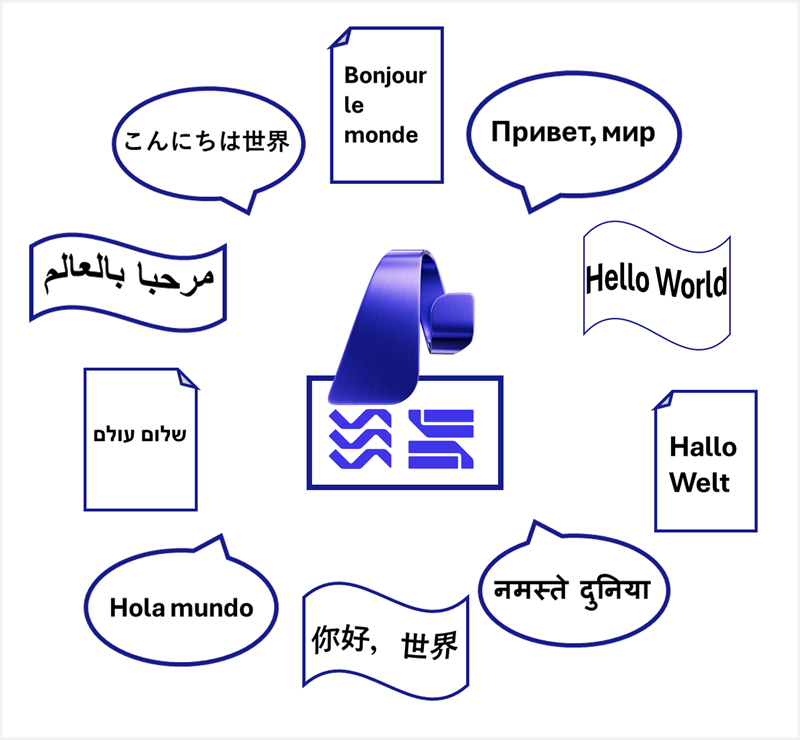
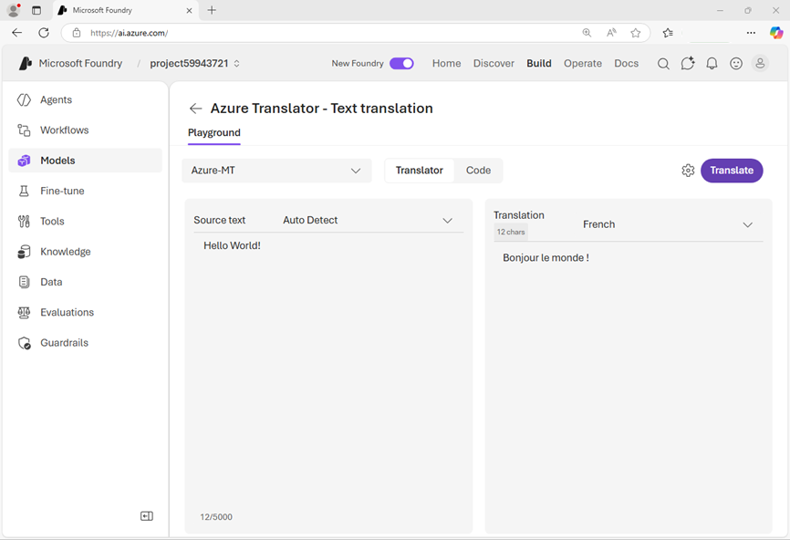

# Translate text and speech with Microsoft Foundry Tools

## Overview

**Learning objectives**

After completing this module, you'll be able to:

- Identify options for translating text and speech in Microsoft Foundry Tools
- Use Azure Translator in Foundry Tools to translate text
- Use Azure Speech in Foundry Tools to translate speech

**Prerequisites**

Before starting this module, you need

- Familiarity with Microsoft Foundry and Azure.
- Programming experience.

## Introduction

There are many commonly used languages throughout the world, and the ability to exchange information between speakers of different languages is often a critical requirement for global solutions.

Translation between languages is a specialized skill, and can often be time-consuming and expensive. Automated translation (sometimes referred to as "machine translation") is often used to reduce the time and costs involved; but it requires complex software that understands the linguistic rules and idioms of both source and target languages.

AI models are commonly at the heart of automated translation solutions; whether they be used to translate text-based documents or spoken language. In this module, you'll explore some of the ways in which you can develop AI-powered translation solutions using Microsoft Foundry.

> **Note:** We recognize that different people like to learn in different ways. You can choose to complete this module in video-based format or you can read the content as text and images. The text contains greater detail than the videos, so in some cases you might want to refer to it as supplemental material to the video presentation.

## Translation in Microsoft Foundry

Many large language models (LLMs) can generate output in multiple languages, and can translate phrases or even documents. However, comprehensive multi-language translation solutions generally require specialized models; and Microsoft Foundry provides support for translation through Foundry Tools. Specifically:

- **Azure Translator in Foundry Tools**: A comprehensive translation service for text, with a wide range of supported languages and the ability to create custom translation models.
- **Azure Speech in Foundry Tools**: A suite of speech-related tools, including speech-to-text and speech-to-speech translation in multiple languages simultaneously.



Both Azure Translator and Azure Speech are accessible through a Microsoft Foundry resource endpoint, and provide extensive APIs and language-specific SDKs that you can use to develop comprehensive translation solutions.

## Translate text

Azure Translator in Foundry Tools provides an API for translating text between over 90 supported languages. With Azure Translator you can:

- Translate or transliterate text using the default translation model or a large language model (LLM).
- Translate documents, synchronously or asynchronously, while maintaining document structure.
- Use custom translation models to translate domain-specific terms.

We'll focus on the *text translation* API in this module. You can find out more about the full range of Azure Translator capabilities in the [Azure Translator in Foundry Tools documentation](/en-us/azure/ai-services/translator?azure-portal=true).

### Use Azure Translator in the Microsoft Foundry portal

You can explore Azure Translator in the Microsoft Foundry portal, where there are playgrounds for text translation and document translation.



The Foundry portal is a great way to experiment with Azure translator, comparing results from the default model with those from LLMs, and viewing sample code to use the translator from your own client applications.

### Use Azure Translator in application code

You can use the [REST API](/en-us/azure/ai-services/translator/text-translation/reference/rest-api-guide?azure-portal=true) to call Azure Translator functions, or you can write code in your preferred language by using one of the supported SDKs; which include:

- [Azure Translator Text Translation Client for Python](https://pypi.org/project/azure-ai-translation-text/1.0.1/?azure-portal=true)
- [Azure Translator Text Translation Client for Microsoft .NET](https://www.nuget.org/packages/Azure.AI.Translation.Text/1.0.0?azure-portal=true)
- [Azure Translator Text Translation Client for Java](https://mvnrepository.com/artifact/com.azure/azure-ai-translation-text/1.0.0?azure-portal=true)
- [Azure Translator Text Translation Client for JavaScript](https://www.npmjs.com/package/@azure-rest/ai-translation-text/v/1.0.0?azure-portal=true)

#### Connect to an Azure Translator resource

Azure Translator APIs are served through REST *endpoints*, to which your client must make an authenticated connection. The endpoint can be:

- The Azure Translator *global* endpoint: `api.cognitive.microsofttranslator.com`
- Azure Translator *regional* endpoints: These endpoints include `api-nam.cognitive.microsofttranslator.com`, `api-apc.cognitive.microsofttranslator.com`, and `api-eur.cognitive.microsofttranslator.com`
- Foundry resource endpoints: `{foundry-resource-name}.cognitiveservices.azure.com/`

You can connect a client to a specific endpoint, or you can connect by specifying the region in which your resource is provisioned. For example, you could use either of the techniques shown in the following code sample to connect to Azure Translator using your Foundry API key for authentication:

```python
from azure.core.credentials import AzureKeyCredential
from azure.ai.translation.text import *

key_credential = AzureKeyCredential("FOUNDRY_KEY")

# Connect to a Foundry resource endpoint
client = TextTranslationClient(credential=key_credential, endpoint="FOUNDRY_ENDPOINT")

# Or connect using a region
client = TextTranslationClient(credential=key_credential, region="FOUNDRY_REGION")
```

> **Tip:** For more information about the **TextTranslationClient** constructor, see the [Azure Translator Python SDK documentation](/en-us/python/api/azure-ai-translation-text/azure.ai.translation.text.texttranslationclient?azure-portal=true#constructor).

#### Determine available languages

Azure Translator supports over 90 languages. In some cases, you may want to provide users with a list of available languages for translation; as shown in the following example code:

```python
languages = client.get_supported_languages(scope="translation")
print("{} languages supported:".format(len(languages.translation)))
for language in languages.translation.keys():
    print(languages.translation[language].name + " (" + language + ")")
```

The results include the *name* and *ISO code* for each language:

```
137 languages supported:
Afrikaans (af)
Amharic (am)
Arabic (ar)
Assamese (as)
Azerbaijani (az)
Bashkir (ba)
Belarusian (be)
Bulgarian (bg)
...
```

> **Tip:** For more information about the **get\_supported\_language** method, see the [Azure Translator Python SDK documentation](/en-us/python/api/azure-ai-translation-text/azure.ai.translation.text.texttranslationclient?azure-portal=true#azure-ai-translation-text-texttranslationclient-get-supported-languages).

#### Translate text

To translate text from a *source* language to one or more *target* languages, use the **translate** method.

- Source text is passed into the method as a list of **InputTextItem** objects, each containing a text string to be translated.
- You can optionally specify a **from\_language** parameter with the ISO code for the source language (for example, "en"); or you can omit this parameter to have Azure Translator automatically detect the source language.
- Target languages as specified as a list of language codes in the **to\_language** parameter - Azure Translator will return a translation for each valid language code.

The following example translates two text inputs in different unspecified languages into French (*fr*) and English (*en*):

```python
input_text_elements = [InputTextItem(text="Hola"), InputTextItem(text="こんにちは")]
translation_results = client.translate(body=input_text_elements, to_language=["fr", "en"])
idx = 0
for translation in translation_results:
    input_text = input_text_elements[idx].text
    idx += 1
    sourceLanguage = translation.detected_language
    for translated_text in translation.translations:
        print(f"'{input_text}' was translated from {sourceLanguage.language} to {translated_text.to} as '{translated_text.text}'.")
```

The output from this code shows the detected source languages as Spanish (*es*) and Japanese (*ja*):

```
'Hola' was translated from es to fr as 'Bonjour'.
'Hola' was translated from es to en as 'Hello'.
'こんにちは' was translated from ja to fr as 'Bonjour'.
'こんにちは' was translated from ja to en as 'Hello'.
```

> **Tip:** For more information about the **translate** method, see the [Azure Translator Python SDK documentation](/en-us/python/api/azure-ai-translation-text/azure.ai.translation.text.texttranslationclient?azure-portal=true#azure-ai-translation-text-texttranslationclient-translate).

#### Transliterate text

The Japanese text in the previous example is written using Hiragana script, so rather than translate it to a different language, you may want to transliterate it to a different script - for example to render the Japanese words in Latin script (as used by English language text).

To accomplish this, we can submit the Japanese text to the **transliterate** method with a **from\_script** parameter of **Jpan** and a **to\_script** parameter of **Latn**, like this:

```python
source_text = "こんにちは"
input_text_elements = [InputTextItem(text=source_text)]
transliteration_results = client.transliterate(body=input_text_elements, language="ja",
                                               from_script="Jpan", to_script="Latn")
for transliteration in transliteration_results:
    sourceScript = transliteration.script
    targetScript = transliteration.text
    print(f"'{source_text}' was transliterated into {sourceScript} as {targetScript}.")
```

This code example produces the following result:

```
'こんにちは' was transliterated into Latn as Kon'nichiwa​.
```

> **Tip:** For more information about the **transliterate** method, see the [Azure Translator Python SDK documentation](/en-us/python/api/azure-ai-translation-text/azure.ai.translation.text.texttranslationclient?azure-portal=true#azure-ai-translation-text-texttranslationclient-transliterate).

## Translate speech

Azure Speech in Foundry Tools provides multiple APIs that you can use to build speech-enabled applications and agents. The Speech Translation API enables you to build solutions that translate spoken input and return the translation as text or speech.

### Use Azure Speech translation in application code

To support speech translation, Azure Speech provides an API that you can use from your application code through the **TranslationRecognizer** object; which you can create by connecting to your Azure Speech resource using a **SpeechTranslationConfig** object.

#### Connect to an Azure Speech resource

To use the Azure Speech Translation API in client code, you must use a **SpeechTranslationConfig** object to connect to an Azure Speech resource. Microsoft Foundry provides Azure Speech as a tool in a Foundry resource, and you can connect by specifying the relevant *endpoint* or *region* for your resource, as shown in this code example:

```python
import azure.cognitiveservices.speech as speech_sdk

# Connect to a Foundry resource endpoint
translation_cfg = speech_sdk.translation.SpeechTranslationConfig(
                    subscription="FOUNDRY_KEY", endpoint="FOUNDRY_ENDPOINT")

# Or connect using a region
translation_cfg = speech_sdk.translation.SpeechTranslationConfig(
                    subscription="FOUNDRY_KEY", region="FOUNDRY_REGION")

```

> **Tip:** For more information about the **SpeechTranslationConfig** constructor, see the [Azure Speech Python SDK documentation](/en-us/python/api/azure-cognitiveservices-speech/azure.cognitiveservices.speech.translation.speechtranslationconfig?azure-portal=true#constructor).

#### Configure translation languages and input

Azure Speech can translate spoken audio input to one or more languages. You use the **SpeechTranslationConfig** object to configure the source and target languages, and an **AudioConfig** object to specify the source audio stream.

For example, the following code configures the **SpeechTranslationConfig** object for translation from US English (*en-US*) to French (*fr*) and Japanese (*ja*); and uses an **AudioConfig** object to specify the source audio as coming from the default system microphone.

```python
# Configure languages
translation_cfg.speech_recognition_language = 'en-US'
translation_cfg.add_target_language('fr')
translation_cfg.add_target_language('ja')
print('Ready to translate from',translation_cfg.speech_recognition_language)

# Configure audio source
audio_cfg = speech_sdk.AudioConfig(use_default_microphone=True)
```

> **Tip:** For more information about the **AudioConfig** class, see the [Azure Speech Python SDK documentation](/en-us/python/api/azure-cognitiveservices-speech/azure.cognitiveservices.speech.audio.audioconfig?azure-portal=true).

#### Translate speech to text

Now you're ready to translate spoken input using a **TranslationRecognizer** object, like this:

```python
# Get a TranslationRecognizr object
translator = speech_sdk.translation.TranslationRecognizer(translation_config=translation_cfg,
                                                          audio_config=audio_cfg)
# Get input from mic and translate
print("Speak now...")
translation_results = translator.recognize_once_async().get()
print(f"Translating '{translation_results.text}'")

# Print each translation
translations = translation_results.translations
for translation_language in translations:
    print(f"{translation_language}: '{translations[translation_language]}'")
```

Running this code and saying "hello" into the microphone results in the following output:

```
Speak now...
Translating 'Hello.'
fr: 'Bonjour.'
ja: 'こんにちは。'
```

> **Tip:** For more information about the **TranslationRecognizer** class, see the [Azure Speech Python SDK documentation](/en-us/python/api/azure-cognitiveservices-speech/azure.cognitiveservices.speech.translation.translationrecognizer?azure-portal=true).

### Synthesize translations as speech

If you need to implement speech-to-speech translation, there are two common approaches you can choose from:

#### Manual synthesis

Manual synthesis is a straightforward way to synthesize the results of speech translation You can use manual synthesis to generate audio from text translations. It's essentially just the combination of two separate operations in which you:

1. Use a **TranslationRecognizer** to translate spoken input into text transcriptions in one or more target languages.
2. Iterate through the **Translations** in the result of the translation operation, using a **SpeechSynthesizer** to synthesize an audio stream for each language.

For example, we could expand the previous example to use Azure Speech to synthesize each translation that is returned, like this:

```python
import azure.cognitiveservices.speech as speech_sdk

# Configure translation
translation_cfg = speech_sdk.translation.SpeechTranslationConfig(subscription="FOUNDRY_KEY",
                                                                 endpoint="FOUNDRY_ENDPOINT")
translation_cfg.speech_recognition_language = 'en-US'
translation_cfg.add_target_language('fr')
translation_cfg.add_target_language('ja')
audio_cfg = speech_sdk.AudioConfig(use_default_microphone=True)

# Configure speech synthesis
speech_cfg = speech_sdk.SpeechConfig(subscription="FOUNDRY_KEY", 
                                     endpoint="FOUNDRY_ENDPOINT")
audio_out_cfg = speech_sdk.audio.AudioOutputConfig(use_default_speaker=True)
voices = {
        "fr": "fr-FR-HenriNeural",
        "ja": "ja-JP-NanamiNeural"
}

# Get trsnslations
translator = speech_sdk.translation.TranslationRecognizer(translation_config=translation_cfg,
                                                          audio_config=audio_cfg)
print("Speak now...")
translation_results = translator.recognize_once_async().get()
print(f"Translating '{translation_results.text}'")

# process the translation results
translations = translation_results.translations
for translation_language in translations:

    # Print ressults
    print(f"{translation_language}: '{translations[translation_language]}'")

    # Speak results
    speech_cfg.speech_synthesis_voice_name = voices.get(translation_language)
    speech_synthesizer = speech_sdk.SpeechSynthesizer(speech_cfg, audio_out_cfg)
    speak = speech_synthesizer.speak_text_async(translations[translation_language]).get()

    # CHeck for speech failure
    if speak.reason != speech_sdk.ResultReason.SynthesizingAudioCompleted:
        print(speak.reason)
```

Note that you need to create a **SpeechConfig** object for the speech synthesis API, and a separate **AudioConfig** to direct the spoken output to the default speaker. You can also specify language-specific voices to optimize pronunciation of the translated speech.

#### Event-based synthesis

When you want to perform 1:1 translation (translating from one source language into a single target language), you can use event-based synthesis to capture the translation as an audio stream. To do this, you need to:

- Specify the desired voice for the translated speech in the **TranslationConfig**.
- Create an event handler for the **TranslationRecognizer** object's **Synthesizing** event.
- In the event handler, use the **GetAudio**() method of the **Result** parameter to retrieve the byte stream of translated audio.

> **Note:** You can't use event-based synthesis for multi-language translation.

For example, the following Python code uses an inline event handler to capture the translated audio stream and save it as a file. The code subsequently plays the file using the **playsound** library.

```python
import azure.cognitiveservices.speech as speech_sdk
from playsound3 import playsound

# Configure translation
source_language, target_language = "en-US", "fr"
output_file = "translation.wav"
translation_cfg = speech_sdk.translation.SpeechTranslationConfig(subscription="FOUNDRY_KEY",
                                                                 endpoint="FOUNDRY_ENDPOINT")
translation_cfg.speech_recognition_language = source_language
translation_cfg.add_target_language(target_language)
translation_cfg.voice_name = "fr-FR-HenriNeural"
audio_cfg = speech_sdk.AudioConfig(use_default_microphone=True)
translator = speech_sdk.translation.TranslationRecognizer(translation_config=translation_cfg,
                                                          audio_config=audio_cfg)

# Event handler function to save the synthesized audio to a file
def synthesis_callback(evt):
    size = len(evt.result.audio)
    print(f'Audio synthesized: {size} byte(s) {"(COMPLETED)" if size == 0 else ""}')

    if size > 0:
        file = open(output_file, 'wb+')
        file.write(evt.result.audio)
        file.close()

# Connect the event handler function
translator.synthesizing.connect(synthesis_callback)

# Get input from mic and translate it
print(f"Speak now (in {source_language})...")
translation_results = translator.recognize_once()
print(f"Translating '{translation_results.text}'")

# Print and play the translation results
print(translation_results.translations[target_language])
playsound(output_file)
```

> **Tip:** For more information about synthesizing translations, see the [Azure Speech documentation](/en-us/azure/ai-services/speech-service/how-to-translate-speech?tabs=terminal&pivots=programming-language-python&azure-portal=true#synthesize-translations).

## Summary

This module explored options for implementing an AI-powered translation solution with Microsoft Foundry. Specifically, it described how to:

- Use Azure Translator in Foundry Tools for text translation.
- Use Azure Speech in Foundry Tools for speech translation.

For more information about the tools discussed in this module, see the following documentation:

- [Azure Translator in Foundry Tools documentation](/en-us/azure/ai-services/translator?azure-portal=true)
- [Azure Speech in Foundry Tools translation documentation](/en-us/azure/ai-services/speech-service/speech-translation?azure-portal=true)

## Exercise / Lab

Hands-on lab: [07-translation](../../../labs/mslearn-ai-language/Instructions/Exercises/07-translation.md)
