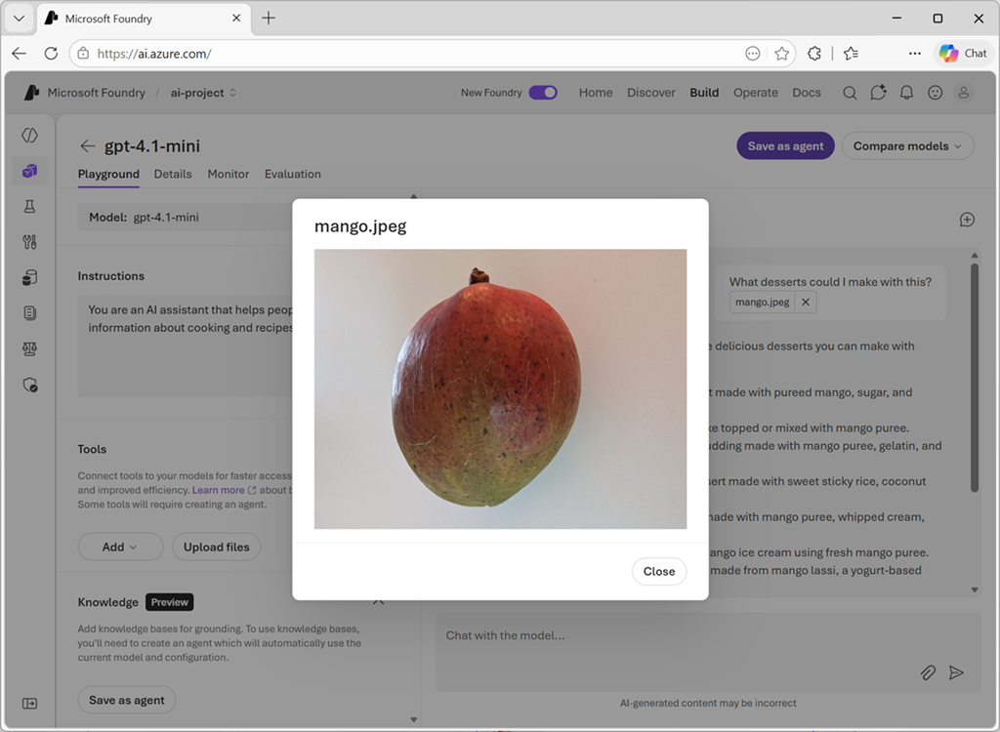

# Develop a vision-enabled generative AI application

**Module:** develop-generative-ai-vision-apps  
**Level:** Intermediate | **Role:** AI Engineer | **Service:** Microsoft Foundry

## Learning objectives

After completing this module, you'll be able to:

- Deploy a vision-enabled generative AI model in Microsoft Foundry.
- Test an image-based prompt in the chat playground.
- Create a chat app that submits image-based prompts.

## Prerequisites

Before starting this module, you should have:

- Experience with deploying generative AI models in Microsoft Foundry.
- Programming experience.

---

## Introduction

Generative AI models enable you to develop chat-based applications that reason over and respond to input. Often this input takes the form of a text-based prompt, but increasingly multimodal models that can respond to visual input are becoming available.

In this module, we'll discuss vision-enabled generative AI and explore how you can use Microsoft Foundry to create generative AI solutions that respond to prompts that include a mix of text and image data.

> **Note:** You can complete this module in video-based format or read the content as text and images. The text contains greater detail than the videos, so in some cases you might want to refer to it as supplemental material to the video presentation.

---

## Use a vision-capable model in the Microsoft Foundry portal

To handle prompts that include images, you need to deploy a *multimodal* generative AI model — in other words, a model that supports not only text-based input, but image-based (and in some cases, audio-based) input as well. Multimodal models available in Microsoft Foundry include (among others):

- Microsoft **Phi-4-multimodal-instruct**
- OpenAI **gpt-4.1**
- OpenAI **gpt-4.1-mini**

> **Tip:** To learn more about available models in Microsoft Foundry, see the [Microsoft Foundry Models overview](https://learn.microsoft.com/en-us/azure/foundry/concepts/foundry-models-overview) article in the Microsoft Foundry documentation.

### Testing multimodal models with image-based prompts

After deploying a multimodal model, you can test it in the chat playground in Microsoft Foundry portal.



In the chat playground, you can upload an image from a local file and add text to the message to elicit a response from a multimodal model.

---

## Develop a vision-based chat app

To develop a client app that engages in vision-based chats with a multimodal model, you can use the same basic techniques used for text-based chats. You require a connection to the endpoint where the model is deployed, and you use that endpoint to submit prompts that consists of messages to the model and process the responses.

The key difference is that prompts for a vision-based chat include multi-part user messages that contain both a *text* content item and an *image* content item.


### Submit an image-based prompt using the *Responses* API

To include an image in a prompt using the *Responses* API, specify a URL for a web-based image file, or load a local image and encode its data in Base64 format and submit a URL in the format `data:image/jpeg;base64,{image_data}` (replacing "jpeg" with "png" or other formats as appropriate).

The following Python example shows how to submit an image in a prompt using the *Responses* API:

```python
# Read the image data from a local file
image_path = Path("dragon-fruit.jpeg")
image_format = "jpeg"
with open(image_path, "rb") as image_file:
    image_data = base64.b64encode(image_file.read()).decode("utf-8")

data_url = f"data:image/{image_format};base64,{image_data}" # You can also use a web URL

# Send the image data in a prompt to the model
response = client.responses.create(
    model="gpt-4.1",
    input=[
        {"role": "developer", "content": "You are an AI assistant for chefs planning recipes."},
        {"role": "user", "content": [  
            { "type": "input_text", "text": "What desserts could I make with this?"},
            { "type": "input_image", "image_url": data_url}
        ] } 
    ]
)
print(response.output_text)
```

### Submit an image-based prompt using the *ChatCompletions* API

When using the Azure OpenAI endpoint to submit prompts to models that don't support the *Responses* API, you can use the *ChatCompletions* API; like this:

```python
# Read the image data from a local file
image_path = Path("orange.jpeg")
image_format = "jpeg"
with open(image_path, "rb") as image_file:
    image_data = base64.b64encode(image_file.read()).decode("utf-8")

data_url = f"data:image/{image_format};base64,{image_data}" # You can also use a web URL

# Send the image data in a prompt to the model
response = client.chat.completions.create(
    model="Phi-4-multimodal-instruct",
    messages=[
        {"role": "system", "content": "You are an AI assistant for chefs planning recipes."},
        { "role": "user", "content": [  
            { "type": "text", "text": "What can I make with this fruit?"},
            { "type": "image_url", "image_url": {"url": data_url}}
        ] }
    ]
)
print(response.choices[0].message.content)
```

---

## Summary

In this module, you learned about vision-enabled generative AI models and how to implement chat solutions that include image-based input.

Vision-enabled models let you create AI solutions that can understand images and respond to related questions or instructions. Beyond just identifying objects in pictures, some models can also use reasoning based on what they see. For instance, they can interpret a chart or assess if an object is damaged.

> **Tip:** For more information about analyzing images with the OpenAI Responses API, see [Images and vision](https://developers.openai.com/api/docs/guides/images-vision?format=url#analyze-images) in the OpenAI developer guide.

---

## Exercise / Lab

Hands-on lab: [01-gen-ai-vision.md](../../../labs/mslearn-ai-vision/Instructions/Exercises/01-gen-ai-vision.md)
