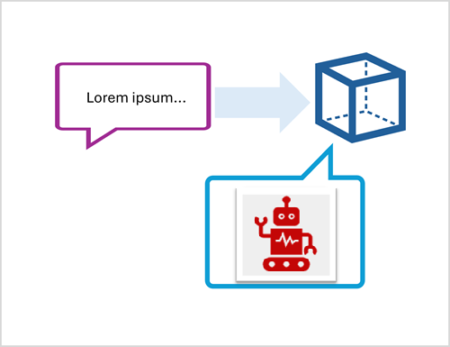
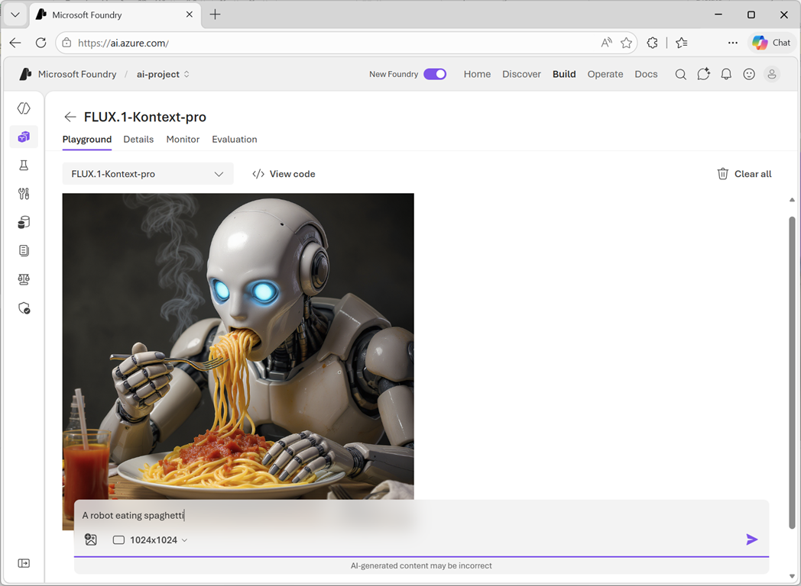

# Generate images with AI

**Module:** `generate-images-azure-openai`
**Source:** <https://learn.microsoft.com/en-us/training/modules/generate-images-azure-openai/>

## Learning objectives

After completing this module, you'll be able to:

- Describe the capabilities of image generation models
- Use the Images playground in Microsoft Foundry portal
- Integrate image generation models into your apps

## Prerequisites

Before starting this module, you should be familiar with Microsoft Foundry. You should also have programming experience.

---

## Introduction

With Microsoft Foundry, you can use language models to generate content based on natural language prompts. Often the generated content is in the form of natural language text, but increasingly, models can generate other kinds of content.

For example, the OpenAI *gpt-image-1* model can create original graphical content based on a description of a desired image.



The ability to use AI to generate graphics has many applications; including the creation of illustrations or photorealistic images for articles or marketing collateral, generation of unique product or company logos, or any scenario where a desired image can be described.

In this module, you'll learn how to develop an application that uses generative AI to generate original images.

> **Note:** Different people like to learn in different ways. You can choose to complete this module in video-based format or read the content as text and images. The text contains greater detail than the videos, so in some cases you might want to refer to it as supplemental material to the video presentation.

---

## What are image-generation models?

Microsoft Foundry supports multiple models that are capable of generating images, including (but not limited to):

- The OpenAI *gpt-image-1* series of models.
- The Black Forest Labs *FLUX* series of models.

> **Tip:** View the **[Model catalog](https://ai.azure.com/catalog/models?azure-portal=true)** for the full set of models available in Microsoft Foundry. In the Foundry portal you can filter by inference task to find *text to image* models.

Image generation models are generative AI models that can create graphical data from natural language input. Put more simply, you can provide the model with a description and it can generate an appropriate image.

For example, you might submit the following natural language prompt to an image generation model:

*A robot eating spaghetti*

This prompt could result in the generation of graphical output such as the following image:


The images generated are original; they aren't retrieved from a curated image catalog. In other words, the model isn't a search system for *finding* appropriate images — it is an artificial intelligence (AI) model that *generates* new images based on the data on which it was trained.

---

## Explore image-generation models in Microsoft Foundry portal

To experiment with image generation models, you can create a Microsoft Foundry project and use the *model playground* in Microsoft Foundry portal to submit prompts and view the resulting generated images.



When using the playground (subject to model support), you can specify the resolution (size) of the generated images and include a reference image for the model to base its output on.

---

## Create a client application that uses an image generation model

You can use a language-specific SDK (for example, the OpenAI Python SDK or the Azure OpenAI .NET SDK) to develop client applications that use models to generate images.

For example, the following Python code uses the OpenAI *Images* API to submit a request to a model to generate an image of a robot eating a cheeseburger:

```python
# Generate an image
img_results = client.images.generate(
    model="FLUX.1-Kontext-pro",
    prompt="A robot eating a cheeseburger.",
    n=1,
    size="1024x1024",
)

# Save the generated image
image_data = base64.b64decode(img_results.data[0].b64_json)
with open("image.png", "wb") as image_file:
    image_file.write(image_data)
```

The result is a binary stream containing the requested image:


---

## Summary

This module described image generation models, and how you can use them in Microsoft Foundry to generate images based on natural language prompts. You can explore image generation models using the *Images* playground in Microsoft Foundry portal, and you can use REST APIs or SDKs to build applications that generate new images.

---

## Exercise / Lab

Hands-on lab: [02-generate-image.md](../../../labs/mslearn-ai-vision/Instructions/Exercises/02-generate-image.md)

> After completing the exercise, if you've finished exploring Microsoft Foundry, delete the Azure resources that you created during the exercise.
