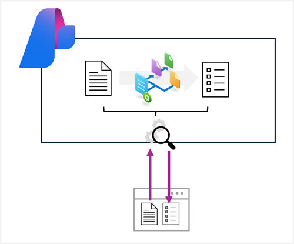

# Create an Azure Content Understanding client application

**Module slug:** `analyze-content-ai-api`
**Source:** <https://learn.microsoft.com/en-us/training/modules/analyze-content-ai-api/>

## Learning objectives

After completing this module, you will be able to:

- Use the Azure Content Understanding API to build a content analyzer.
- Use the Azure Content Understanding API to consume an analyzer.

## Prerequisites

Before starting this module, you should:

- Be familiar with Azure services and the Azure portal.
- Have some familiarity with Python and APIs.

---

## Introduction

Azure Content Understanding is a multimodal service that simplifies the creation of AI-powered analyzers that can extract information from multiple content formats, including documents, images, audio files, and videos.

> **Tip:** To learn how to build Azure Content Understanding analyzers, complete the **[Create a multimodal analysis solution with Azure Content Understanding](https://learn.microsoft.com/en-us/training/modules/analyze-content-ai/)** module.

You can develop client applications that use Azure Content Understanding analyzers by using the Python SDK or the REST API; which is the focus of this module.



In this module, you'll learn how to write code that uses the Python SDK and REST API to submit a content file to an analyzer and process the results.

---

## Prepare to use the AI Content Understanding API

Before you can use the Azure Content Understanding API, you need a Microsoft Foundry resource in your Azure subscription. You can provision this resource in the following ways:

- Create a **Microsoft Foundry** resource in the Azure portal.
- Create a **Microsoft Foundry** project, which includes a Microsoft Foundry resource by default.

> **Tip:** Creating a Microsoft Foundry project enables you to use visual tools to create and manage Azure Content Understanding schemas and analyzers.

After you've provisioned a Microsoft Foundry resource, you need the following information to connect to the Azure Content Understanding API from a client application:

- The Microsoft Foundry resource *endpoint*
- One of the API *keys* associated with the endpoint.

You can obtain these values from the Azure portal, as shown in the following image:


If you're working within a Microsoft Foundry project, you can find the endpoint and key for the associated Foundry resource in the Foundry portal project home page.

When working in a Microsoft Foundry project, you can also write code that uses the Microsoft Foundry SDK to connect to the project using Microsoft Entra ID authentication, and retrieve the connection details for the Microsoft Foundry resource.

### Installing the Python SDK

To use the Python SDK for Content Understanding, install the `azure-ai-contentunderstanding` package:

```bash
pip install azure-ai-contentunderstanding
```

> **Note:** The Python SDK requires Python 3.9 or later. You can also use the REST API directly from any language that supports HTTP requests.

> **Important:** Before using the Content Understanding API, you must set up default model deployments for your Microsoft Foundry resource. Content Understanding requires `GPT-4.1`, `GPT-4.1-mini`, and `text-embedding-3-large` model deployments. You can configure these in the Azure portal or by using the API. For more information, see **[Set up model deployments](https://learn.microsoft.com/en-us/azure/ai-services/content-understanding/how-to/migration-preview-to-ga#prerequisites)**.

> **Tip:** To learn more about programming with the Microsoft Foundry SDK, complete the **[Develop an AI app with the Microsoft Foundry SDK](https://learn.microsoft.com/en-us/training/modules/ai-foundry-sdk/)** module.

---

## Create a Content Understanding analyzer

In most scenarios, you should consider creating and testing analyzers using the visual interface in Content Understanding Studio. However, in some cases you might want to create an analyzer by submitting a JSON definition of the schema for your desired content fields to the API.

### Defining a schema for an analyzer

Analyzers are based on schemas that define the fields you want to extract or generate from a content file. At its simplest, a schema is a set of fields, which can be specified in a JSON document, as shown in this example of an analyzer definition:

```json
{
    "description": "Simple business card",
    "baseAnalyzerId": "prebuilt-document",
    "config": {
        "returnDetails": true
    },
    "fieldSchema": {
        "fields": {
            "ContactName": {
                "type": "string",
                "method": "extract",
                "description": "Name on business card"
            },
            "EmailAddress": {
                "type": "string",
                "method": "extract",
                "description": "Email address on business card"
            }
        }
    },
    "models": {
        "completion": "gpt-4.1",
        "embedding": "text-embedding-3-large"
    }
}
```

This example of a custom analyzer schema is based on the pre-built *document* analyzer, and describes two fields that you would expect to find on a business card: *ContactName* and *EmailAddress*. Both fields are defined as string data types, and are expected to be *extracted* from a document (in other words, the string values are expected to exist in the document so they can be "read"; rather than being fields that can be *generated* by inferring information about the document). The `models` object specifies the generative models that the analyzer uses for processing.

> **Note:** This example is deliberately simple, with the minimal information needed to create a working analyzer. In reality, the schema would likely include more fields of different types, and the analyzer definition would include more configuration settings. The JSON might even include a sample document. See the [Azure Content Understanding API documentation](https://learn.microsoft.com/en-us/rest/api/contentunderstanding/content-analyzers/create-or-replace) for more details.

### Using the Python SDK to create an analyzer

With your analyzer definition in place, you can use the Python SDK to create the analyzer. The `ContentUnderstandingClient` class provides a `begin_create_analyzer` method that handles the asynchronous creation process for you.

```python
from azure.ai.contentunderstanding import ContentUnderstandingClient
from azure.core.credentials import AzureKeyCredential

# Authenticate the client
endpoint = "<YOUR_ENDPOINT>"
credential = AzureKeyCredential("<YOUR_API_KEY>")
client = ContentUnderstandingClient(endpoint=endpoint, credential=credential)

# Define the analyzer
analyzer_name = "business_card_analyser"
analyzer_definition = {
    "description": "Simple business card",
    "baseAnalyzerId": "prebuilt-document",
    "config": {"returnDetails": True},
    "fieldSchema": {
        "fields": {
            "ContactName": {
                "type": "string",
                "method": "extract",
                "description": "Name on business card"
            },
            "EmailAddress": {
                "type": "string",
                "method": "extract",
                "description": "Email address on business card"
            }
        }
    },
    "models": {
        "completion": "gpt-4.1",
        "embedding": "text-embedding-3-large"
    }
}

# Create the analyzer and wait for completion
poller = client.begin_create_analyzer(analyzer_name, body=analyzer_definition)
result = poller.result()
print(f"Analyzer created: {result.analyzer_id}")
```

### Using the REST API to create an analyzer

Alternatively, you can use the REST API directly. The JSON data is submitted as a `PUT` request to the endpoint with the API key in the request header to start the analyzer creation operation.

The response from the `PUT` request includes a **Operation-Location** in the header, which provides a *callback* URL that you can use to check on the status of the request by submitting a `GET` request.

The following Python code submits a request to create an analyzer based on the contents of a file named *card.json* (which is assumed to contain the JSON definition described previously):

```python
import json
import requests

# Get the business card schema
with open("card.json", "r") as file:
    schema_json = json.load(file)

# Use a PUT request to submit the schema for a new analyzer
analyzer_name = "business_card_analyser"

headers = {
    "Ocp-Apim-Subscription-Key": "<YOUR_API_KEY>",
    "Content-Type": "application/json"}

url = f"{<YOUR_ENDPOINT>}/contentunderstanding/analyzers/{analyzer_name}?api-version=2025-11-01"

response = requests.put(url, headers=headers, data=json.dumps(schema_json))

# Get the response and extract the ID assigned to the operation
callback_url = response.headers["Operation-Location"]

# Use a GET request to check the status of the operation
result_response = requests.get(callback_url, headers=headers)

# Keep polling until the operation is complete
status = result_response.json().get("status")
while status == "Running":
    result_response = requests.get(callback_url, headers=headers)
    status = result_response.json().get("status")

print("Done!")
```

---

## Analyze content

To analyze the contents of a file, you can use the Azure Content Understanding API to submit it to the endpoint. You can specify the content as a URL (for a file hosted in an Internet-accessible location) or upload binary file data directly (for example, a .pdf document, a .png image, an .mp3 audio file, or an .mp4 video file). The analysis request includes the analyzer to be used.

Analysis is an asynchronous operation. After submitting the request, you receive an operation ID that you can use to check the status and retrieve the results when the operation is complete.

For example, suppose you want to use the business card analyzer discussed previously to extract the name and email address from the following scanned business card image:


### Using the Python SDK

The Python SDK for Content Understanding (`azure-ai-contentunderstanding`) provides a `ContentUnderstandingClient` class that simplifies interaction with the service. The SDK handles authentication, request formatting, and automatic polling for asynchronous operations.

The following Python code uses the SDK to submit a business card for analysis and retrieve the results:

```python
from azure.ai.contentunderstanding import ContentUnderstandingClient
from azure.ai.contentunderstanding.models import AnalysisInput
from azure.core.credentials import AzureKeyCredential

# Authenticate the client
endpoint = "<YOUR_ENDPOINT>"
credential = AzureKeyCredential("<YOUR_API_KEY>")
client = ContentUnderstandingClient(endpoint=endpoint, credential=credential)

# Analyze the business card using the custom analyzer
analyzer_name = "business_card_analyser"
poller = client.begin_analyze(
    analyzer_id=analyzer_name,
    inputs=[AnalysisInput(url="https://host.com/business-card.png")]
)

# Wait for the operation to complete and get the results
result = poller.result()

# Extract field values from the results
content = result.contents[0]
if content.fields:
    for field_name, field_data in content.fields.items():
        if field_data.type == "string":
            print(f"{field_name}: {field_data.value}")
```

> **Tip:** The SDK's `begin_analyze` method returns a poller object. Calling `.result()` on the poller automatically handles polling until the operation completes, so you don't need to write your own polling loop.

### Using the REST API

You can also submit analysis requests directly by using the REST API. Your client application submits HTTP calls to the Content Understanding endpoint for your Microsoft Foundry resource, passing an API key in the header.

The following Python code submits a request for analysis using a URL, and then polls the service until the operation is complete and the results are returned.

```python
import json
import requests

## Use a POST request to submit the file URL to the analyzer
analyzer_name = "business_card_analyser"

headers = {
        "Ocp-Apim-Subscription-Key": "<YOUR_API_KEY>",
        "Content-Type": "application/json"}

url = f"{<YOUR_ENDPOINT>}/contentunderstanding/analyzers/{analyzer_name}:analyze?api-version=2025-11-01"

request_body = {
    "inputs": [
        {
            "url": "https://host.com/business-card.png"
        }
    ]
}

response = requests.post(url, headers=headers, json=request_body)

# Get the response and extract the ID assigned to the analysis operation
response_json = response.json()
id_value = response_json.get("id")

# Use a GET request to check the status of the analysis operation
result_url = f"{<YOUR_ENDPOINT>}/contentunderstanding/analyzerResults/{id_value}?api-version=2025-11-01"

result_response = requests.get(result_url, headers=headers)

# Keep polling until the analysis is complete
status = result_response.json().get("status")
while status == "Running":
        result_response = requests.get(result_url, headers=headers)
        status = result_response.json().get("status")

# Get the analysis results
if status == "Succeeded":
    result_json = result_response.json()
```

> **Note:** You can specify a URL for the content file location as shown here. To submit binary file data directly, use the `analyzeBinary` operation instead.

### Processing analysis results

The results depend on:

- The kind of content the analyzer is designed to analyze (for example, document, video, image, or audio).
- The schema for the analyzer.
- The contents of the file that was analyzed.

For example, the response from the *document*-based business card analyzer when analyzing the business card described previously contain:

- The extracted fields
- The optical character recognition (OCR) layout of the document, including locations of lines of text, individual words, and paragraphs on each page.

#### Using the Python SDK

When using the SDK, the `AnalysisResult` object provides typed access to the results. The `contents` property contains a list of content objects, each with fields, markdown, and metadata. The following code shows how to extract string field values:

```python
# (continued from previous SDK code example)

content = result.contents[0]
if content.fields:
    for field_name, field_data in content.fields.items():
        if field_data.type == "string":
            print(f"{field_name}: {field_data.value}")
```

#### Using the REST API

When using the REST API, the response is a JSON payload that your application must parse. Here's the complete JSON response for the business card analysis:

```json
{
    "id": "00000000-0000-0000-0000-a00000000000",
    "status": "Succeeded",
    "result": {
        "analyzerId": "biz_card_analyser_2",
        "apiVersion": "2025-11-01",
        "createdAt": "2025-05-16T03:51:46Z",
        "warnings": [],
        "contents": [
            {
                "markdown": "John Smith\nEmail: john@contoso.com\n",
                "fields": {
                    "ContactName": {
                        "type": "string",
                        "valueString": "John Smith",
                        "spans": [
                            {
                                "offset": 0,
                                "length": 10
                            }
                        ],
                        "confidence": 0.994,
                        "source": "D(1,69,234,333,234,333,283,69,283)"
                    },
                    "EmailAddress": {
                        "type": "string",
                        "valueString": "john@contoso.com",
                        "spans": [
                            {
                                "offset": 18,
                                "length": 16
                            }
                        ],
                        "confidence": 0.998,
                        "source": "D(1,179,309,458,309,458,341,179,341)"
                    }
                },
                "kind": "document",
                "startPageNumber": 1,
                "endPageNumber": 1,
                "unit": "pixel",
                "pages": [
                    {
                        "pageNumber": 1,
                        "angle": 0.03410444,
                        "width": 1000,
                        "height": 620,
                        "spans": [
                            {
                                "offset": 0,
                                "length": 35
                            }
                        ],
                        "words": [
                            {
                                "content": "John",
                                "span": {
                                    "offset": 0,
                                    "length": 4
                                },
                                "confidence": 0.992,
                                "source": "D(1,69,234,181,234,180,283,69,283)"
                            },
                            {
                                "content": "Smith",
                                "span": {
                                    "offset": 5,
                                    "length": 5
                                },
                                "confidence": 0.998,
                                "source": "D(1,200,234,333,234,333,282,200,283)"
                            },
                            {
                                "content": "Email:",
                                "span": {
                                    "offset": 11,
                                    "length": 6
                                },
                                "confidence": 0.995,
                                "source": "D(1,75,310,165,309,165,340,75,340)"
                            },
                            {
                                "content": "john@contoso.com",
                                "span": {
                                    "offset": 18,
                                    "length": 16
                                },
                                "confidence": 0.977,
                                "source": "D(1,179,309,458,311,458,340,179,341)"
                            }
                        ],
                        "lines": [
                            {
                                "content": "John Smith",
                                "source": "D(1,69,234,333,233,333,282,69,282)",
                                "span": {
                                    "offset": 0,
                                    "length": 10
                                }
                            },
                            {
                                "content": "Email: john@contoso.com",
                                "source": "D(1,75,309,458,309,458,340,75,340)",
                                "span": {
                                    "offset": 11,
                                    "length": 23
                                }
                            }
                        ]
                    }
                ],
                "paragraphs": [
                    {
                        "content": "John Smith Email: john@contoso.com",
                        "source": "D(1,69,233,458,233,458,340,69,340)",
                        "span": {
                            "offset": 0,
                            "length": 34
                        }
                    }
                ],
                "sections": [
                    {
                        "span": {
                            "offset": 0,
                            "length": 34
                        },
                        "elements": [
                            "/paragraphs/0"
                        ]
                    }
                ]
            }
        ]
    }
}
```

Your application must typically parse the JSON to retrieve field values. For example, the following Python code extracts all of the *string* values:

```python
# (continued from previous code example)

# Iterate through the fields and extract the names and type-specific values
contents = result_json["result"]["contents"]
for content in contents:
    if "fields" in content:
        fields = content["fields"]
        for field_name, field_data in fields.items():
            if field_data['type'] == "string":
                print(f"{field_name}: {field_data['valueString']}")
```

The output from this code is shown here:

```
ContactName: John Smith
EmailAddress: john@contoso.com
```

---

## Summary

Azure Content Understanding is a multimodal AI service that enables you to extract information from many different kinds of content. The Python SDK and REST API for the service enable you to create client applications that analyze content to extract and generate field values.

For more information about Azure Content Understanding, see **[Azure Content Understanding documentation](https://learn.microsoft.com/en-us/azure/ai-services/content-understanding/)**.

---

## Exercise / Lab

Hands-on lab: [02-content-understanding-api.md](../../../labs/mslearn-ai-information-extraction/Instructions/Exercises/02-content-understanding-api.md)
