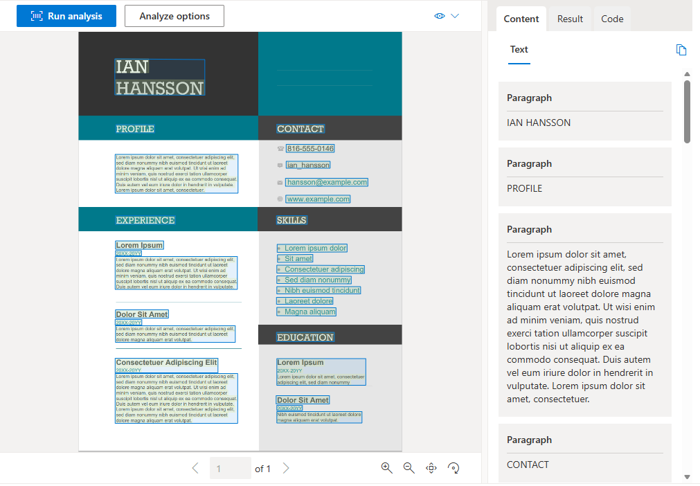
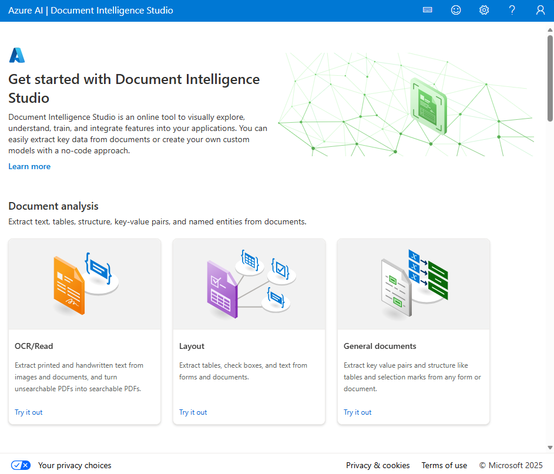
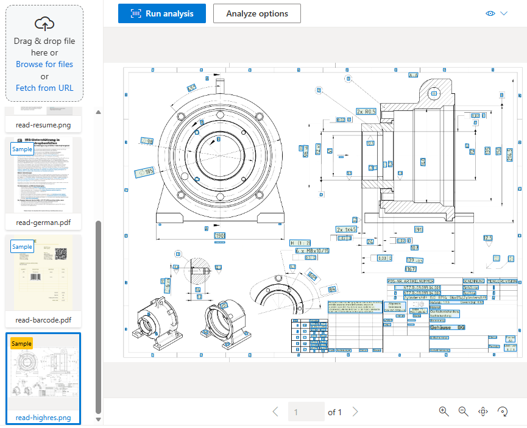
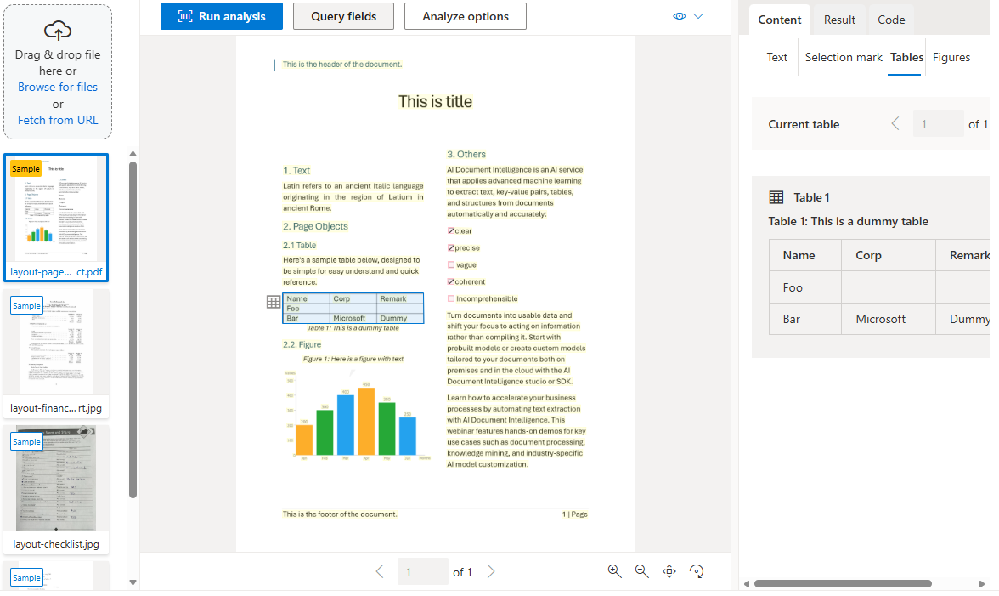

# Extract data with Azure Document Intelligence

## Learning Objectives and Prerequisites

By the end of this module, you'll be able to:

- Describe the capabilities and components of Azure Document Intelligence.
- Use the Document Intelligence Studio to explore and test models.
- Use prebuilt models to extract data from common document types.
- Train and use custom models for industry-specific forms.

**Prerequisites:**

- Familiarity with Azure and the Azure portal.
- Programming experience with C# or Python.

---

## Introduction

Forms and documents are used to communicate information in every industry, every day. Many organizations still manually extract data from forms to exchange information, whether it's filing claims, enrolling patients, processing receipts for expense reports, or reviewing operations data.

Imagine you work for a company that processes thousands of invoices, receipts, and tax forms each month. You want to automate the extraction of key data from these documents to reduce manual effort and improve accuracy. Azure Document Intelligence provides the AI-powered tools you need to build this kind of solution.

Azure Document Intelligence is a cloud-based service in Microsoft Foundry that uses optical character recognition (OCR) and deep learning models to extract text, key-value pairs, tables, and structured data from forms and documents. It offers prebuilt models for common document types, document analysis models for general text extraction, and the ability to train custom models for your specific forms.

> **Note:** We recognize that different people like to learn in different ways. You can choose to complete this module in video-based format or you can read the content as text and images. The text contains greater detail than the videos, so in some cases you might want to refer to it as supplemental material to the video presentation.

---

## What is Azure Document Intelligence?

**Azure Document Intelligence** is a cloud-based AI service in Microsoft Foundry that uses OCR and deep learning models to extract text, key-value pairs, selection marks, and tables from documents.

OCR captures document structure by creating bounding boxes around detected objects in an image. The locations of the bounding boxes are recorded as coordinates in relation to the rest of the page. Azure Document Intelligence returns bounding box data and other information in a structured JSON format that preserves the relationships from the original document.



To build a high-accuracy document extraction model from scratch requires deep learning expertise, large amounts of compute, and long training times. Azure Document Intelligence provides underlying models already trained on thousands of form examples, so you can achieve high-accuracy data extraction with minimal effort.

### Document Intelligence service components

Azure Document Intelligence is composed of three categories of models:

- **Document analysis models**: Extract text, structure, tables, and selection marks from documents. The **read** model extracts text and detects languages, while the **layout** model adds table and structure extraction. You'll explore these models in detail in the *Use prebuilt models* unit.
- **Prebuilt models**: Extract information from common document types — such as invoices, receipts, tax forms, ID documents, and more — without any training required. You'll see the full list of available prebuilt models in the *Use prebuilt models* unit.
- **Custom models**: Extract data from forms specific to your business using your own labeled datasets. Options include custom template models (fast and cost-effective for fixed layouts), custom neural models (higher accuracy for varying layouts), composed models, and custom classifiers. You'll learn about training and using custom models in the *Train and use custom models* unit.

### Access Document Intelligence services

You can access Azure Document Intelligence in several ways:

- **REST API**: Call the service directly using HTTP requests.
- **Client library SDKs**: Use SDKs for Python, C#, Java, and JavaScript.
- **Document Intelligence Studio**: An online tool for visually exploring, testing, and building Document Intelligence solutions.
- **Microsoft Foundry portal**: Integrate Document Intelligence with other Foundry tools.

> **Tip:** This module's exercise focuses on the Python SDK. The underlying REST services can be used by any language.

### Create a Document Intelligence resource

To use Azure Document Intelligence, you need an Azure resource. You can use either:

- A **Foundry resource**: A multi-service subscription that provides access to multiple AI services under a single endpoint and key.
- An **Azure Document Intelligence resource**: A single-service resource used only with Document Intelligence.

> **Note:** Create a Foundry resource if you plan to access multiple Foundry tools under a single endpoint and key. For Document Intelligence access only, create a dedicated Document Intelligence resource.

### Input requirements

Azure Document Intelligence works on input documents that meet these requirements:

- Format must be JPEG, PNG, BMP, PDF (text or scanned), or TIFF. The read model also accepts Microsoft Office file formats.
- File size must be less than 500 MB for the standard tier and 4 MB for the free tier.
- Image dimensions must be between 50 x 50 pixels and 10,000 x 10,000 pixels.
- PDF documents must have dimensions less than 17 x 17 inches (A3 paper size).
- PDF documents must not be password-protected.

**Learn more:**
- [What is Azure Document Intelligence?](https://learn.microsoft.com/en-us/azure/ai-services/document-intelligence/overview)
- [Azure Document Intelligence model overview](https://learn.microsoft.com/en-us/azure/ai-services/document-intelligence/model-overview)

---

## Use the Document Intelligence Studio

The Azure Document Intelligence Studio is an online tool for visually exploring, understanding, and integrating features from the Document Intelligence service. You can use the Studio to analyze form layouts, extract data from prebuilt models, and train custom models—all through a visual interface.

You can access the Studio at https://documentintelligence.ai.azure.com.



### Studio capabilities

The Document Intelligence Studio supports the following project types:

- **Document analysis models**: Test the read and layout models against your own documents to see extracted text, tables, and structure.
- **Prebuilt models**: Analyze documents using any available prebuilt model, such as invoices, receipts, ID documents, and tax forms.
- **Custom models**: Build, label, train, and test custom extraction models and custom classifiers.

### Analyze documents with prebuilt models

To extract data from documents using prebuilt models in the Studio:

1. Create an Azure Document Intelligence or Foundry Tools resource in the Azure portal.
2. Open the Document Intelligence Studio and select a prebuilt model (for example, Invoice, Receipt, or ID Document).
3. Provide your resource endpoint and key.
4. Upload or provide a URL to the document you want to analyze.
5. Review the extracted fields and their confidence scores.

### Build custom model projects

You can use the Studio to handle the entire process of labeling, training, and testing custom models — without manually creating JSON files. The Studio generates the required `ocr.json`, `labels.json`, and `fields.json` files automatically.

The high-level workflow is:

1. Create an Azure Document Intelligence or Foundry resource.
2. Upload at least 5-6 sample forms to an Azure Blob Storage container.
3. Configure cross-origin resource sharing (CORS) so the Studio can access your storage container.
4. Create a custom model project in the Studio, linking your storage container and Document Intelligence resource.
5. Label fields in your sample documents using the Studio's visual interface.
6. Train your model and review accuracy metrics.
7. Test the model against a new document that wasn't used during training.

You'll learn more about the custom model types and the alternative REST API/SDK training workflow in the *Train and use custom models* unit.

### Add-on capabilities

Document Intelligence supports optional features that you can enable depending on your extraction scenario:

| Capability | Description |
| --- | --- |
| **High resolution extraction** | Extract text from high-resolution documents with greater accuracy. |
| **Formula extraction** | Detect and extract mathematical formulas from documents. |
| **Font property extraction** | Extract font information such as style, weight, and color. |
| **Barcode extraction** | Detect and read barcodes in documents. |
| **Searchable PDF** | Convert scanned documents into searchable PDF files. |
| **Query fields** | Use natural language queries to extract specific fields from documents. |
| **Key-value pairs** | Extract key-value pair relationships from documents using the layout model. |

> **Note:** Some add-on capabilities are premium features that incur extra costs. Check the [pricing page](https://azure.microsoft.com/pricing/details/ai-document-intelligence/) for details.

**Learn more:**
- [Document Intelligence Studio](https://documentintelligence.ai.azure.com)
- [Document Intelligence add-on capabilities](https://learn.microsoft.com/en-us/azure/ai-services/document-intelligence/concept-add-on-capabilities)

---

## Use Prebuilt Models

Prebuilt models in Azure Document Intelligence enable you to extract data from common form types without training your own models. Microsoft trains these models on large numbers of sample documents, so you can expect accurate and reliable results for standard document types.

### Document analysis models

Before looking at the domain-specific prebuilt models, it's important to understand the document analysis models that underpin them.

#### Read model

The read model extracts printed and handwritten text from documents and images. It detects the language of each text line and classifies whether text is handwritten or printed. The read model is used as the foundation for text extraction in all other Document Intelligence models.

For multi-page PDF or TIFF files, you can use the `pages` parameter in your request to specify a page range for analysis.

The read model is ideal when you want to extract words and lines from documents with no fixed or predictable structure.



#### Layout model

The layout model extends the read model's text extraction with detection of selection marks, tables, and document structure information. It also supports an optional `keyValuePairs` feature to extract key-value pairs.

When you digitize a document, it might be angled, or tables might have complex structures with merged cells or incomplete rows. The layout model can handle these difficulties. Each table cell is extracted with its content, bounding box position, and row/column indexes.

Selection marks (checkboxes and radio buttons) are extracted with their bounding box, confidence level, and whether they're selected.



> **Note:** The *general document model* was available in earlier versions of Document Intelligence, but was deprecated in the `2023-10-31-preview` release. Its functionality for key-value pair and entity extraction has been incorporated into the layout model and other features.

### Prebuilt models for specific document types

Azure Document Intelligence includes prebuilt models trained on specific document types. The following prebuilt models are some examples available to extract fields from common business documents:

#### Financial and legal documents

| Model | Description |
| --- | --- |
| **Invoice** | Extracts customer name, vendor details, purchase order number, invoice and due dates, billing and shipping addresses, line items, and totals. |
| **Receipt** | Extracts merchant details, transaction date and time, line items, and totals. Supports single-page hotel receipt processing. |
| **Bank statement** | Extracts account information, beginning and ending balances, and transaction details. |
| **Check** | Extracts payee, amount, date, and other relevant information. |
| **Pay stub** | Extracts wages, hours, deductions, net pay, and other common pay stub fields. |
| **Credit card** | Extracts payment card information. |
| **Contract** | Extracts agreement and party details. |

#### US tax documents

| Model | Description |
| --- | --- |
| **Unified US tax** | A single model that extracts from any supported US tax form type. |
| **W-2** | Extracts taxable compensation details. |
| **1098** and variations | Extracts mortgage interest and related details. |
| **1099** and variations | Extracts income from various sources. |
| **1040** and variations | Extracts individual income tax return details. |

#### US mortgage documents

| Model | Description |
| --- | --- |
| **1003 (URLA)** | Extracts loan application details. |
| **1004 (URAR)** | Extracts information from property appraisals. |
| **1005** | Extracts validation-of-employment information. |
| **1008** | Extracts loan transmittal details. |
| **Closing disclosure** | Extracts final closing loan terms. |

#### Personal identification documents

| Model | Description |
| --- | --- |
| **ID document** | Extracts details from US driver's licenses, European Union IDs and driver's licenses, and international passports. Includes names, dates of birth, document numbers, and endorsements or restrictions. |
| **Health insurance card** | Extracts common fields from US health insurance cards. |
| **Marriage certificate** | Extracts certified marriage information. |

> **Important:** The ID document model extracts personal information covered by data protection laws in most jurisdictions. Ensure you have the individual's permission to store their data and that you comply with all applicable legal requirements.

### Features of prebuilt models

Prebuilt models are designed to extract different types of data from documents. These features include:

- **Text extraction**: All prebuilt models extract lines and words from handwritten and printed text.
- **Key-value pairs**: Spans of text that identify a label and its response. For example, **Weight** and **31 kg**.
- **Selection marks**: Checkboxes and radio buttons, including whether they're selected or not.
- **Tables**: Data in cells, including the number of columns and rows, column and row headings, and merged cells.
- **Fields**: Models trained for a specific form type identify a fixed set of fields. For example, the invoice model extracts `CustomerName` and `InvoiceTotal`.

### When to use prebuilt vs. custom models

Prebuilt models cover the most common document types. If you have an industry-specific or unique form type, you might get more accurate results with a custom model. However, custom models require time and sample data to train. Always check whether a prebuilt model exists for your scenario before investing in custom model development.

**Learn more:**
- [Azure Document Intelligence prebuilt models](https://learn.microsoft.com/en-us/azure/ai-services/document-intelligence/model-overview)
- [Azure Document Intelligence read model](https://learn.microsoft.com/en-us/azure/ai-services/document-intelligence/prebuilt/read)
- [Azure Document Intelligence layout model](https://learn.microsoft.com/en-us/azure/ai-services/document-intelligence/prebuilt/layout)
- [Azure Document Intelligence invoice model](https://learn.microsoft.com/en-us/azure/ai-services/document-intelligence/prebuilt/invoice)
- [Azure Document Intelligence receipt model](https://learn.microsoft.com/en-us/azure/ai-services/document-intelligence/prebuilt/receipt)
- [Azure Document Intelligence ID document model](https://learn.microsoft.com/en-us/azure/ai-services/document-intelligence/prebuilt/id-document)

---

## Train and Use Custom Models

When prebuilt models don't cover your specific document types, you can train custom models to extract data from your own forms. Azure Document Intelligence supports supervised machine learning, where you label sample documents with the fields you want to extract, and the service trains a model to recognize those fields in new documents.

### Custom model types

Azure Document Intelligence offers two types of custom extraction models, plus a classification model:

#### Custom template models

Custom template models rely on a consistent visual template to extract labeled data. They work best for structured forms where the layout is static from one document instance to the next, such as questionnaires, applications, or standard government forms.

Template models accurately extract labeled key-value pairs, selection marks, tables, regions, and signatures. Training takes only a few minutes, and more than 100 languages are supported. Because template models are fast to train and cost-effective to run, they're a good starting point when your documents have a uniform visual layout.

#### Custom neural models

Custom neural models use deep learning and are fine-tuned on your labeled data. They combine layout and language features to extract fields from structured, semi-structured, and unstructured documents. Neural models support:

- Overlapping fields
- Signature detection
- Table, row, and cell level confidence

Neural models deliver higher accuracy than template models, especially for semi-structured or unstructured documents where the layout varies between instances. However, they take longer to train and consume more resources.

#### Choose between template and neural models

When deciding which custom model type to use, consider the tradeoffs:

| Factor | Custom template | Custom neural |
| --- | --- | --- |
| **Best for** | Structured forms with a consistent visual layout | Semi-structured or unstructured documents with varying layouts |
| **Training time** | Minutes | Longer (depends on dataset size) |
| **Training cost** | Lower | Higher |
| **Accuracy** | High for fixed-layout forms; decreases when layout varies | Higher overall, especially for documents with format variation |
| **Language support** | 100+ languages | Fewer languages (check documentation for current support) |
| **Feature support** | Key-value pairs, selection marks, tables, regions, signatures | Overlapping fields, signature detection, table/row/cell confidence |

> **Tip:** Start with a custom template model if your forms have a consistent visual layout. It's faster and cheaper to train. If accuracy is insufficient or your documents vary in format, switch to a custom neural model.

#### Custom classifiers

Custom classification models identify the type of a document before invoking an extraction model. You can use a classifier to route incoming documents to the appropriate extraction model when you're handling multiple form types.

### Train a custom model

To train a custom extraction model:

1. Store sample forms in an Azure blob container, along with JSON files containing layout and label field information:
    - An `ocr.json` file for each sample form (generated using the Analyze document function).
    - A single `fields.json` file describing the fields you want to extract.
    - A `labels.json` file for each sample form, mapping fields to their location in the form.
2. Generate a shared access signature (SAS) URL for the container.
3. Use the **Build model** REST API function or the equivalent SDK method.
4. Use the **Get model** REST API function to retrieve the trained model ID.

You can also train custom models visually using the Document Intelligence Studio, as described in the *Use the Document Intelligence Studio* unit.

> **Tip:** Use at least five to six sample forms for training. A larger and more varied dataset produces more accurate models.

### Use a custom model

To extract form data with a custom model, call the **Analyze document** function with your model ID. You can use either a supported SDK or the REST API.

**C#**

```csharp
string endpoint = "<endpoint>";
string apiKey = "<apiKey>";
AzureKeyCredential credential = new AzureKeyCredential(apiKey);
DocumentAnalysisClient client = new DocumentAnalysisClient(new Uri(endpoint), credential);

string modelId = "<modelId>";
Uri fileUri = new Uri("<fileUri>");

AnalyzeDocumentOperation operation = await client.AnalyzeDocumentFromUriAsync(WaitUntil.Completed, modelId, fileUri);
AnalyzeResult result = operation.Value;
```

**Python**

```python
endpoint = "YOUR_DOC_INTELLIGENCE_ENDPOINT"
key = "YOUR_DOC_INTELLIGENCE_KEY"

model_id = "YOUR_CUSTOM_BUILT_MODEL_ID"
formUrl = "YOUR_DOCUMENT"

document_analysis_client = DocumentAnalysisClient(
    endpoint=endpoint, credential=AzureKeyCredential(key)
)

task = document_analysis_client.begin_analyze_document_from_url(model_id, formUrl)
result = task.result()
```

A successful response contains an `analyzeResult` object with the extracted content and an array of pages containing information about the document.

### Composed models

You can combine multiple custom models into a single **composed model**. When you submit a document to a composed model, Document Intelligence classifies it to determine the most appropriate component model, and then returns the extraction results from that model. This approach is useful when you handle multiple form types that each require their own extraction model.

**Learn more:**
- [Document Intelligence custom models](https://learn.microsoft.com/en-us/azure/ai-services/document-intelligence/train/custom-model)
- [Custom neural models](https://learn.microsoft.com/en-us/azure/ai-services/document-intelligence/train/custom-neural)
- [Custom template models](https://learn.microsoft.com/en-us/azure/ai-services/document-intelligence/train/custom-template)
- [Composed models](https://learn.microsoft.com/en-us/azure/ai-services/document-intelligence/train/composed-models)

---

## Summary

Azure Document Intelligence provides powerful capabilities for extracting data from documents at scale. In this module, you explored the full range of the service's functionality.

You learned how to:

- Describe the capabilities and components of Azure Document Intelligence, including document analysis, prebuilt, and custom models.
- Use the Document Intelligence Studio to visually explore, test, and build document processing solutions.
- Use prebuilt models to extract data from common document types like invoices, receipts, tax forms, and ID documents.
- Train and use custom template and neural models for industry-specific forms.

Azure Document Intelligence is one part of the broader set of AI services available in Microsoft Foundry. You can integrate Document Intelligence with other services, such as Azure AI Search for knowledge mining scenarios or generative AI models for document summarization.

**Learn more:**
- [What is Azure Document Intelligence?](https://learn.microsoft.com/en-us/azure/ai-services/document-intelligence/overview)
- [Azure Document Intelligence model overview](https://learn.microsoft.com/en-us/azure/ai-services/document-intelligence/model-overview)
- [Document Intelligence custom models](https://learn.microsoft.com/en-us/azure/ai-services/document-intelligence/train/custom-model)
- [Document Intelligence Studio](https://documentintelligence.ai.azure.com)
- [Language support for Azure Document Intelligence](https://learn.microsoft.com/en-us/azure/ai-services/document-intelligence/language-support)

---

## Exercise / Lab

Hands-on lab: [03-document-intelligence.md](../../../labs/mslearn-ai-information-extraction/Instructions/Exercises/03-document-intelligence.md)
